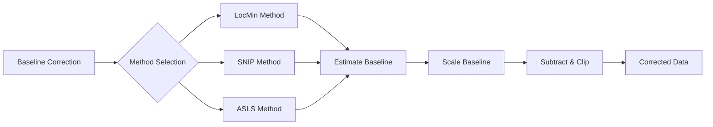

# MassFlow

This document introduces the baseline correction module in MassFlow, focusing on `preprocess/ms_preprocess.py` and the unified entry `MSIPreprocessor.baseline_correction`.

## Overview
- Input and output
  - Input: `module.ms_module.SpectrumBaseModule`
  - Output: a tuple `(corrected, baseline)`:
  - `SpectrumBaseModule`: `(SpectrumBaseModule corrected_spectrum, np.ndarray baseline)` with `mz_list` and coordinates preserved.
- Methods
  - LocMin (Local Minima Interpolation): baseline from local extrema anchors with optional smoothing.
  - SNIP (Statistics-Sensitive Non-linear Iterative Peak-clipping): iterative clipping with adaptive early stop.
  - ASLS (Asymmetric Least Squares): robust baseline estimation with peak preservation.
- Baseline scaling
  - `baseline_scale` scales the estimated baseline by `(0,1]` (default `1.0`) to prevent over-subtraction.
  - The returned baseline is scaled. Set `baseline_scale=1.0` to keep native algorithm behavior.

### Function Relationship Diagram



## Core API

### MSIPreprocessor.baseline_correction_spectrum
```python
preprocess.ms_preprocess.MSIPreprocessor.baseline_correction_spectrum(
  data: SpectrumBaseModule | SpectrumImzML
  method: str = "asls",
  smooth: str = "none",
  span: float = 0.1,
  s: float | None = 0.0,
  upper: bool = False,
  width: int = 5,
  lam: float = 1e7,
  p: float = 0.01,
  niter: int = 15,
  baseline_scale: float = 1.0,
  m: int | None = None,
  decreasing: bool = True
) -> tuple[SpectrumBaseModule, np.ndarray]
```
- Description: Unified entry for baseline correction. Dispatches to LocMin, SNIP, or ASLS and returns the corrected spectrum and the scaled estimated baseline.
- Supported methods: `"locmin"`, `"snip"`, `"asls"`
- Returns: `(corrected_spectrum, baseline)`; corrected spectrum preserves `mz_list` and coordinates.
- Exceptions: `ValueError` (unsupported method), `TypeError` (invalid input type)
 

### baseline_corrector
```python
preprocess.baseline_correction_helper.baseline_corrector(
  intensity: np.ndarray,
  index: np.ndarray | None = None,
  method: str = "asls",
  smooth: str = "none",
  span: float = 0.1,
  s: float | None = 0.0,
  upper: bool = False,
  width: int = 5,
  lam: float = 1e7,
  p: float = 0.01,
  niter: int = 15,
  baseline_scale: float = 1.0,
  m: int | None = None,
  decreasing: bool = True,
) -> tuple[np.ndarray, np.ndarray]
```
- Parameters:
  - `intensity`: 1D intensity array.
  - `index`: optional 1D coordinate array; validated for alignment but not directly used by current methods.
  - `method`: `'locmin' | 'snip' | 'asls'`.
  - `smooth`, `span`, `s`, `upper`, `width`: LocMin options (smoothing and anchor detection).
  - `lam`, `p`, `niter`: ASLS options.
  - `baseline_scale`: scale factor in `(0,1]` applied to the estimated baseline (default `1.0`).
  - `m`, `decreasing`: SNIP options.
- Returns:
  - `(corrected, scaled_baseline)`: corrected intensity and the scaled baseline.
- Exceptions:  
  - `ValueError`: unsupported `method`.
  - Input validation errors for non-1D or empty arrays.

### locmin_baseline
```python
preprocess.baseline_correction_helper.locmin_baseline(
  intensity: np.ndarray,
  smooth: str = "none",
  span: float = 0.1,
  s: float | None = 0.0,
  upper: bool = False,
  width: int = 5
) -> np.ndarray
```
- Description: Baseline estimation by interpolation from local extrema anchors. Detect local minima (or maxima if `upper=True`) using a windowed rule, force endpoints as anchors, then linearly interpolate. Optionally smooth the baseline via Loess (`smooth='loess', span`) or spline (`smooth='spline', s`).
- Parameters:
  - `smooth`: `'none' | 'loess' | 'spline'`
  - `span`: Loess span proportion (0 < span ≤ 1), default 0.1
  - `s`: Spline smoothing target residual sum of squares; `0.0` means interpolation
  - `upper`: Use local maxima as anchors when `True` (otherwise minima)
  - `width`: Neighborhood width for local extrema detection (default 5)
- Notes:
  - `s=0.0` yields exact interpolation through all anchor points; `s>0.0` smooths the spline toward a residual sum of squares ≈ `s`.
  - Endpoints are always included as anchors to ensure full coverage.
  - Minima and maxima detection are symmetric; maxima produce an upper envelope.
- Exceptions:
  - `ValueError`: invalid `smooth` value; `span` not in `(0,1]`; `s < 0`; `width < 3`.
  - `TypeError`: `width` is not an integer, intensity is not a 1D array.

Example:

```python
import numpy as np
from module.ms_module import SpectrumBaseModule
from preprocess.ms_preprocess import MSIPreprocessor
from tools.plot import plot_spectrum

sp = SpectrumBaseModule(mz_list=mz_data, intensity=intensity_original, coordinates=[0, 0, 0])

corrected_sp, baseline = MSIPreprocessor.baseline_correction_spectrum(
    data=sp,
    method="locmin",
    upper=False,
    width=11,
    smooth="none",
    baseline_scale=1.0
)

plot_spectrum(
    base=sp,
    target=corrected_sp,
    mz_range=(400, 450),
    intensity_range=(0.0, 2.0),
    metrics_box=True,
    title_suffix="LocMin",
    overlay=True
)
```


### snip_baseline
```python
preprocess.baseline_correction_helper.snip_baseline(
  intensity: np.ndarray,
  m: int | None = None,
  decreasing: bool = True
) -> np.ndarray
```
- Description: Statistics-sensitive Non-linear Iterative Peak-clipping (SNIP) baseline estimation algorithm. Performs multi-scale iterative processing to effectively estimate and remove baseline while preserving real mass spectral peaks.
- Parameters:
  - `m`: Window half-size; if None, auto-selects based on spectrum length: `min(100, max(10, n//10))`
  - `decreasing`: Iterate from large window to small (`True`) or small to large (`False`)
- Returns:
  - `baseline`: Estimated baseline as 1D numpy array
- Exceptions:
  - `TypeError`: `m` is not an integer.
  - `ValueError`: `m <= 0`; `intensity` is not a 1D array.

Example:

```python
import numpy as np
from module.ms_module import SpectrumBaseModule
from preprocess.ms_preprocess import MSIPreprocessor

sp = SpectrumBaseModule(mz_list=mz_data, intensity=intensity_original , coordinates=[0, 0, 0])

corrected_sp, baseline = MSIPreprocessor.baseline_correction_spectrum(
    data=sp,
    method="snip",
    m=50,
    decreasing=True,
    baseline_scale=1.0
)

plot_spectrum(
    base=sp,
    target=corrected_sp,
    mz_range=(400, 450),
    intensity_range=(0.0, 2.0),
    metrics_box=True,
    title_suffix="SNIP",
    overlay=True
)
```


### asls_baseline
```python
preprocess.baseline_correction_helper.asls_baseline(
  intensity: np.ndarray,
  lam: float = 1e7,
  p: float = 0.01,
  niter: int = 15
) -> np.ndarray
```
- Description: Asymmetric Least Squares (ASLS) baseline estimation algorithm. Uses weighted least squares with asymmetric penalties to estimate baseline while preserving peak signals through iterative reweighting.
- Parameters:
  - `lam`: Smoothness control parameter (positive float; larger values produce smoother baselines, typical range 1e4–1e8)
  - `p`: Asymmetry parameter (0–1; smaller values provide better peak preservation, typical range 0.001–0.1)
  - `niter`: Iteration count (positive integer; typical range 5–30)
- Returns:
  - `baseline`: Estimated baseline as 1D numpy array
 - Exceptions:
  - `ValueError`: `lam <= 0`; `p` not in `(0,1)`; `niter` not a positive integer.
  - `TypeError`:  `intensity` is not a 1D array

## Parameters and Tuning
- General
  - `baseline_scale` (`(0,1]`): smaller values reduce over-subtraction; `1.0` preserves native behavior.
- LocMin
  - `width`: Larger window reduces anchor density; start at 5–9.
    - Must be an integer and `>= 3`.
  - `upper`: Use maxima for upper envelope; keep `False` for baseline.
  - `smooth`: `'none'` for raw interpolation; `'loess'` for local smoothing; `'spline'` for global smoothing.
  - `span`: Loess span 0.05–0.3; larger values smooth more aggressively.
  - `s`: Spline smoothing target residual sum of squares; `0.0` or `None` for interpolation.
- ASLS
  - `lam` (smoothness): `1e4–1e8`, larger → smoother baseline.
  - `p` (asymmetry): `0.001–0.1`, smaller → stronger peak preservation.
  - `niter` (iterations): `5–30`, more iterations stabilize weights.
- SNIP
  - `m` (half-window): default `min(100, max(10, n//10))`; overly large windows may over-subtract.
  - `decreasing`: `True` (coarse→fine) usually more robust; `False` (fine→coarse) emphasizes local-first.

## Tips
- Ensure `mz` and `intensity` lengths match when reading NPY files.
- Use `metrics_box=True` to visualize SNR, TIC ratio and related metrics inline.
- Overlay mode: set `overlay=True` to plot original and corrected spectra on the same axis. Omit or set `overlay=False` for stacked subplots.

## References
- `preprocess/ms_preprocess.py` (unified entry, parameter defaults)
- `preprocess/baseline_correction_helper.py` (LocMin, SNIP, ASLS implementations)
- `module/ms_module.py` (Data structure for `SpectrumBaseModule`)
- `tools/plot.py` (Plotting utilities for `SpectrumBaseModule`)

## Error Handling and Logging

- All input validation errors log via `logger.error` before raising `TypeError` or `ValueError`.
- Baseline scaling: `baseline_scale` must be a finite number in `(0,1]`; violations log and raise `ValueError`.
- LocMin:
  - `smooth` must be one of `'none' | 'loess' | 'spline'`.
  - `span` must be in `(0,1]`; `s` must be a finite number and `>= 0`.
  - `width` must be an integer and `>= 3`.
  - Loess/Spline smoothing depends on external functions (`_smooth1d`, `UnivariateSpline`); if they fail (e.g., missing dependency, invalid parameters), exceptions will propagate.
- SNIP:
  - `m` must be an integer (type violation raises `TypeError`); if provided, it must be `>= 1`.
- ASLS:
  - `lam` must be a positive finite number; `p` must be in `(0,1)`; `niter` must be a positive integer.
