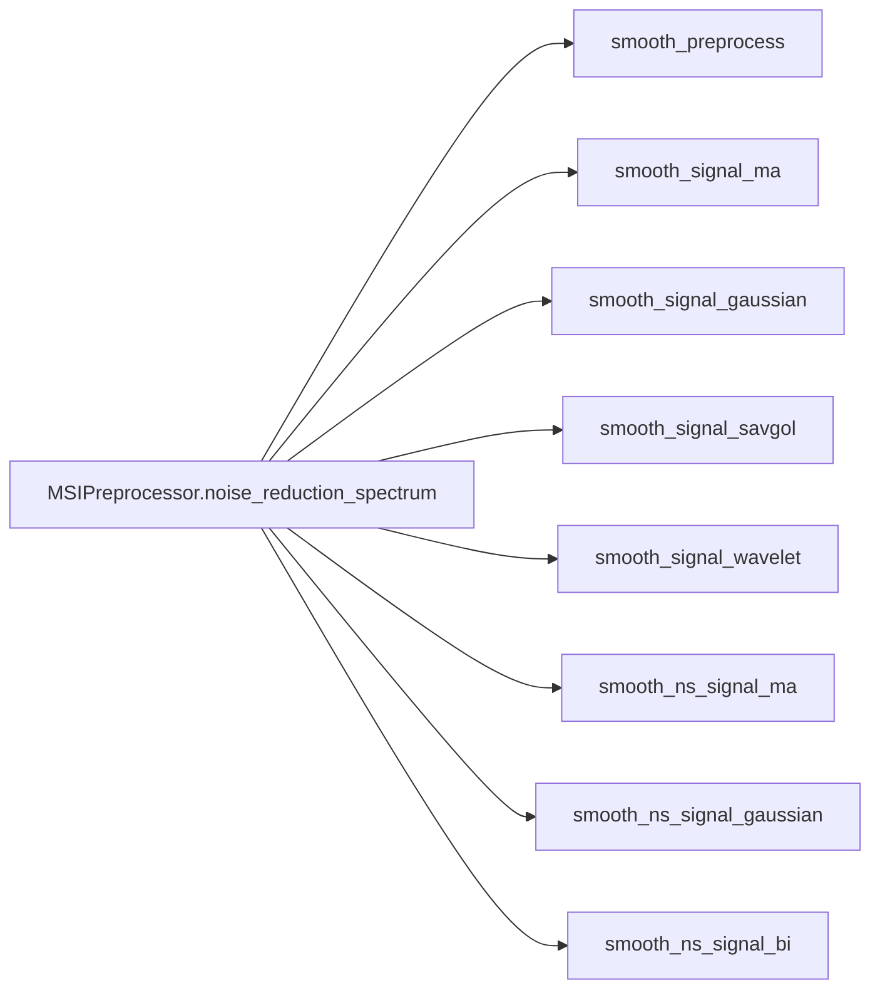

# MassFlow 

This document introduces the noise suppression and filtering module in MassFlow, focusing on the functions in `preprocess/filter_helper.py` and their coordinated use with `MSIPreprocessor.noise_reduction_spectrum`. The content includes API descriptions, example code, parameters and tuning suggestions, application scenarios, and common issues.
## Overview

- Input and Output
  - Input: `module.ms_module.SpectrumBaseModule` (1D `intensity` must exist; `mz_list` is optional)
  - Output: All function calls should be made through the `MSIPreprocessor.noise_reduction_spectrum` method.
- Algorithm Categories
  - Time-domain convolution smoothing: `smooth_signal_ma` (moving average/custom kernel), `smooth_signal_gaussian` (discrete Gaussian)
  - Polynomial fitting smoothing: `smooth_signal_savgol` (Savitzky-Golay)
  - Wavelet denoising: `smooth_signal_wavelet` (thresholding based on PyWavelets)
  - Smoothing based on m/z neighborhood search: `smooth_ns_signal_ma`, `smooth_ns_signal_gaussian`, `smooth_ns_signal_bi` (bilateral)
- Preprocessing
  - `smooth_preprocess`: Sets negative intensities to zero; optional utility, not automatically called by `noise_reduction_spectrum`.

### Function Relationship Diagram



## Core API

### MSIPreprocessor.noise_reduction_spectrum

```python
preprocess.ms_preprocess.MSIPreprocessor.noise_reduction_spectrum(
  data: SpectrumBaseModule | SpectrumImzML,
  method: str = "ma",
  window: int = 5,
  sd: float | None = None,
  sd_intensity: float | None = None,
  p: int = 2,
  coef: np.ndarray | None = None,
  polyorder: int = 2,
  wavelet: str = "db4",
  threshold_mode: str = "soft",
) -> SpectrumBaseModule
```

- Description: Unified entry point for denoising. Dispatches to the specific filter implementation based on `method`, and returns a spectrum object with the same coordinates as the input, where `intensity` is the smoothed result.
- Supported `method`s:
  - `ma`, `gaussian`, `savgol`, `wavelet`
  - `ma_ns`, `gaussian_ns`, `bi_ns`
- Returns: A new `SpectrumBaseModule` instance, with `mz_list` and coordinates preserved, and `intensity` replaced with the smoothed result.
- Exceptions:
  - `ValueError`: unsupported `method`.
  - `TypeError`: invalid input type.

### smooth_signal_ma

```python
preprocess.filter_helper.smooth_signal_ma(
  intensity: np.ndarray,
  coef: np.ndarray | None = None,
  window: int = 5,
) -> np.ndarray
```

- Notes: When passing `coef`, it is normalized automatically; its length determines the effective window.
- Description: Moving average (or custom convolution kernel) smoothing. Uses `edge` padding for 1D boundaries and automatically normalizes weights.
- Parameters(Note that only the following parameters are available, other parameters do not affect the effectiveness of this smoothing method.):
  - `coef`: Convolution kernel; if `None`, a uniform kernel of length `window` is used.
  - `window`: Window length (positive integer; if even and `coef is None`, it is automatically coerced to odd for centered alignment).
- Returns: A 1D `intensity` array of the same length as the input.
- Exceptions:
  - `ValueError`: `window <= 0` or even when `coef` is None,intensity is not a 1D array.
  - `TypeError`: `window` must be integer when `coef` is None，`coef` must be a non-empty 1D numpy array when provided.

Example:

```python
denoised_spectrum = MSIPreprocessor.noise_reduction_spectrum(
    data=sp,
    method="ma",
    window=7
)
```

Example:

```python
import sys
import os
from pathlib import Path
import numpy as np
import matplotlib.pyplot as plt
from module.ms_module import MS, SpectrumBaseModule
from module.ms_data_manager_imzml import MSDataManagerImzML
from preprocess.ms_preprocess import MSIPreprocessor
from tools.plot import plot_spectrum

# Dataloading part only show once for blow examples
# Load data
# Data path
FILE_PATH = 'data/neg-gz4.imzML'
ms = MS()
ms_md = MSDataManagerImzML(ms, filepath=FILE_PATH)
ms_md.load_full_data_from_file()
sp = ms[0]

# Denoising processing (using directly set window size)
denoised_spectrum = MSIPreprocessor.noise_reduction_spectrum(
    data=sp,
    method="ma",
    window=7  # Window size for moving average
)

# Plotting (overlay original and denoised)
plot_spectrum(
    base=sp,
    target=denoised_spectrum,
    mz_range=(500.0, 510.0),
    intensity_range=(0.0, 1.5),
    metrics_box=True,
    title_suffix='MA',
)
```


### smooth_signal_gaussian

```python
preprocess.filter_helper.smooth_signal_gaussian(
  intensity: np.ndarray,
  sd: float | None = None,
  window: int = 5,
) -> np.ndarray
```

- Description: Discrete Gaussian kernel smoothing; defaults to `sd = window / 4`.
- Parameters(Note that only the following parameters are available, other parameters do not affect the effectiveness of this smoothing method.): 
  - `sd` (Gaussian standard deviation), default `sd = window / 4.0`
  - `window` (odd length),default = 5
- Returns: A 1D `intensity` array of the same length as the input.
- Exceptions:
  - `ValueError`: `window <= 0` or even; `sd` must be positive finite,intensity is not a 1D array.
  -  `TypeError`: `window` must be integer.

Example:

```python
denoised = MSIPreprocessor.noise_reduction_spectrum(
    data=sp,
    method="gaussian",
    window=7,
    # If default, it is set to `window / 4.0`
    # sd=None
    )
```


### smooth_signal_savgol

```python
preprocess.filter_helper.smooth_signal_savgol(
  intensity: np.ndarray,
  window: int = 5,
  polyorder: int = 2,
) -> np.ndarray
```

 - Description: Savitzky-Golay polynomial fitting smoothing; automatically ensures `window` is odd and `window >= 3`. `polyorder` must be strictly less than `window` (a violation raises an error).
- Parameters:
  - `window`: Odd window size; minimum 3.
  - `polyorder`: Polynomial order; must be `< window`.
- Returns: A 1D `intensity` array of the same length as the input.
- Exceptions: 
  - `ValueError`: `window <= 0` or even; `polyorder` must be less than `window`,intensity is not a 1D array.
  -  `TypeError`: `window` and `polyorder` must be integer.
Example:

```python
denoised = MSIPreprocessor.noise_reduction_spectrum(
    data=sp,
    method="savgol",
    window=10,
    polyorder=1
    
)
```


​        window=3, polyorder=1


### smooth_signal_wavelet

```python
preprocess.filter_helper.smooth_signal_wavelet(
  intensity: np.ndarray,
  wavelet: str = "db4",
  threshold_mode: str = "soft",
) -> np.ndarray
```

- Description: Wavelet threshold denoising; automatically estimates noise using Donoho-Johnstone universal threshold and applies soft/hard thresholding. The output length is guaranteed to match the input through proper wavelet reconstruction.
- Parameters(Note that only the following parameters are available, other parameters do not affect the effectiveness of this smoothing method.): 
  - `wavelet` (e.g., `db4`, `db8`, `haar`, `coif2`),default `db4`
  - `threshold_mode` (`soft`/`hard`),default `'soft'`
- Returns: A 1D `intensity` array of the same length as the input.
- Exceptions:
  - `ImportError`: PyWavelets `pywt` not installed.
  - `ValueError`: `threshold_mode` must be 'soft' or 'hard',intensity is not a 1D array.

Example:

```python
denoised = MSIPreprocessor.noise_reduction_spectrum(
    data=sp,
    method="wavelet",
)
```


### smooth_ns_signal_ma

```python
preprocess.filter_helper.smooth_ns_signal_ma(
  intensity: np.ndarray,
  index: np.ndarray,
  k: int = 5,
  p: int = 2,
) -> np.ndarray
```

 - Description: Uniform neighborhood smoothing over the `k` nearest neighbors (row-wise mean). Index validation and fallback are handled upstream.
- Parameters(Note that only the following parameters are available, other parameters do not affect the effectiveness of this smoothing method):  
  - `k` (number of neighbors),default 5,
  - `p` (distance metric),default 2.
- Returns: A 1D `intensity` array of the same length as the input.
- Exceptions:
  - `ValueError`: `k < 1` or `p < 1`,intensity is not a 1D array.
  -  `TypeError`: `k` and `p` must be integers.

Example:

```python
denoised = MSIPreprocessor.noise_reduction_spectrum(
    data=sp,
    method="ma_ns",
    window=10,  # window maps to k
    p=2
)
```


### smooth_ns_signal_gaussian

```python
preprocess.filter_helper.smooth_ns_signal_gaussian(
  intensity: np.ndarray,
  index: np.ndarray,
  k: int = 5,
  p: int = 2,
  sd: float | None = None,
) -> np.ndarray
```

- Description: Applies Gaussian weighting to neighborhood distances; the exponent is clipped to avoid underflow, and row normalization avoids division by zero.
- Default: `sd = median(max_row_distance) / 2.0`.
- Parameters:
  - `index`: 1D coordinates aligned with `intensity`.
  - `k`: number of neighbors (>=1).
  - `p`: Minkowski distance parameter (>=1).
  - `sd`: Gaussian scale over neighbor distances; auto-estimated if `None`.
- Returns: A 1D `intensity` array of the same length as the input.
- Exceptions:
  - `ValueError`: `k < 1` or `p < 1`,intensity is not a 1D array.
  -  `TypeError`: `k` and `p` must be integers.
- Notes: If `index` is `None` or length-mismatched, it falls back to `np.arange(...)` with a warning.

Example:

```python
denoised = MSIPreprocessor.noise_reduction_spectrum(
    data=sp,
    method="gaussian_ns",
    window=10,  # window maps to k
    p=2,
    sd=None
)
```


### smooth_ns_signal_bi (Bilateral)

```python
preprocess.filter_helper.smooth_ns_signal_bi(
  intensity: np.ndarray,
  index: np.ndarray,
  k: int = 5,
  p: int = 2,
  sd_dist: float | None = None,
  sd_intensity: float | None = None,
) -> np.ndarray
```

- Description: Bilateral weighting that considers both m/z distance and intensity difference; suitable for edge-preserving smoothing.
- Parameters:
  - `index`: 1D coordinates aligned with `intensity`.
  - `k`: number of neighbors (>=1).
  - `p`: Minkowski distance parameter.
  - `sd_dist`: spatial Gaussian scale over neighbor distances; default `median(max_row_distance)/2`.
  - `sd_intensity`: intensity Gaussian scale; default `stats.median_abs_deviation(intensity, scale="normal")`.
- Returns: A 1D `intensity` array of the same length as the input.
- Exceptions:
  - `ValueError`: `k < 1` or `p < 1`,intensity is not a 1D array.
  -  `TypeError`: `k` and `p` must be integers.
- Notes: Both exponent terms are clipped to avoid numerical underflow; weights are row-normalized.

Example:

```python
denoised = MSIPreprocessor.noise_reduction_spectrum(
    data=sp,
    method="bi_ns",
    window=10,  # window maps to k
    p=2
)
```

window =10


window=20:


## Parameter Descriptions and Tuning Suggestions

- `window` (Convolution/SG window or neighbor count `k` in NS methods)
  - Positive integer. Savitzky-Golay: auto-coerced to odd and minimum 3. Moving Average/Gaussian: even windows are automatically coerced to odd for centered alignment.
  - Recommendation: 5–15 (adjust based on peak width and noise intensity).
- `coef` (Custom convolution kernel)
  - Automatically normalized when passed; its length determines the effective window.
- `sd` (Gaussian kernel scale)
  - Convolution default `sd = window / 4.0`.
  - Neighborhood Gaussian default `sd = median(max_row_distance) / 2.0` (data-adaptive).
- `polyorder` (Polynomial order for SG)
  - Must be less than `window`; recommended 1–2. Auto-lowered if needed.
- `wavelet` and `threshold_mode`
  - Recommendation: `db4` + `soft`; for strong noise, try `hard`.
- `k` (Number of neighbors for neighborhood search)
  - `k >= 1`; too large can lead to over-smoothing; generally 5–11.
- `p` (Minkowski distance parameter)
  - `p=1` for Manhattan, `p=2` for Euclidean; higher `p` emphasizes distance differences more.
- `sd_intensity` (Scale of intensity difference for bilateral filter)
  - Defaults to `median_abs_deviation(intensity, scale="normal")`.

## References

## Error Handling and Logging

- All input validation errors are logged via `logger.error` before raising `TypeError` or `ValueError`.
- Savitzky-Golay: `window` is coerced to odd; if `polyorder >= window`, a `ValueError` is logged and raised.
- Gaussian and Moving Average: `window` must be a positive integer; if even, it is coerced to odd. `sd` must be positive.
- Neighborhood methods: when `index` is missing or mismatched, a `logger.warning` is emitted and it falls back to `np.arange(len(intensity))` for KD-tree queries.

- `preprocess/filter_helper.py` (Core implementation of filtering/denoising)
- `preprocess/ms_preprocess.py` (Unified entry point and parameter dispatch)
- `module/ms_module.py` (Data structure for `SpectrumBaseModule`)
- `tools/plot.py` (Plotting utilities for `SpectrumBaseModule`)