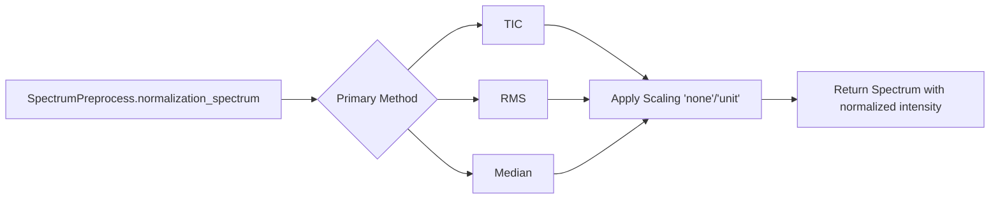

# MassFlow

This document introduces the normalization module in MassFlow, focusing on the unified entry `SpectrumPreprocess.normalization_spectrum` and helper functions defined in `preprocess/normalizer_helper.py`. It provides an overview, API specification, example code, parameter notes, and troubleshooting tips.

## Overview
- Input and output
  - Input: `massflow.module.spectrum.Spectrum` or `SpectrumImzML` (with 1D `intensity` and optional `mz_list`).
  - Output: A new `SpectrumImzML` with the same `mz_list` and coordinates; `intensity` is replaced by normalized (and optionally scaled) values.
- Methods
  - TIC (Total Ion Current) normalization: scales intensities such that the sum equals 1.
  - RMS (Root Mean Square) normalization: scales intensities such that the RMS equals 1.
  - Median normalization: scales intensities such that the median equals 1.

### Function Relationship Diagram



## Core API

### Preprocess.normalization (Data manager level)

```python
massflow.preprocess.dm_pre_fun.Preprocess.normalization(
  data_manager: MSDataManager,
  scale_method: str = "none",
  method: str = "tic",
  scale: float = 1.0,
  batch_size: int = 256,
  temp_dir: str = "./temp_normalization_data",
) -> MSDataManagerImzML
```
- Description: Data-manager-level entry for normalization. Processes all spectra in an `MSDataManager` using the same methods as the spectrum-level API, streaming data in batches and writing normalized spectra to disk.
- Input: `MSDataManagerImzML` (or subclass) containing spectra to be normalized.
- Output: A new `MSDataManagerImzML` with the same `mz_list`/coordinates as the original, and normalized `intensity` values.
- Notes:
  - Internally uses `BatchPreprocess.normalization_batch` to apply `SpectrumPreprocess.normalization_spectrum` over batches of spectra.
  - Batch-wise processing clears in-memory spectra and swaps normalized data out to disk, allowing large datasets to be processed within limited memory.

Example (data manager level):

```python
import numpy as np
from massflow.module.mass_spectrum_set import MassSpectrumSet
from massflow.module.ms_data_manager_imzml import MSDataManagerImzML
from massflow.preprocess.dm_pre_fun import Preprocess
from massflow.tools.plot import plot_spectrum

FILE_PATH = "data/example.imzML"
ms = MassSpectrumSet()
dm = MSDataManagerImzML(ms, filepath=FILE_PATH)
dm.load_full_data_from_file()

# Normalize all spectra using TIC (sum=1) without extra scaling
dm_norm = Preprocess.normalization(
    data_manager=dm,
    method="tic",
    scale_method="none",
    scale=1.0,
    batch_size=256,
)

sp_orig = dm.ms[0]
sp_norm = dm_norm.ms[0]

plot_spectrum(
    base=sp_orig,
    target=sp_norm,
    mz_range=(500.0, 510.0),
    intensity_range=(0.0, 1.5),
    metrics_box=True,
    title_suffix="DM_TIC",
)

dm.close()
dm_norm.close()
```

### SpectrumPreprocess.normalization_spectrum

```python
massflow.preprocess.spectrum_pre_fun.SpectrumPreprocess.normalization_spectrum(
  data: Spectrum | SpectrumImzML,
  scale_method: str = "none",
  method: str = "tic",
  scale: float = 1.0,
) -> SpectrumImzML
```
- Description: Unified entry for spectrum normalization. Dispatches to TIC, RMS, or Median normalization and optionally applies post-scaling. Returns a spectrum object preserving `mz_list` and coordinates, with normalized `intensity`.
- Notes:
  - This spectrum-level API performs no automatic memory cleanup; it simply returns a new spectrum instance. When applying it repeatedly over large datasets, you must manage memory yourself or prefer `Preprocess.normalization` at the data-manager level.
- Methods:
  - 'tic' (sum equals 1)
  - 'rms' (RMS equals 1)
  - 'median' (median equals 1)
- Parameters:
  - `scale`: Amplitude scaling factor applied after normalization (default 1.0).


### normalizer
```python
preprocess.normalizer_helper.normalizer(
  intensity: np.ndarray,
  scale_method: str = "none",
  method: str = "tic",
  scale: float = 1.0
) -> np.ndarray
```
- Description: Unified normalization dispatcher. Validates input and routes to `'tic'`, `'rms'`, or `'median'` normalization, then applies optional amplitude `scale` and `'unit'` min-max scaling.
- Parameters:
  - `intensity`: 1D numpy array to normalize.
  - `scale_method`: `'none' | 'unit'` (applied after primary normalization).
  - `method`: `'tic' | 'rms' | 'median'` (primary normalization).
  - `scale`: Amplitude scaling factor applied after normalization (default 1.0).
    - Must be a finite non-negative number.
  - Notes:
    - `scale_method` is case-insensitive and supports only `'none'` and `'unit'`.
- Returns:
  - `intensity`: normalized (and optionally scaled) 1D numpy array.
- Raises:
  - `ValueError`: unsupported `method`, `scale_method`; `scale` must be finite and non-negative.
  - `TypeError`: input not a non-empty 1D array.

### tic_normalize
```python
preprocess.normalizer_helper.tic_normalize(
  intensity: np.ndarray,
  scale_method: str = "none",
  scale: float = 1.0
) -> np.ndarray
```
- Description: Normalize by total ion current (sum). Divides by sum (TIC) when TIC > 0, then applies amplitude scaling `scale`, followed by optional `'unit'` min-max scaling.
- Parameters:
  - `scale_method`: `'none' | 'unit'` (min-max scaling to [0, 1] applied after normalization)
  - `scale`: Amplitude scaling factor applied after normalization (default 1.0)
    - Must be a finite non-negative number.
- Returns:
  - `intensity`: 1D numpy array; sum equals 1 before amplitude/optional unit scaling
- Exceptions: 
  - `ValueError`: TIC ≤ 0; unsupported `scale_method`; 
  - `TypeError`: input not a non-empty 1D array

Example: (after Savitzky-Golay denoising)

```python
import sys
import os
import numpy as np
from massflow.module.mass_spectrum_set import MassSpectrumSet
from massflow.module.ms_data_manager_imzml import MSDataManagerImzML
from massflow.preprocess.spectrum_pre_fun import SpectrumPreprocess
from massflow.tools.plot import plot_spectrum

FILE_PATH = "data/example.imzML"
ms = MassSpectrumSet()
ms_md = MSDataManagerImzML(ms, filepath=FILE_PATH)
ms_md.load_full_data_from_file()
sp = ms[0]
# Denoise then normalize
denoised = SpectrumPreprocess.noise_reduction_spectrum(
    data=sp,
    method="savgol",
    window=11,
    polyorder=3,
)
normalized_tic = SpectrumPreprocess.normalization_spectrum(
    data=denoised,
    method="tic",
    scale_method="none",
)

tic_origin = float(np.sum(denoised.intensity))
tic_after = float(np.sum(normalized_tic.intensity))
print(f"TIC normalized sum={tic_after:.6f}")

plot_spectrum(
    base=denoised,
    mz_range=(500.0, 510.0),
    intensity_range=(0.0, 1.5),
    title_suffix="Savgol_denoised",
)

plot_spectrum(
    base=normalized_tic,
    mz_range=(500.0, 510.0),
    intensity_range=(0.0, 1.5 / tic_origin),
    title_suffix="TIC_normalized_none",
)
```


### rms_normalize
```python
preprocess.normalizer_helper.rms_normalize(
  intensity: np.ndarray,
  scale_method: str = "none",
  scale: float = 1.0
) -> np.ndarray
```
 - Description: Normalize by root mean square (RMS). Divides by RMS when RMS > 0; if RMS ≤ 0 (or NaN), raises `ValueError`. Applies amplitude `scale`, then optional `'unit'` scaling.
- Parameters:
  - `scale_method`: `'none' | 'unit'` 
  - `scale`: Amplitude scaling factor applied after normalization (default 1.0)
    - Must be a finite non-negative number.
- Returns:
  - `intensity`: 1D numpy array; RMS equals 1 (before amplitude/optional unit scaling)
- Notes:
  - Implementation matches R style: `b = sqrt(mean(x^2))`; if `b > 0` then `y = scale * x / b`, otherwise an error is raised.
- Exceptions:
  - `ValueError`: RMS ≤ 0; unsupported `scale_method`.
  - `TypeError`: input not a non-empty 1D array.

Example: (after Savitzky-Golay denoising)

```python
# Denoise then normalize (same as TIC example)
denoised = SpectrumPreprocess.noise_reduction_spectrum(
    data=sp,
    method="savgol",
    window=11,
    polyorder=3,
)

normalized_rms = SpectrumPreprocess.normalization_spectrum(
    data=denoised,
    method="rms",
    scale_method="none",
)

# RMS before and after (RMS equals 1 after normalization when input RMS > 0)
rms_origin = float(np.sqrt(np.nanmean(np.square(denoised.intensity))))
rms_after = float(np.sqrt(np.nanmean(np.square(normalized_rms.intensity))))
print(f"RMS normalized value={rms_after:.6f}")

# Plot normalized spectrum; scale the y-range using original RMS for visibility
plot_spectrum(
    base=normalized_rms,
    mz_range=(500.0, 510.0),
    intensity_range=(0.0, 1.5 / max(rms_origin, 1e-12)),
    title_suffix="RMS_normalized_none",
)
```


### apply_scaling
```python
preprocess.normalizer_helper.apply_scaling(
  intensity: np.ndarray,
  scale_method: str
) -> np.ndarray
```
- Description: Apply scaling transformation after primary normalization.
  - `'none'`: return original values
  - `'unit'`: min-max scale to `[0, 1]`
- Parameters:
  - `scale_method`: `'none' | 'unit'` (case-insensitive)
- Returns:
  - `intensity`: scaled 1D numpy array
- Exceptions:
  - `ValueError`: unsupported `scale_method`.
  - `TypeError`: input not a non-empty 1D array.

### Optional 0–1 scaling (unit scaling)
```python
normalized_unit = SpectrumPreprocess.normalization_spectrum(
    data=denoised,
  method="tic",          # or "rms"
    scale_method="unit"    # min-max scaling to [0, 1]
)
plot_spectrum(
        base = normalized_unit,
        mz_range=(500.0, 510.0),
        intensity_range=(0.0, 0.1),
        title_suffix='TIC_normalized_unit'     
    )
```


- Use `'unit'` to scale the normalized intensity to `[0, 1]` for consistent visualization/comparison across spectra.

## Parameters and Tuning
- General
  - Choose `'tic'` for consistent total intensity across pixels; suitable for visualization, relative quantitation.
  - Choose `'median'` to reduce the influence of extreme values; robust for noisy spectra.
  - Use `'unit'` scaling for plotting or UI normalization; avoid if you need numeric properties like sum=1 or median=1 to remain interpretable.
- TIC
  - Sensitive to large peaks; consider prior denoising/baseline correction.
- Median
  - More robust against heavy-tailed distributions; preserves rank structure.

## Troubleshooting
- `ValueError: TIC value is not greater than 0`  
  Ensure the spectrum has non-zero sum after preprocessing; avoid using entirely empty or clipped spectra.
- `ValueError: Median value is not greater than 0`  
  Ensure intensities are not all zero; consider baseline correction or avoiding aggressive clipping.
 - `ValueError: RMS value is not greater than 0`  
   Check for empty/constant spectra or all-NaN values; ensure preprocessing retains signal.
- Unsupported method or scale_method  
  Check spelling: `method='tic'|'median'`, `scale_method='none'|'unit'`.

## References
- `preprocess/normalizer_helper.py` (TIC/RMS/median implementations and scaling)
- `preprocess/spectrum_pre_fun.py` (Spectrum-level entry points and parameter dispatch)
- `preprocess/dm_pre_fun.py` (Data-manager-level normalization entry)
- `module/spectrum.py` and `module/mass_spectrum_set.py` (Spectrum and MassSpectrumSet data structures)
- `src/massflow/tools/plot.py` (Plotting utilities for Spectrum/MassSpectrumSet)