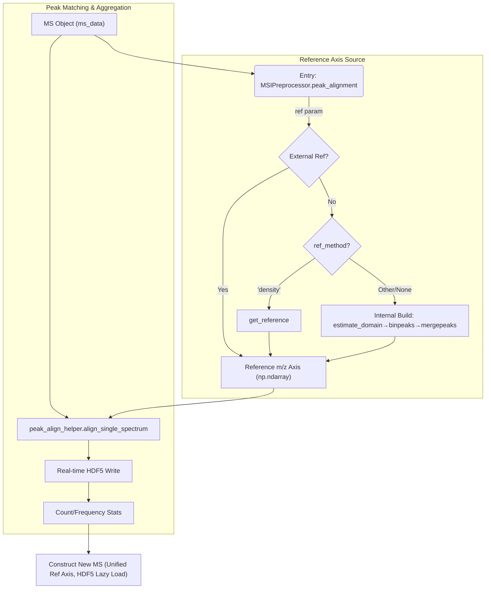

# MassFlow Peak Alignment

This document introduces the peak alignment workflow and implementation in MassFlow, focusing on construction of a reference m/z axis, per-spectrum peak matching and aggregation, tolerance estimation, and the unified external API. Core implementations reside in:

- `preprocess/peak_align_helper.py`
- `preprocess/ms_preprocess.py`

The goal is to provide implementation-centric details, including function signatures, parameter semantics, data shapes and flow, and reproducible usage examples.

## Overview

Layered design of “reference axis construction” and “peak matching & aggregation”:

- Reference domain and reference peaks
  - Automatically estimate the shared reference domain and resolution step: `estimate_domain`
  - Aggregate peaks of each spectrum into this domain using tolerance and averaging: `binpeaks`
  - Merge adjacent reference peaks within tolerance neighborhoods: `mergepeaks`
- Density-based reference peaks
  - Density method: when `ref_method='density'`, concatenate all m/z values and call `get_reference(mz_all, ref_mzres, ref_mzmaxshift, ref_mzunits)` to compute the reference axis
- Streaming alignment and disk persistence
  - Align per spectrum on the shared reference axis: `align_single_spectrum`
  - Alignment results are persisted in HDF5 in real time (`mz` and `intensity` datasets), dramatically reducing memory usage
  - Unit normalization and tolerance handling: `_normalize_units`, `_estimate_tolerance`
- Unified entry point
  - `MSIPreprocessor.peak_alignment` collects data, selects the reference axis source (external or internal), calls `peak_align`, and constructs a new `MS` collection; the returned `MS` contains `SpectrumHDF5Lazy` proxy objects to access on-disk data on demand

### Flow




## Core Functions

### MSIPreprocessor.peak_alignment Method

```python
def preprocess.ms_preprocess.MSIPreprocessor.peak_alignment(
    ms_data: MS,
    ref: np.ndarray | None = None,
    units: str = 'ppm',
    tolerance: float | None = None,
    binfun: str = 'median',
    binratio: int = 2,
    output_path: str | None = None,
    ref_method: str | None = None,
    ref_mzres: float | None = None,
    ref_mzmaxshift: float | None = None,
    ref_mzunits: str | None = None,
) -> MS
```

- Behavior
  - Collect each spectrum’s `mz_list` and `intensity`; validate non-empty and consistent lengths
  - Reference axis sources:
    - If `ref` is provided, use it directly
    - If `ref_method=='density'`, concatenate all m/z arrays and call `get_reference(mz_all, ref_mzres, ref_mzmaxshift, ref_mzunits)` to compute the reference axis
    - Otherwise, estimate the reference domain internally and construct reference peaks during alignment
  - Call `peak_align` to obtain `AlignResult` (`ms_aligned`, reference axis, counts, frequencies, tolerance, and units)
  - Construct a new `MS` aligned to `res.ref`, and use `SpectrumHDF5Lazy` proxies to read per-spectrum intensities from disk on demand
- Parameters
  - `ms_data` — Unaligned `MS` collection
  - `ref` — External reference axis; `None` means auto-estimation or density-based computation
  - `units` — Tolerance units, `'ppm'` or `'mz'/'absolute'`; default `'ppm'`
  - `tolerance` — Tolerance half-window; `None` triggers auto-estimation
  - `binfun` — Resolution aggregation policy, `'median'|'min'|'max'|'mean'`
  - `binratio` — Tolerance scaling factor; default 2
  - `output_path` — HDF5 output path; default auto-derivation:
    - If `ms_data.meta.filepath` (input `.imzML` path) is available, attempt to write `align_ms_{timestamp}.h5` to the same directory; if not writable, fall back to the current working directory
    - If no input file path is available, write `align_ms_{timestamp}.h5` to the current working directory
  - `ref_method` — Select reference axis source; `'density'` uses the kernel-density histogram method `get_reference`
  - `ref_mzres` — Histogram resolution for the reference axis; default mapping: ppm→`100.0`, Da→`0.01`
  - `ref_mzmaxshift` — Minimal spacing for peak detection (`gap` in `_find_peaks`); default mapping: ppm→`100.0`, `Da`→`0.05`
  - `ref_mzunits` — Units used for reference axis computation; defaults mapped from `units` (ppm→`'ppm'`; mz/absolute→`'Da'`)
- Return
  - A new `MS` object containing `SpectrumHDF5Lazy` proxies; all spectra share the same reference m/z axis and intensities are read from `output_path` on demand

### align_single_spectrum Function

```python
def preprocess.peak_align_helper.align_single_spectrum(
    idx: np.ndarray,
    dat: np.ndarray,
    ref: np.ndarray,
    tol: float,
    tol_ref: Literal['x','y','abs']
) -> np.ndarray
```

- Purpose
  - Align a single spectrum’s peak intensities to the shared reference axis `ref` under tolerance gating, returning an intensity vector of length `len(ref)`
- Key logic
  - Downsample branch: when `len(ref) <= 2 * len(idx)` or the reference axis is not strictly ascending, search nearest hits in the spectrum index and write to corresponding reference positions
    - Uses `_binary_search(ref, idx_sorted, tol, tol_ref, nearest=False)`; only in-tolerance hits are accepted
  - Upsample branch: when the reference axis is much denser, expand left/right around the initial hit positions on `ref` until exceeding the tolerance window, marking processed positions to avoid repeated overwrites
    - First, `_binary_search(idx_sorted, ref, tol, new_ref, nearest=False)` locates initial positions; then expand left/right
- Parameter notes
  - `tol_ref='x'` denotes relative tolerance (ppm, using the reference axis as denominator); `'abs'` denotes absolute tolerance (Da); `'y'` uses the spectrum index as denominator when needed
- Return
  - `np.ndarray`: aligned single-spectrum intensity column with length equal to the reference axis length

#### Examples

- Example 1: default reference axis construction

```python
>>> ms_ali = MSIPreprocessor.peak_alignment(ms_data, binfun='max')
INFO:     25-11-21 17:09 162 ms_preprocess - peak_alignment_entry: ref_method=None, units=ppm...
INFO:     25-11-21 17:09 625 peak_alignment - peak_align: start, spectra=33425, units=ppm...
INFO:     25-11-21 17:09 648 peak_alignment - peak_align: start domain estimation
INFO:     25-11-21 17:09 650 peak_alignment - peak_align: domain estimated, bins=87198, by=2.05e-05
INFO:     25-11-21 17:09 657 peak_alignment - peak_align: tolerance resolved to 4.1e-05 (units=relative)
INFO:     25-11-21 17:09 672 peak_alignment - peak_align: using estimated domain resolution
INFO:     25-11-21 17:12 704 peak_alignment - peak_align: ref built (27070 peaks). Starting stream alignment...
INFO:     25-11-21 17:14 760 peak_alignment - peak_align: writing HDF5 datasets to align_ms_{timestamp}.h5 (mz/intensity)...
INFO:     25-11-21 17:16 738 peak_alignment - peak_align: alignment complete.
INFO:     25-11-21 17:16 199 ms_preprocess - peak_alignment_entry: done, peaks=27070
>>> plot(ms_ali[0],mz_range=[100,1000],plot_mode=["stem"])
output:
```


- Example 2: comparison with Cardinal using the same parameters

```R
>>> ms_peakalign <- peakAlign(ms_raw,binfun='max')

detected ~883.9 peaks per spectrum
summarizing peak gaps for alignment
using bin function ‘max’ to summarize peak gaps across spectra
# processing chunk 1/20 (1672 items | 13.48 MB)
# processing chunk 2/20 (1671 items | 12.87 MB)
# processing chunk 3/20 (1671 items | 12.79 MB)
# processing chunk 4/20 (1671 items | 12.63 MB)
# processing chunk 5/20 (1672 items | 12.6 MB)
# processing chunk 6/20 (1671 items | 12.21 MB)
# processing chunk 7/20 (1671 items | 11.78 MB)
# processing chunk 8/20 (1671 items | 11.57 MB)
# processing chunk 9/20 (1671 items | 11.51 MB)
# processing chunk 10/20 (1672 items | 11.43 MB)
# processing chunk 11/20 (1671 items | 11.22 MB)
# processing chunk 12/20 (1671 items | 11 MB)
# processing chunk 13/20 (1671 items | 10.72 MB)
# processing chunk 14/20 (1671 items | 10.68 MB)
# processing chunk 15/20 (1672 items | 10.53 MB)
# processing chunk 16/20 (1671 items | 10.76 MB)
# processing chunk 17/20 (1671 items | 11.2 MB)
# processing chunk 18/20 (1671 items | 11.88 MB)
# processing chunk 19/20 (1671 items | 13.3 MB)
# processing chunk 20/20 (1672 items | 13.9 MB)
# collecting 33425 results from 20 chunks
estimated relative tolerance of 4.1e-05
using bin ratio of 2 to create peak bins (per tolerance half-window)
using peak bins with relative resolution of 2.05e-05
binning peaks to create shared reference
# processing chunk 1/20 (1672 items | 13.48 MB)
# processing chunk 2/20 (1671 items | 12.87 MB)
# processing chunk 3/20 (1671 items | 12.79 MB)
# processing chunk 4/20 (1671 items | 12.63 MB)
# processing chunk 5/20 (1672 items | 12.6 MB)
# processing chunk 6/20 (1671 items | 12.21 MB)
# processing chunk 7/20 (1671 items | 11.78 MB)
# processing chunk 8/20 (1671 items | 11.57 MB)
# processing chunk 9/20 (1671 items | 11.51 MB)
# processing chunk 10/20 (1672 items | 11.43 MB)
# processing chunk 11/20 (1671 items | 11.22 MB)
# processing chunk 12/20 (1671 items | 11 MB)
# processing chunk 13/20 (1671 items | 10.72 MB)
# processing chunk 14/20 (1671 items | 10.68 MB)
# processing chunk 15/20 (1672 items | 10.53 MB)
# processing chunk 16/20 (1671 items | 10.76 MB)
# processing chunk 17/20 (1671 items | 11.2 MB)
# processing chunk 18/20 (1671 items | 11.88 MB)
# processing chunk 19/20 (1671 items | 13.3 MB)
# processing chunk 20/20 (1672 items | 13.9 MB)
# collecting 33425 results from 20 chunks
merging peak bins with relative centroid differences <= 4.1e-05
aligned to 27070 reference peaks with relative tolerance 4.1e-05 (41 ppm)

>>> plot(ms_peakalign,i=1,xlim=c(100,1000),type="h")
output:
```


### peak_align Function

```python
def preprocess.peak_align_helper.peak_align(
    ms_data: MS,
    ref: np.ndarray | None = None,
    binfun: Literal['median','min','max','mean'] = 'min',
    binratio: int = 2,
    tolerance: float | None = None,
    units: Literal['ppm','mz','relative','absolute'] = 'ppm',
    output_path: str = 'aligned_data.h5',
) -> AlignResult
```

- Functionality
  - Unit normalization (`'ppm'/'relative'`→`'relative'`, `'mz'/'absolute'`→`'absolute'`)
  - Reference domain estimation and reference peak construction (when `ref` is missing: `estimate_domain`→`binpeaks`→`mergepeaks`)
  - Automatic tolerance estimation (when `tolerance` is missing: `_estimate_tolerance`)
  - Streaming alignment and disk persistence: call `align_single_spectrum` per spectrum and write results to HDF5 (`mz`/`intensity` datasets)
  - Output counts and frequency statistics
- Parameters
  - `ms_data` — Unaligned `MS` collection
  - `ref` — External reference peak vector; `None` triggers internal construction
  - `binfun`/`binratio`/`tolerance`/`units`
  - `output_path` — HDF5 output path (file contains `mz` and `intensity` datasets; `intensity` shape is `[nspec, n_peaks]` with `chunks=(1, n_peaks)` and gzip compression)
- Return
  - `AlignResult`: `ms_aligned`, reference axis, counts, frequencies, tolerance, and units

### AlignResult Dataclass

```python
class preprocess.peak_align_helper.AlignResult(ms_aligned, ref, count, freq, tolerance, units, binfun, binratio)
```

- Fields
  - `ms_aligned` — Aligned `MS` collection where all spectra share the reference axis; internal spectra are `SpectrumHDF5Lazy` proxies that load `mz_list/intensity` from HDF5 on access
  - `ref` — Reference peak vector (ascending)
  - `count` — Hit count per reference peak
  - `freq` — Hit frequency (`count/nspec`)
  - `tolerance/units/binfun/binratio` — Echoed runtime parameters

### estimate_domain Function

```python
def preprocess.peak_align_helper.estimate_domain(xlist, width='median', units='relative') -> (domain, by)
```

- Functionality
  - Estimate resolution and range of per-spectrum peak indices, and aggregate resolution by `width`
  - Generate an ascending reference domain (relative sequence or linear sequence) based on units and apply minimum resolution thresholding
- Return
  - `(domain, by)`: reference domain and resolution step

### binpeaks Function

```python
def preprocess.peak_align_helper.binpeaks(peaklist, domain=None, xlist=None, tol=None, tol_ref='abs', merge=False, na_drop=True) -> PeakBins
```

- Functionality
  - Initial mapping: for each spectrum, use `_binary_search(nearest=False)` to map peak indices to bins in `domain`
  - Conflict deduplication: when the same spectrum hits the same bin, keep the one closer to the bin center (relative/absolute differences), mark others as no-hit
  - Aggregate hits per bin, average peak positions and intensities, and record counts
- Return
  - `PeakBins`: `peaks/values/counts/tolerance/domain`

### mergepeaks Function

```python
def preprocess.peak_align_helper.mergepeaks(peaks, n, x, tol=None, tol_ref='abs', na_drop=True) -> PeakBins
```

- Functionality
  - Within the tolerance half-window, expand left/right to find the neighborhood `[i..j]`, compute the count-weighted mean position and intensity, update the middle index, and clear the others
  - Expansion gating by counts: once counts rise again after passing the mode side, treat it as a new peak and stop expansion immediately

### _binary_search Function

```python
def preprocess.peak_align_helper._binary_search(x, table, tol=0.0, tol_ref='abs', nomatch=-1, nearest=False) -> np.ndarray
```

- Functionality
  - In a sorted `table`, for each `x[i]` find left/right neighbors and compare relative/absolute differences; if within tolerance, return the closer one (tie-break to the left)

### _rel_diff Function

```python
def preprocess.peak_align_helper._rel_diff(x, y=None, ref='y') -> np.ndarray
```

- Functionality
  - Compute relative/absolute differences; when `y` is not provided, compute adjacent differences of `x`

### _es_resolution Function

```python
def preprocess.peak_align_helper._es_resolution(x, tol=None, ref=None) -> float
```

- Functionality
  - Choose a reference (MAD robustness on adjacent absolute/relative differences) and return the minimum difference as resolution
  - Optional tolerance threshold for grid consistency checks

### _estimate_tolerance Function

```python
def preprocess.peak_align_helper._estimate_tolerance(
    indexbins: np.ndarray,
    binratio: int,
    units: Literal['relative','absolute']
) -> float
```

- Purpose
  - Based on the shared reference domain `indexbins` resolution estimation `_es_resolution`, multiply by `binratio` to obtain the tolerance half-window
- Rounding policy
  - Relative units: round to 6-digit half-steps (`round(2*tol, 6)/2`); absolute units: 4 digits (`round(tol, 4)`)
- Return
  - `float`: tolerance half-window used by `_binary_search/expansion`

### get_reference Function (Density Method)

```python
def preprocess.peak_align_helper.get_reference(mz, mzres, mzmaxshift, mzunits) -> np.ndarray
```

- Functionality
  - Using kernel density estimation in histogram space, find high-frequency peak locations and return an ascending consensus m/z reference axis
  - Includes smoothing (tricubic weights), PCHIP interpolation, MAD thresholding, tie-breaking, and local extrema detection
- Parameters
  - `mz` — concatenated m/z array (1D)
  - `mzres` — histogram resolution (bin width)
  - `mzmaxshift` — minimal spacing for peak detection (used as `gap`)
  - `mzunits` — `'Da'` or `'ppm'` (operate in ppm space when in ppm mode and convert back to m/z)


## Parameter and Unit Conventions

- Unit normalization:
  - `'ppm'/'relative'` normalized to relative units; `'mz'/'absolute'` normalized to absolute units
  - Difference reference selection in alignment/search: relative→`tol_ref='x'`; absolute→`tol_ref='abs'`
- Tolerance estimation:
  - When `tolerance=None`, first estimate resolution via `_es_resolution`, then multiply by `binratio`
  - Rounding rules: relative uses 6-digit half-steps (`round(2*res, 6)/2`), absolute uses 4 digits
- Reference axis construction:
  - When external `ref` is provided, skip internal construction
  - `'density'` requires providing or auto-mapping `ref_mzres/ref_mzmaxshift/ref_mzunits`
- Ordering constraints:
  - `_binary_search` requires an ascending `table`, otherwise raises `ValueError`
  - `binpeaks` requires an ascending `domain`, otherwise raises `ValueError`
- Default mappings for density-based reference:
  - In ppm: `ref_mzres=100.0`, `ref_mzmaxshift=100.0`; in Da: `ref_mzres=0.01`, `ref_mzmaxshift=0.05`


## Data Flow Summary

1. Collect all spectra’s `mz_list` and `intensity`
2. Choose reference axis source (external `ref`, `'density'` method, or internal domain & peak estimation)
3. Normalize units and parse/estimate tolerance
4. Align per spectrum on the reference axis and persist results to HDF5 in real time (no large in-memory matrices)
5. Construct a new `MS` collection sharing the unified m/z axis; spectra are HDF5 lazy-loading proxies that read intensities on demand


## Extensibility Notes

- Tolerance strategy: `binratio` can be tuned based on instrument drift and resolution; manual `tolerance` is supported
- Scalability: for sparse peak lists, prefer absolute units with a shorter reference axis to reduce search and expansion costs


## Glossary

- Reference axis: row index of aligned data, ascending m/z list (stored in the HDF5 `mz` dataset)
- Relative tolerance (ppm): half-window proportional to m/z
- Absolute tolerance (Da): fixed m/z half-window
- downsample/upsample: two alignment strategies for shorter/longer reference axes
- Count-weighted mean: aggregation strategy using hit counts as weights
- Lazy-loading proxy: `SpectrumHDF5Lazy` loads data from HDF5 upon property access
