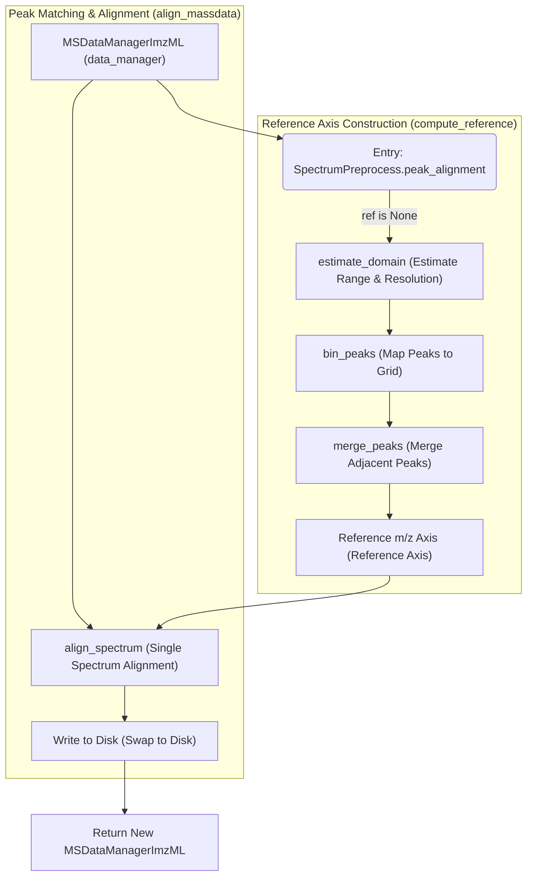

# MassFlow Peak Alignment

This document introduces the peak alignment workflow and implementation details in MassFlow, focusing on reference m/z axis construction, single-spectrum peak matching and aggregation, tolerance estimation, and the unified external API. The core implementations are located in:

- `src/massflow/preprocess/peak_align_helper.py`
- `src/massflow/preprocess/spectrum_preprocess.py`

This document aims to provide implementation-centric details, including function signatures, parameter semantics, data shapes, and data flow.

## Overview

MassFlow's peak alignment design adopts a layered architecture, mainly consisting of two stages: "Reference Axis Construction" and "Peak Matching & Aggregation":

- **Reference Axis Construction**
  - Automatically estimate the shared reference domain and resolution step: `estimate_domain`
  - Aggregate peaks from each spectrum into this domain using tolerance and averaging: `bin_peaks`
  - Merge adjacent reference peaks within a tolerance neighborhood: `merge_peaks`
  - Top-level wrapper function: `compute_reference`

- **Streaming Alignment & Persistence**
  - Align each spectrum to the shared reference axis: `align_spectrum`
  - Support batch processing of `MSDataManagerImzML` objects: `align_massdata`
  - Alignment results are written to disk (temporary directory) in real-time via the `MSDataManagerImzML` mechanism, significantly reducing memory usage.

- **Unified Entry Point**
  - `SpectrumPreprocess.peak_alignment`: Responsible for receiving data, selecting the backend (Python or Cardinal), and calling the corresponding alignment logic.

### Flow



## Core Functions

### SpectrumPreprocess.peak_alignment Method

```python
def peak_alignment(
    data_manager: Optional[MSDataManagerImzML] = None,
    spectrum: Optional[SpectrumImzML] = None,
    ref: Optional[np.ndarray] = None,
    units: str = 'ppm',
    tolerance: Optional[float] = None,
    binfun: str = 'median',
    binratio: int = 2,
    backend_method: Optional[str] = None
)
```

- **Behavior**
  - Serves as the unified entry point for peak alignment.
  - Supports `backend_method="cardinal"` to call the R language Cardinal package for alignment.
  - If `backend_method` is `None` or `"python"`, the pure Python implementation is used.
  - Supports alignment of a single `spectrum` or an entire `data_manager`.
  - If `ref` (reference axis) or `tolerance` is not provided, it is automatically calculated internally.
- **Parameters**
  - `data_manager` — The `MSDataManagerImzML` data manager object to be aligned.
  - `spectrum` — The single `SpectrumImzML` object to be aligned.
  - `ref` — External reference m/z axis; if `None`, it is automatically estimated.
  - `units` — Tolerance units, `'ppm'` (relative) or `'absolute'` (absolute).
  - `tolerance` — Tolerance half-window; `None` triggers automatic estimation.
  - `binfun` — Resolution aggregation policy, `'median'|'min'|'max'|'mean'`.
  - `binratio` — Tolerance scaling factor; default is 2.
  - `backend_method` — Backend method selection, `"python"` (default) or `"cardinal"`.
- **Returns**
  - The aligned `MSDataManagerImzML` or `SpectrumImzML` object.

#### Examples

- Example 1: Default reference axis calculation

```python
>>> ms_ali = MSIPreprocessor.peak_alignment(ms_data, binfun='max')
INFO:     25-11-21 17:09 162 ms_preprocess - peak_alignment_entry: ref_method=None, units=ppm...
INFO:     25-11-21 17:09 625 peak_alignment - peak_align: start, spectra=33425, units=ppm...
INFO:     25-11-21 17:09 648 peak_alignment - peak_align: start domain estimation
INFO:     25-11-21 17:09 650 peak_alignment - peak_align: domain estimated, bins=87198, by=2.05e-05
INFO:     25-11-21 17:09 657 peak_alignment - peak_align: tolerance resolved to 4.1e-05 (units=relative)
INFO:     25-11-21 17:09 672 peak_alignment - peak_align: using estimated domain resolution
INFO:     25-11-21 17:12 704 peak_alignment - peak_align: ref built (27070 peaks). Starting stream alignment...
INFO:     25-11-21 17:14 760 peak_alignment - peak_align: writing HDF5 datasets to align_ms_{timestamp}.h5 (mz/intensity)...
INFO:     25-11-21 17:16 738 peak_alignment - peak_align: alignment complete.
INFO:     25-11-21 17:16 199 ms_preprocess - peak_alignment_entry: done, peaks=27070
>>> plot(ms_ali[0],mz_range=[100,1000],plot_mode=["stem"])
output:
```


- Example 2: Cardinal calculation results with the same parameters

```R
>>> ms_peakalign <- peakAlign(ms_raw,binfun='max')

detected ~883.9 peaks per spectrum
summarizing peak gaps for alignment
using bin function ‘max’ to summarize peak gaps across spectra
# processing chunk 1/20 (1672 items | 13.48 MB)
# processing chunk 2/20 (1671 items | 12.87 MB)
# processing chunk 3/20 (1671 items | 12.79 MB)
# processing chunk 4/20 (1671 items | 12.63 MB)
# processing chunk 5/20 (1672 items | 12.6 MB)
# processing chunk 6/20 (1671 items | 12.21 MB)
# processing chunk 7/20 (1671 items | 11.78 MB)
# processing chunk 8/20 (1671 items | 11.57 MB)
# processing chunk 9/20 (1671 items | 11.51 MB)
# processing chunk 10/20 (1672 items | 11.43 MB)
# processing chunk 11/20 (1671 items | 11.22 MB)
# processing chunk 12/20 (1671 items | 11 MB)
# processing chunk 13/20 (1671 items | 10.72 MB)
# processing chunk 14/20 (1671 items | 10.68 MB)
# processing chunk 15/20 (1672 items | 10.53 MB)
# processing chunk 16/20 (1671 items | 10.76 MB)
# processing chunk 17/20 (1671 items | 11.2 MB)
# processing chunk 18/20 (1671 items | 11.88 MB)
# processing chunk 19/20 (1671 items | 13.3 MB)
# processing chunk 20/20 (1672 items | 13.9 MB)
# collecting 33425 results from 20 chunks
estimated relative tolerance of 4.1e-05
using bin ratio of 2 to create peak bins (per tolerance half-window)
using peak bins with relative resolution of 2.05e-05
binning peaks to create shared reference
# processing chunk 1/20 (1672 items | 13.48 MB)
# processing chunk 2/20 (1671 items | 12.87 MB)
# processing chunk 3/20 (1671 items | 12.79 MB)
# processing chunk 4/20 (1671 items | 12.63 MB)
# processing chunk 5/20 (1672 items | 12.6 MB)
# processing chunk 6/20 (1671 items | 12.21 MB)
# processing chunk 7/20 (1671 items | 11.78 MB)
# processing chunk 8/20 (1671 items | 11.57 MB)
# processing chunk 9/20 (1671 items | 11.51 MB)
# processing chunk 10/20 (1672 items | 11.43 MB)
# processing chunk 11/20 (1671 items | 11.22 MB)
# processing chunk 12/20 (1671 items | 11 MB)
# processing chunk 13/20 (1671 items | 10.72 MB)
# processing chunk 14/20 (1671 items | 10.68 MB)
# processing chunk 15/20 (1672 items | 10.53 MB)
# processing chunk 16/20 (1671 items | 10.76 MB)
# processing chunk 17/20 (1671 items | 11.2 MB)
# processing chunk 18/20 (1671 items | 11.88 MB)
# processing chunk 19/20 (1671 items | 13.3 MB)
# processing chunk 20/20 (1672 items | 13.9 MB)
# collecting 33425 results from 20 chunks
merging peak bins with relative centroid differences <= 4.1e-05
aligned to 27070 reference peaks with relative tolerance 4.1e-05 (41 ppm)

>>> plot(ms_peakalign,i=1,xlim=c(100,1000),type="h")
output:
```


### align_massdata Function

```python
def align_massdata(
    data_manager: MSDataManagerImzML,
    reference: Optional[NDArray[np.float64]] = None,
    tolerance: Optional[float] = None,
    units: str = "ppm",
    binfun: str = "max",
    binratio: float = 2.0,
) -> MSDataManagerImzML
```

- **Functionality**
  - Performs batch alignment on all spectra in `MSDataManagerImzML`.
  - If `reference` or `tolerance` is not provided, calls `compute_reference` to calculate them.
  - Creates a new `MSDataManagerImzML` (located in `./temp_align_data`) to store the aligned data.
  - Processes spectra one by one, calls `align_spectrum`, and writes the results to disk.
- **Returns**
  - A new `MSDataManagerImzML` object containing the aligned data.

### align_spectrum Function

```python
def align_spectrum(
    spectrum: SpectrumImzML,
    reference: NDArray[np.float64],
    tolerance: float,
    units: str = "ppm",
) -> SpectrumImzML
```

- **Purpose**
  - Aligns the peak intensities of a single spectrum to the shared reference axis `reference`, returning a new `SpectrumImzML` object.
- **Key Logic**
  - **Downsample Branch**: When the reference axis length is short (`n_ref <= 2 * n_peaks`), iterates through each point of the reference axis and finds the nearest matching peak in the spectrum.
    - Uses `search_nearest` to find the nearest neighbor.
  - **Upsample Branch**: When the reference axis is very dense, iterates through each peak in the spectrum, finds its insertion position on the reference axis, and expands left/right until the tolerance window is exceeded.
    - This method prevents missing peaks and can handle cases where one peak corresponds to multiple reference points (although usually avoided by `bin_peaks`, it may happen with high-resolution reference axes).
- **Parameter Description**
  - `units='ppm'` indicates using relative tolerance; `'absolute'` indicates using absolute tolerance.

### compute_reference Function

```python
def compute_reference(
    data_manager: MSDataManagerImzML,
    binfun="median",
    binratio=2.0,
    units="ppm",
    clear_memory=False
) -> Tuple[NDArray[np.float64], float]
```

- **Functionality**
  - Calculates the reference m/z axis and tolerance.
  - Sequentially calls `estimate_domain` (estimate grid), `bin_peaks` (classify peaks), and `merge_peaks` (merge peaks).
- **Returns**
  - `(reference, tolerance)`: The reference axis array and the calculated tolerance value.

### estimate_domain Function

```python
def estimate_domain(
    data_manager: MSDataManagerImzML,
    binfun: str = "median",
    binratio: float = 2.0,
    units: str = "relative",
    clear_memory: bool = True,
) -> Tuple[NDArray[np.float64], float]
```

- **Functionality**
  - Iterates through all spectra to estimate the m/z range (`min`, `max`) and resolution (`resolution`).
  - Aggregates resolutions according to `binfun` (e.g., median, min) to get the step size `step`.
  - Generates a geometric sequence (PPM) or arithmetic sequence (Absolute) covering the full range as the initial `domain`.
  - Calculates the suggested `tolerance`.

### bin_peaks Function

```python
def bin_peaks(
    data_manager: MSDataManagerImzML,
    domain: NDArray[np.float64],
    tolerance: float,
    tol_method: Literal["abs", "x", "y"] = "abs",
) -> NDArray[np.float64]
```

- **Functionality**
  - Maps peaks from all spectra to the `domain` grid.
  - **Conflict Resolution**: When multiple peaks from the same spectrum map to the same bin, keeps the one closest to the bin center and discards the others.
  - Accumulates peak positions and counts for each bin.
  - Calculates the weighted average position.
  - Finally calls `merge_peaks` for further merging.

### merge_peaks Function

```python
def merge_peaks(
    mz_list: NDArray[np.float64],
    counts: NDArray[np.int64],
    tolerance: float,
    tol_method: Literal["abs", "x", "y"] = "abs",
) -> NDArray[np.float64]
```

- **Functionality**
  - Merges adjacent peaks that are too close (within the `tolerance` range).
  - **Expansion Logic**: Expands left/right from a peak, continuing to merge as long as the distance is within tolerance and the counts do not show a "valley" (i.e., remain monotonic or flat).
  - Calculates the merged weighted average m/z and total count.

### search_nearest Function

```python
def search_nearest(
    queries: NDArray[np.float64],
    targets: NDArray[np.float64],
    tolerance: float = 0.0,
    tol_method: Literal["x", "y", "abs"] = "abs",
    nomatch_value: int = -1,
    force_nearest: bool = False,
) -> NDArray[np.int64]
```

- **Functionality**
  - Finds matching indices for `queries` in the sorted array `targets`.
  - Uses `np.searchsorted` for binary search to locate the insertion point, then checks left and right neighbors.
  - Determines the best match based on `tolerance` and `tol_method`.
  - `force_nearest=True` can ignore tolerance and force returning the nearest neighbor.

## Parameter and Unit Conventions

- **Unit Normalization**:
  - `'ppm'` / `'relative'` normalized to relative units.
  - `'absolute'` normalized to absolute units.
  - In difference calculation: relative units correspond to `tol_ref='x'` (or `'y'`), absolute units correspond to `tol_ref='abs'`.
- **Tolerance Estimation**:
  - When `tolerance=None`, `estimate_domain` automatically calculates it based on the data's resolution distribution.
  - The calculation formula involves `step * binratio`.
- **Sorting Constraints**:
  - `search_nearest` requires `targets` to be sorted in ascending order.
  - `merge_peaks` requires the input peak list to be sorted.

## Data Flow Summary

1. **Collect Information**: Iterate through spectra in `data_manager` to collect m/z range and resolution information.
2. **Construct Reference Axis**:
   - `estimate_domain`: Generate the initial grid.
   - `bin_peaks`: Map all peaks to the grid and calculate the weighted average.
   - `merge_peaks`: Merge adjacent peaks to get the final `reference` axis.
3. **Execute Alignment**:
   - `align_massdata` creates a new data manager.
   - Loop to call `align_spectrum`, projecting each spectrum's data onto the `reference` axis.
   - Results are written to disk in real-time, freeing up memory.
4. **Return Results**: Return the `MSDataManagerImzML` object containing the aligned data.

## Extensibility Notes

- **Tolerance Strategy**: The `binratio` parameter can be adjusted based on instrument drift and resolution; manually specifying `tolerance` is also supported.
- **Scalability**: The algorithm design considers memory efficiency, supporting large-scale datasets through streaming processing and disk swapping.
