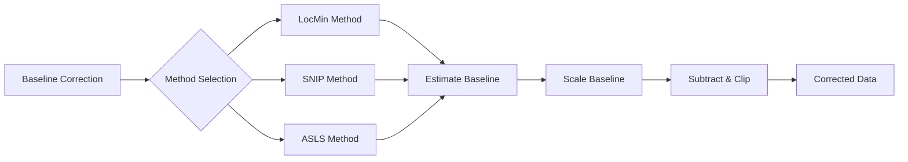

# MassFlow

本文介绍 MassFlow 中的基线校正（baseline correction）模块，重点包括：
- 光谱级入口 `SpectrumPreprocess.baseline_correction_spectrum`
- 数据管理器级入口 `Preprocess.baseline_correction`
- `preprocess/baseline_correction_helper.py` 中的各类辅助函数

## 概述
- 输入与输出
  - 光谱级：输入 `massflow.module.spectrum.Spectrum`（或 `SpectrumImzML`），其 `intensity` 与 `mz_list` 为一维数组；输出为新的 `SpectrumImzML`，其 `mz_list` 与坐标保持不变，`intensity` 为基线校正后的结果。
  - 数据管理器级：输入 `massflow.module.ms_data_manager.MSDataManager`（通常为 `MSDataManagerImzML`）；输出为新的 `MSDataManagerImzML`，其中所有光谱通过 `Preprocess.baseline_correction` 完成基线校正，并使用批处理与磁盘换出控制内存占用。
- 方法
  - LocMin（局部极值插值）：基于局部极值锚点插值估计基线，可选平滑。
  - SNIP（Statistics-Sensitive Non-linear Iterative Peak-clipping）：多尺度迭代裁剪估计基线，适合峰形保留。
  - SNIP（Numba 加速变体）：与 SNIP 算法一致，由 `snip_baseline_numba` 实现，在大规模光谱上更快。
  - ASLS（Asymmetric Least Squares）：非对称最小二乘估计基线，具有较强的峰保留能力。由于计算复杂度较高，运行速度较慢，适合对单谱或少量质谱进行精确的基线校正。
- 基线缩放
  - `baseline_scale` 用于将估计基线按 `(0, 1]`（默认 `1.0`）缩放，以避免过度扣除。
  - 实际扣除的是“缩放后的基线”；设置 `baseline_scale=1.0` 可保持算法原生行为。

### 函数关系示意图



## 核心 API

### Preprocess.baseline_correction（数据管理器级）
```python
massflow.preprocess.dm_pre_fun.Preprocess.baseline_correction(
  data_manager: MSDataManager,
  method: str = "asls",
  smooth: str = "none",
  span: float = 0.1,
  s: float | None = 0.0,
  upper: bool = False,
  width: int = 5,
  lam: float = 1e7,
  p: float = 0.01,
  niter: int = 15,
  baseline_scale: float = 1.0,
  m: int | None = None,
  decreasing: bool = True,
  batch_size: int = 256,
  temp_dir: str = "./temp_baseline_data",
) -> MSDataManagerImzML
```
- 描述：数据管理器级基线校正入口。对 `MSDataManager` 中的所有光谱应用与光谱级 API 相同的算法，按批次处理并将结果写入磁盘。
- 输入：包含待处理光谱的 `MSDataManagerImzML`（或其子类）。
- 输出：新的 `MSDataManagerImzML`，其光谱的 `mz_list` 与坐标与原始数据一致，`intensity` 为基线校正后的结果。
- 说明：
  - 内部使用 `BatchPreprocess.baseline_correction_batch` 在批次上调用 `SpectrumPreprocess.baseline_correction_spectrum`。
  - 按批次处理会清理内存中的光谱数据（`MSDataManager.clear_batch_data_memory`），并将校正后的批次写出到磁盘，从而支持大数据集在有限内存下运行。
  - 支持方法包括：Python 版本（`"locmin"`, `"snip"`, `"asls"`）以及 Numba 加速的 SNIP（`"snip_numba"`）。

示例（数据管理器级）：

```python
from massflow.module.mass_spectrum_set import MassSpectrumSet
from massflow.module.ms_data_manager_imzml import MSDataManagerImzML
from massflow.preprocess.dm_pre_fun import Preprocess
from massflow.tools.plot import plot_spectrum

FILE_PATH = "data/example.imzML"
ms = MassSpectrumSet()
dm = MSDataManagerImzML(ms, filepath=FILE_PATH)
dm.load_full_data_from_file()

dm_corrected = Preprocess.baseline_correction(
    data_manager=dm,
    method="snip_numba",  # 使用 Numba 加速的 SNIP 提升速度
    m=50,
    baseline_scale=1.0,
    batch_size=256,
)

sp_orig = dm.ms[0]
sp_corr = dm_corrected.ms[0]

plot_spectrum(
    base=sp_orig,
    target=sp_corr,
    mz_range=(400.0, 450.0),
    intensity_range=(0.0, 2.0),
    metrics_box=True,
    title_suffix="DM_SNIPNumba",
)

dm.close()
dm_corrected.close()
```

### SpectrumPreprocess.baseline_correction_spectrum（光谱级）
```python
massflow.preprocess.spectrum_pre_fun.SpectrumPreprocess.baseline_correction_spectrum(
  data: Spectrum | SpectrumImzML,
  method: str = "asls",
  smooth: str = "none",
  span: float = 0.1,
  s: float | None = 0.0,
  upper: bool = False,
  width: int = 5,
  lam: float = 1e7,
  p: float = 0.01,
  niter: int = 15,
  baseline_scale: float = 1.0,
  m: int | None = None,
  decreasing: bool = True,
) -> SpectrumImzML
```
- 描述：单条光谱基线校正的统一入口。根据 `method` 分发到 LocMin、SNIP 或 ASLS，并返回新的 `SpectrumImzML`，其 `mz_list`/坐标保持不变，`intensity` 为基线校正后的结果。
- 支持方法：`"locmin"`、`"snip"`、`"snip_numba"`、`"asls"`。
- 说明：
  - 此光谱级 API 不会自动进行内存清理，只是返回新的光谱对象。对于大规模数据集，优先使用数据管理器级 `Preprocess.baseline_correction`。
  - 若需要显式获得 baseline 数组（用于分析或绘图），请直接使用 `baseline_corrector`。
- 异常：`ValueError`（不支持的方法）、`TypeError`（输入类型非法）

### baseline_corrector
```python
preprocess.baseline_correction_helper.baseline_corrector(
  intensity: np.ndarray,
  index: np.ndarray | None = None,
  method: str = "asls",
  smooth: str = "none",
  span: float = 0.1,
  s: float | None = 0.0,
  upper: bool = False,
  width: int = 5,
  lam: float = 1e7,
  p: float = 0.01,
  niter: int = 15,
  baseline_scale: float = 1.0,
  m: int | None = None,
  decreasing: bool = True,
) -> tuple[np.ndarray, np.ndarray]
```
- 参数：
  - `intensity`：一维强度数组。
  - `index`：可选的一维坐标数组（例如 m/z），用于长度一致性校验，也可用于绘图等场景。
  - `method`：`'locmin' | 'snip' | 'snip_numba' | 'asls'`。
  - `smooth`, `span`, `s`, `upper`, `width`：LocMin 参数（平滑与锚点检测）。
  - `lam`, `p`, `niter`：ASLS 参数。
  - `baseline_scale`：基线缩放因子，取值范围 `(0,1]`（默认 `1.0`）。
  - `m`, `decreasing`：SNIP 参数（Python 与 Numba 版本共用）。
- 返回值：
  - `(corrected, scaled_baseline)`：基线校正后的强度与“缩放后的基线”。
- 异常：
  - `ValueError`：不支持的 `method`；输入数组非 1D 或为空；`baseline_scale` 非法等。

### locmin_baseline
```python
preprocess.baseline_correction_helper.locmin_baseline(
  intensity: np.ndarray,
  smooth: str = "none",
  span: float = 0.1,
  s: float | None = 0.0,
  upper: bool = False,
  width: int = 5
) -> np.ndarray
```
- 描述：基于局部极值锚点插值估计基线。通过窗口规则检测局部最小值（若 `upper=True` 则检测局部最大值），强制加入两端点作为锚点，再线性插值形成基线；可选 Loess（`smooth='loess', span`）或样条（`smooth='spline', s`）平滑。
- 参数：
  - `smooth`：`'none' | 'loess' | 'spline'`
  - `span`：Loess 平滑跨度比例（0 < span ≤ 1），默认 0.1
  - `s`：样条平滑目标残差平方和；`0.0` 表示插值
  - `upper`：为 `True` 时使用局部最大值作为锚点（上包络）；否则使用局部最小值
  - `width`：用于局部极值检测的邻域宽度（默认 5）
- 说明：
  - `s=0.0` 表示通过所有锚点精确插值；`s>0.0` 会使样条更平滑。
  - 两端点总会作为锚点加入，以保证全区间覆盖。
  - 最小值与最大值检测规则是对称的；最大值用于构造上包络。
- 异常：
  - `ValueError`：`smooth` 非法；`span` 不在 `(0,1]`；`s < 0`；`width < 3`。
  - `TypeError`：`width` 非整数；`intensity` 非一维数组。

示例：

```python
import numpy as np
from massflow.module.spectrum import Spectrum
from massflow.preprocess.spectrum_pre_fun import SpectrumPreprocess
from massflow.tools.plot import plot_spectrum

sp = Spectrum(mz_list=mz_data, intensity=intensity_original, coordinate=[0, 0, 0])

corrected_sp = SpectrumPreprocess.baseline_correction_spectrum(
    data=sp,
    method="locmin",
    upper=False,
    width=11,
    smooth="none",
    baseline_scale=1.0,
)

plot_spectrum(
    base=sp,
    target=corrected_sp,
    mz_range=(400, 450),
    intensity_range=(0.0, 2.0),
    metrics_box=True,
    title_suffix="LocMin",
    overlay=True,
)
```


### snip_baseline
```python
preprocess.baseline_correction_helper.snip_baseline(
  intensity: np.ndarray,
  m: int | None = None,
  decreasing: bool = True,
) -> np.ndarray
```
- 描述：SNIP 基线估计算法（Python 实现）。多尺度迭代处理以估计并去除基线，同时尽量保留真实的谱峰结构。
- 参数：
  - `m`：窗口半宽；若为 `None`，则按谱长自动选择：`min(100, max(10, n//10))`。
  - `decreasing`：迭代顺序，`True` 表示从大窗口到小窗口，`False` 表示从小到大。
- 返回值：
  - `baseline`：估计基线（一维 numpy 数组）。
- 异常：
  - `TypeError`：`m` 不是整数。
  - `ValueError`：`m <= 0`；`intensity` 非一维数组。

示例：

```python
from massflow.module.spectrum import Spectrum
from massflow.preprocess.spectrum_pre_fun import SpectrumPreprocess
from massflow.tools.plot import plot_spectrum

sp = Spectrum(mz_list=mz_data, intensity=intensity_original, coordinate=[0, 0, 0])

corrected_sp = SpectrumPreprocess.baseline_correction_spectrum(
    data=sp,
    method="snip",
    m=50,
    decreasing=True,
    baseline_scale=1.0,
)

plot_spectrum(
    base=sp,
    target=corrected_sp,
    mz_range=(400, 450),
    intensity_range=(0.0, 2.0),
    metrics_box=True,
    title_suffix="SNIP",
    overlay=True,
)
```


### snip_baseline_numba
```python
preprocess.numba.baseline_correction_numba.snip_baseline_numba(
  intensity: np.ndarray,
  m: int | None = None,
  decreasing: bool = True,
) -> np.ndarray
```
- 描述：SNIP 基线估计算法的 Numba 加速实现。通过 JIT 编译与并行循环（`prange`）提升大规模光谱上的计算速度，同时保持与 `snip_baseline` 相同的算法行为。
- 参数：
  - `intensity`：一维输入光谱；必须非空。
  - `m`：窗口半宽；若为 `None`，则按谱长自动选择：`min(100, max(10, n//10))`（内部会进一步裁剪到合法范围）。
  - `decreasing`：迭代顺序，`True` 表示从大到小，`False` 表示从小到大。
- 返回值：
  - `baseline`：估计基线（float32 numpy 数组）。
- 异常：
  - `ValueError`：`intensity` 非一维数组；谱长过短；或传入 `m < 1`。
- 说明：
  - 当在 `baseline_corrector` 中使用 `method="snip_numba"` 时，会内部调用该 Numba 实现。

### asls_baseline
```python
preprocess.baseline_correction_helper.asls_baseline(
  intensity: np.ndarray,
  lam: float = 1e5,
  p: float = 0.001,
  niter: int = 15,
) -> np.ndarray
```
- 描述：ASLS 基线估计算法。通过带非对称惩罚的加权最小二乘反复迭代，估计平滑基线并保留谱峰信号。
- 参数：
  - `lam`：平滑控制参数（正数；越大基线越平滑，常见范围 1e4–1e8）
  - `p`：非对称参数（0–1；越小越偏向保峰，常见范围 0.001–0.1）
  - `niter`：迭代次数（正整数；常见范围 5–30）
- 返回值：
  - `baseline`：估计基线（一维 numpy 数组）
- 异常：
  - `ValueError`：`lam <= 0`；`p` 不在 `(0,1)`；`niter` 非正整数。
  - `TypeError`：`intensity` 非一维数组

## 参数与调参建议
- 通用
  - `baseline_scale`（`(0,1]`）：值越小越不容易过度扣除；`1.0` 保持原生算法行为。
- LocMin
  - `width`：窗口越大，锚点越稀疏；建议从 5–9 开始。
    - 必须为整数且 `>= 3`。
  - `upper`：为上包络时设为 `True`；基线一般保持 `False`。
  - `smooth`：`'none'` 为原始插值；`'loess'` 为局部平滑；`'spline'` 为全局平滑。
  - `span`：Loess 的 span 可取 0.05–0.3；越大越平滑。
  - `s`：样条平滑目标残差平方和；`0.0` 或 `None` 表示插值。
- ASLS
  - `lam`（平滑）：`1e4–1e8`，越大基线越平滑。
  - `p`（非对称）：`0.001–0.1`，越小越偏向保峰。
  - `niter`（迭代次数）：`5–30`，更多迭代可使权重更稳定。
- SNIP
  - `m`（半窗口）：默认 `min(100, max(10, n//10))`；窗口过大可能导致过度扣除。
  - `decreasing`：`True`（粗到细）通常更稳健；`False`（细到粗）更强调局部优先。

## Tips
- 从 NPY 文件读取时确保 `mz` 与 `intensity` 长度一致。
- `metrics_box=True` 可在图中同时展示 SNR、TIC ratio 等指标。
- 叠加绘图模式：设置 `overlay=True` 可在同一坐标轴叠加原始与校正后光谱；若省略或设为 `overlay=False` 则可能使用分图/堆叠方式展示。

## References
- `massflow.preprocess.spectrum_pre_fun.py`（光谱级统一入口与默认参数）
- `massflow.preprocess.dm_pre_fun.py`（数据管理器级批处理基线校正）
- `preprocess/baseline_correction_helper.py`（LocMin、SNIP、Numba-SNIP、ASLS 的实现）
- `massflow.module.spectrum.py` 与 `massflow.module.spectrum_imzml.py`（Spectrum / SpectrumImzML 数据结构）
- `massflow.tools.plot.py`（Spectrum/SpectrumImzML 绘图工具）

## 错误处理与日志

- 所有输入校验错误在抛出 `TypeError` 或 `ValueError` 前都会通过 `logger.error` 记录。
- 基线缩放：
  - `baseline_scale` 必须为有限数且在 `(0,1]`；否则记录错误并抛出 `ValueError`。
- LocMin：
  - `smooth` 必须为 `'none' | 'loess' | 'spline'` 之一。
  - `span` 必须在 `(0,1]`；`s` 必须为有限数且 `>= 0`。
  - `width` 必须为整数且 `>= 3`。
  - Loess/样条平滑依赖外部函数（例如 `_smooth1d`、`UnivariateSpline`）；如依赖缺失或参数非法，异常将直接向外传播。
- SNIP/SNIPNumba：
  - `m` 必须为整数（类型不符会抛 `TypeError`）；若提供则必须 `>= 1`。
  - `intensity` 必须为非空一维数组，否则抛出 `ValueError`。
- ASLS：
  - `lam` 必须为正的有限数；`p` 必须在 `(0,1)`；`niter` 必须为正整数。