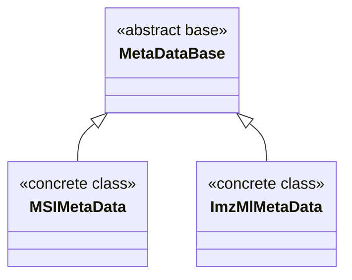

# MassFlow 元数据模块

本文介绍 MassFlow 中的元数据子系统，重点说明 `module/ms_meta_data.py` 中定义的三个类：`MetaDataBase`、`MSIMetaData` 和 `ImzMlMetaData`。内容包括它们的字段、属性、典型用法以及关键注意事项。

## 概述

- 设计
  - 元数据（数据集信息、仪器信息、坐标、像素尺寸等）被建模为独立于光谱集合 `MassSpectrumSet` 的对象。数据管理器（例如 `MSDataManagerImzML`）在读取数据时负责挂载或更新元数据。
  - 通过属性暴露的所有字段都会自动同步到内部字典 `_meta` 中，便于序列化及类似字典的访问。
- 能力
  - 记录图像大小（像素数量）与物理像素尺寸（µm）。
  - 存储占用掩码（`mask`）。
  - 缓存常用的 imzML 元数据（光谱数量、仪器型号、centroid/profile 模式等）。
- 核心类
  - `MetaDataBase`：抽象基类，提供自动同步与字典接口。
  - `MSIMetaData`：用于矩阵式 MSI 的具体子类。
  - `ImzMlMetaData`：用于 imzML 的具体子类，负责管理 `ImzMLParser`。



## 核心类型

### MetaDataBase（抽象基类）

```python
class massflow.module.ms_meta_data.MetaDataBase(
    name: str = "default",
    version: float = 1.0,
    storage_mode: str = "split",
    max_count_of_pixels_x: int | None = None,
    max_count_of_pixels_y: int | None = None,
    pixel_size_x: float | None = None,
    pixel_size_y: float | None = None,
    mask: np.ndarray | None = None,
)
```

- 作用
  - 提供通用元数据字段及属性封装；属性 setter 通过 `self._set(key, value)` 将值同步到 `_meta`。
- 关键字段/属性（部分）
  - `name`, `version`, `storage_mode`
  - `max_count_of_pixels_x`, `max_count_of_pixels_y`（像素个数）
  - `pixel_size_x`, `pixel_size_y`（单位 µm）
  - `processed`, `peakpick`
  - `centroid_spectrum`, `profile_spectrum`
  - `mask`（二维数组；其形状必须为 `(max_count_of_pixels_y, max_count_of_pixels_x)`）
  - `meta_index`（CV 映射，用于元数据抽取）
- 访问方式
  - 字典风格：`__getitem__`、`keys()`、`items()`、`values()`、`get()`、`to_dict()` 等。

### MSIMetaData（矩阵 MSI）

```python
class massflow.module.ms_meta_data.MSIMetaData(
    mask=None,
    need_base_mask: bool = False,
    name: str = "default",
    version: float = 1.0,
    storage_mode: str = "split",
    max_count_of_pixels_x: int | None = None,
    max_count_of_pixels_y: int | None = None,
    pixel_size_x: float | None = None,
    pixel_size_y: float | None = None,
    mz_num: int | None = None,
)
```

- 扩展字段
  - `need_base_mask`：是否需要从强度数据中计算基础掩码（base mask）。
  - `mz_num`：全局 m/z 点数（可选，用于统计或控制）。
- 典型用途
  - 用于非 imzML 来源，或转换为稠密矩阵形式的 MSI 数据。
- 行为
  - 继承自动同步机制：对属性赋值会写入 `_meta`。

### ImzMlMetaData（imzML）

```python
class massflow.module.ms_meta_data.ImzMlMetaData(
    name: str = "ImzML",
    version: float = 1.0,
    storage_mode: str = "split",
    filepath: str | None = None,
    absolute_position_offset_x=None,
    absolute_position_offset_y=None,
    centroid_spectrum=None,
    profile_spectrum=None,
    ms1_spectrum=None,
    msn_spectrum=None,
    instrument_model=None,
    spectrum_count_num=None,
    min_pixel_x=None,
    min_pixel_y=None,
    mask=None,
    pixel_size_x=None,
    pixel_size_y=None,
    max_count_of_pixels_x=None,
    max_count_of_pixels_y=None,
)
```

- 初始化
  - 传入指向现有 `.imzML` 文件的 `filepath: str`；在设置时会验证路径合法性。
- 关键字段
  - `filepath`, `spectrum_count_num`
  - `absolute_position_offset_x`, `absolute_position_offset_y`
  - `instrument_model`, `ms1_spectrum`, `msn_spectrum`
  - `min_pixel_x`, `min_pixel_y`
- 校验与同步
  - `filepath` 必须存在，否则抛出 `FileNotFoundError`。
  - `min_pixel_x`/`min_pixel_y` 必须满足 `0 ≤ value ≤ max_count_of_pixels_*` 约束。

## 使用示例

### 场景 1：矩阵 MSI

```python
>>> from massflow.module.ms_meta_data import MSIMetaData
>>> import numpy as np
>>>
>>> # 1. 创建元数据对象
>>> meta = MSIMetaData(name="test_dataset", mz_num=100, need_base_mask=True)
>>>
>>> # 2. 更新元数据（例如设置 mask）
>>> my_mask = np.zeros((10, 10))
>>> meta.mask = my_mask
>>>
>>> # 3. 通过属性和字典两种方式访问
>>> print(meta.name)
test_dataset
>>> print(meta["name"])
test_dataset
```

### 场景 2：imzML

```python
>>> from massflow.module.mass_spectrum_set import MassSpectrumSet
>>> from massflow.module.ms_data_manager_imzml import MSDataManagerImzML
>>>
>>> ms = MassSpectrumSet()
>>> ms_dm = MSDataManagerImzML(ms=ms, filepath="data/example.imzML")

>>> # 加载光谱并抽取元数据
>>> ms_dm.load_full_data_from_file()
>>>
>>> # 通过 CV 索引映射填充后的元数据访问
>>> print(f"X-axis pixels: {ms.meta.max_count_of_pixels_x}")
X-axis pixels: [X value from example.imzML]
>>> print(f"Y-axis pixels: {ms.meta.max_count_of_pixels_y}")
Y-axis pixels: [Y value from example.imzML]
>>> print(f"Min pixel x: {ms.meta.min_pixel_x}")
Min pixel x: 0
```

## 与数据管理器的关系

- `MSDataManagerImzML` 在读取数据时负责构建并维护 `ImzMlMetaData`，并将其挂载到底层的 `MassSpectrumSet`（即 `ms.meta`）上，供后续分析与绘图使用。
- 在做坐标过滤或可视化时，可以从元数据中读取 `mask` 和像素尺寸。

## 注意事项与建议

- `version` 应为正数。
- `filepath` 必须存在；对 `ImzMlMetaData` 而言，在设置 `filepath` 属性时就会进行验证。
- `mask` 必须是二维 NumPy 数组；约定其形状应为 `(max_count_of_pixels_y, max_count_of_pixels_x)`。
- 应在设置 `min_pixel_*` 之前初始化 `max_count_of_pixels_*`，以通过边界检查。