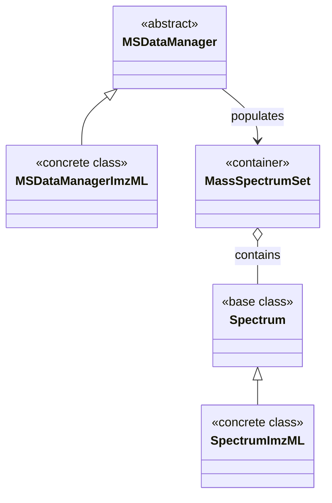

# MassFlow MS 数据结构

本文介绍 MassFlow 在质谱（MS）工作流中使用的核心数据结构，重点围绕从 ImzML 加载和组织光谱数据。主要涵盖以下模块及其关系：

- `module/spectrum.py`
- `module/mass_spectrum_set.py`
- `module/ms_data_manager.py`
- `module/ms_data_manager_imzml.py`

目标是从实现细节角度，说明各类的职责、属性、索引方式，以及“惰性加载（lazy loading）”的数据流。

## 总体概览

MassFlow 将“领域模型（数据结构）”与“数据管理器（I/O 与调度）”进行分离：

- 领域模型（Domain model）
  - `Spectrum`：表示一条带空间坐标的单光谱。
  - `SpectrumImzML`：面向 ImzML 的光谱类，支持惰性加载。
  - `MassSpectrumSet`：光谱集合，支持高效的基于坐标的索引。
- 数据管理器（Data manager）
  - `MSDataManager`：抽象基类，定义公共配置与接口。
  - `MSDataManagerImzML`：具体实现，用于读取 `.imzML` 文件并填充 `MassSpectrumSet`。

元数据由独立模块管理（详见 `module/ms_meta_data.py`），在需要时绑定到管理器/模型上。

### 类图（继承关系）

下图展示了上述核心类之间的继承关系：`SpectrumImzML` 继承自 `Spectrum`，`MSDataManagerImzML` 继承自 `MSDataManager`。`MassSpectrumSet` 是一个独立的容器类，不参与继承层次。

`MSDataManager` 及其具体实现（如 `MSDataManagerImzML`）负责将光谱数据填充到 `MassSpectrumSet` 中。数据管理器持有一个 `MassSpectrumSet` 实例，并通过 `load_full_data_from_file()` 方法向其中加载光谱。`MassSpectrumSet` 则作为容器，持有多条 `Spectrum`（或其子类如 `SpectrumImzML`），并按空间坐标组织以便高效访问。



## 核心类型

### *Spectrum* 类

```python
class massflow.module.spectrum.Spectrum(mz_list, intensity, coordinate, sort_by_mz=True, shared_mz_list=None)
```

表示一条带空间坐标的质谱。关键特征如下：

- 构造参数
  - `mz_list` (*Optional[np.ndarray]*) —— m/z 数组。可为 `None`，用于惰性加载。
  - `intensity` (*Optional[np.ndarray]*) —— 强度数组。可为 `None`，用于惰性加载。
  - `coordinate` (*Sequence[int]*) —— 三个整数 `[x, y, z]`，表示空间坐标。
  - `sort_by_mz` (*bool, optional*) —— 数据是否按 m/z 排序，默认 `True`。
  - `shared_mz_list` (*Optional[np.ndarray]*) —— 连续数据的共享 m/z 轴（由 `MassSpectrumSet` 统一管理）。
- 属性
  - `mz_list: np.ndarray` —— 惰性解析的 getter/setter；在尚未加载或设置前可为 `None`。
  - `intensity: np.ndarray` —— 惰性解析的 getter/setter；在尚未加载或设置前可为 `None`。
- 工具方法
  - `crop_range(x_range, sort_by_mz=True, mode="new")` —— 将光谱裁剪到指定 m/z 范围。
  - `is_sorted()` —— 检查当前光谱是否按 m/z 排序。
- 不变量与注意事项
  - `coordinate` 必须包含恰好 3 个整数，索引约定为 `[x, y, z]`。
  - 当 `mz_list` 与 `intensity` 同时存在时，它们的长度必须一致。
  - 支持通过将 `mz_list`/`intensity` 设为 `None` 来实现惰性加载，以延迟数据读入或磁盘换入。

- 示例

```python
>>> from massflow.tools.plot import plot_spectrum
>>> spectrum = ms[0] or ms.get_spectrum(0, 0, 0)
>>> mz_list = spectrum.mz_list
>>> print(mz_list)
output:
[16441.998  938.1308  2318.6423 ...  1174.1575  1333.138   1488.291 ]
>>> # 使用独立绘图工具绘制光谱
>>> plot_spectrum(base=spectrum)
```

- 示例 2

```python
if __name__ == "__main__":
    from massflow.module.ms_data_manager_imzml import MSDataManagerImzML
    from massflow.module.mass_spectrum_set import MassSpectrumSet
    from massflow.tools.plot import plot_spectrum
    FILE_PATH = "data/example.imzML"
    ms = MassSpectrumSet()
    # 创建 MS 集合与管理器
    # parser 会自动创建
    with MSDataManagerImzML(ms=ms, target_locs=[(1, 1), (50, 50)], filepath=FILE_PATH) as manager:

        # 使用惰性占位符加载数据
        manager.load_full_data_from_file()
        spectrum = ms[0]
        plot_spectrum(spectrum)

output:
```


### *SpectrumImzML* 类

```python
class massflow.module.spectrum_imzml.SpectrumImzML(coordinates, index=None, reader=None, ibd_path=None, mz_list=None, intensity=None, shared_mz_list=None, sort_by_mz=True)
```

面向 ImzML 格式的专用光谱类，具备惰性加载能力。该类继承自 `Spectrum`，通过惰性加载机制高效处理 ImzML（Imaging Mass Spectrometry Markup Language）格式数据，从而降低内存使用。

注意：通常通过 [MSDataManagerImzML](#msdatamanagerimzml-class) 来创建和管理 [SpectrumImzML](#spectrumimzml-class) 实例，而不是直接在业务代码中手动构造。

- 构造参数
  - `coordinates` (*Sequence[int]*) —— 三个整数 `[x, y, z]`，表示光谱的空间坐标。
  - `index` (*int*) —— 此光谱在 ImzML 文件中的索引。
  - `reader` (*PortableSpectrumReader | None*) —— 用于从 `.ibd` 二进制文件中流式读取光谱的底层 reader。
  - `ibd_path` (*str | None*) —— 对应 `.ibd` 文件的路径。
  - `mz_list` (*Optional[np.ndarray]*) —— 可选的 m/z 轴；若为 `None`，则在首次访问时通过惰性加载或 `shared_mz_list` 获取。
  - `intensity` (*Optional[np.ndarray]*) —— 可选的强度数组；若为 `None`，则在首次访问时惰性加载。
  - `shared_mz_list` (*Optional[np.ndarray]*) —— 连续数据共享的 m/z 轴，由 `MassSpectrumSet` 注入。
  - `sort_by_mz` (*bool, optional*) —— 是否保持按 m/z 排序，默认 `True`。
- 继承属性
  - `coordinate` (*PixelCoordinates*) —— 光谱的 3D 坐标 `[x, y, z]`。
  - `x`, `y`, `z` (*int*) —— 各坐标分量。
  - `sort_by_mz` (*bool*) —— 标记数据是否按 m/z 排序。
- 属性
  - `mz_list: np.ndarray` —— 惰性加载的 m/z 数组；首次访问会触发数据加载。
  - `intensity: np.ndarray` —— 惰性加载的强度数组；访问时保证数据已加载。
- 惰性加载行为
  - 首次访问 `mz_list` 或 `intensity` 时，会打开 `.ibd` 文件并通过 `reader.read_spectrum_from_file(ibd_file, index)` 一次性加载两者。
  - `mz_list` 在第一次加载后会被缓存，此后访问复用缓存。
  - 数据加载在属性首次访问前不会发生，有利于降低内存占用。
- 不变量与注意事项
  - 当 `mz_list`/`intensity` 为 `None` 时，构造过程本身不会加载数据。
  - 首次访问任一属性时，两者会一起加载以提高效率。
  - 所有可视化与数据操作方法均继承自 `Spectrum`。

- 示例

```python
>>> # 创建 SpectrumImzML 实例（此时尚未加载数据）
>>> spectrum = SpectrumImzML(parser, index=0, coordinates=[0, 0, 0])
>>> # 首次访问触发惰性加载
>>> mz_values = spectrum.mz_list
>>> print(mz_values[:5])
output:
[100.05    150.12    200.34    250.67    300.89]
```

### *MassSpectrumSet* 类

```python
class massflow.module.mass_spectrum_set.MassSpectrumSet()
```

用于管理多条质谱，并支持基于空间坐标的索引。该类既是容器，也是光谱集合管理者，用于保存多个 `Spectrum`（或 `SpectrumImzML`）实例，并按 3D 空间坐标组织，以便高效存取和操作。

- 构造参数
  - 无需参数，直接初始化空集合。
- 属性
  - `meta` (*Optional*) —— 与光谱集合关联的元数据对象。
- 方法（主要）
  - `add_spectrum(spectrum)` —— 添加一条光谱，并自动更新内部的坐标索引。
  - `get_spectrum(x, y, z=0)` —— 根据 3D 坐标获取指定光谱。
  - `plot_ms_mask(save_path, figsize, dpi, origin, cmap)` —— 绘制元数据中存储的占用掩码（Occupancy Mask）。
- 索引模式
  - `ms[index]` —— 按整数下标顺序访问内部 `_queue`。
  - `ms[x, y]` —— 按二维坐标访问（z 默认为 0）。
  - `ms[x, y, z]` —— 按完整 3D 坐标访问。
  - `ms[x, y, z] = spectrum` —— 将光谱赋值到指定坐标，并自动更新索引。
- 特殊方法
  - `__len__()` —— 返回集合中的光谱总数。
  - `__iter__()` —— 以插入顺序遍历所有光谱。
  - `__getitem__(key)` —— 支持按整数或坐标元组灵活索引。
  - `__setitem__(key, spectrum)` —— 按坐标赋值并自动更新光谱的坐标信息与内部索引。
- 不变量与注意事项
  - 内部维护两套数据结构，以分别支持顺序访问和基于坐标的快速访问。
  - 同时支持 2D（x, y）与 3D（x, y, z）坐标系统。
  - 添加光谱时会自动提取并索引其坐标。
  - 通过赋值操作更新光谱时，会同步更新光谱中的坐标信息与索引。

- 示例

```python
>>> from massflow.module.mass_spectrum_set import MassSpectrumSet
>>> # 创建 MS 集合
>>> ms = MassSpectrumSet()
>>> # 添加光谱（建议通过数据管理器加载，而非手动构造）
>>> ms.add_spectrum(spectrum1)
>>> # 按顺序索引
>>> spec = ms[0]
>>> # 按坐标索引
>>> spec = ms[10, 20, 0]
>>> # 按坐标直接赋值
>>> ms[5, 5, 0] = new_spectrum
>>> # 遍历
>>> for spectrum in ms:
...     print(spectrum.coordinates)
output:
[0, 0, 0]
[1, 0, 0]
[2, 0, 0]
```

- 示例 2

由于坐标可能不连续，推荐先通过 mask 查看可用坐标范围：

```python
>>> ms_md.load_full_data_from_file()
>>> ms_md.inspect_data()
>>> ms.plot_ms_mask()
```


## 数据管理器

### *MSDataManager* 类（抽象）

```python
class massflow.module.ms_data_manager.MSDataManager(
    ms=None,
    target_mz_range=None,
    target_locs=None,
    filepath=None,
    temp_dir=None,
    max_threads: int = 8,
    mz_dtype=np.float64,
    intensity_dtype=np.float32,
)
```

抽象基类，定义了将质谱数据加载到 `MassSpectrumSet` 集合中的通用配置与契约。具体数据管理器（针对不同文件格式）都在此基础上扩展。

- 构造参数
  - `ms` (*MassSpectrumSet | None*) —— 要填充的目标 `MassSpectrumSet` 实例；若为 `None`，则内部自动创建。
  - `target_mz_range` (*Optional[Tuple[float, float]]*) —— 峰过滤的 m/z 范围 `(min_mz, max_mz)`；为 `None` 时加载全部 m/z。
  - `target_locs` (*Optional[List[Tuple[int, int] | Tuple[int, int, int]]]*) —— 空间区域的包围盒，由两个坐标 `[ (x1, y1), (x2, y2) ]`（或 3D 等价形式）表示，用于限制加载的光谱范围；为 `None` 时加载所有位置。
  - `filepath` (*Optional[str]*) —— 输入数据文件路径。
  - `temp_dir` (*Optional[str]*) —— 当 `filepath` 未提供时，用于临时 `.imzML` 交换文件的目录。
  - `max_threads` (*int*) —— 并行加载工具的最大线程数。
  - `mz_dtype` —— m/z 数值使用的 NumPy dtype。
  - `intensity_dtype` —— 强度数值使用的 NumPy dtype。
- 方法（关键）
  - `load_full_data_from_file()` —— 抽象方法；具体管理器必须实现，用于真正加载数据。
  - `inspect_data(inpect_num=10)` —— 记录数据集信息（总数、样本光谱长度/范围等）。
- 参数校验
  - 确保提供的 `target_locs` 至少包含两个坐标点。
  - 校验包围盒坐标满足 `x1 < x2`、`y1 < y2`。
  - 对无效配置抛出相应错误。
- 不变量与注意事项
  - 为抽象类，不能直接实例化。
  - 具体子类必须实现 `load_full_data_from_file()`。
  - 提供空间与 m/z 范围过滤的公共基础设施。
  - 内部维护计数器以跟踪加载进度。

- 示例

```python
# 不能直接实例化抽象类
# 使用具体实现，如 MSDataManagerImzML
if __name__ == "__main__":
    from module.ms_data_manager_imzml import MSDataManagerImzML
    from massflow.module.mass_spectrum_set import MassSpectrumSet
    FILE_PATH = "data/example.imzML"
    ms = MassSpectrumSet()
    # 创建 MS 集合与管理器
    # parser 会自动创建
    with MSDataManagerImzML(ms=ms, target_locs=[(1, 1), (50, 50)], filepath=FILE_PATH) as manager:

        # 使用惰性占位符加载数据
        manager.load_full_data_from_file()

        print(manager.current_spectrum_num)

output:
10000
```

### *MSDataManagerImzML* 类

```python
class massflow.module.ms_data_manager_imzml.MSDataManagerImzML(
    ms=None,
    target_locs=None,
    filepath=None,
    max_threads: int = 8,
    temp_dir=None,
    mz_dtype=np.float64,
    intensity_dtype=np.float32,
)
```

针对 `.imzML` 文件的具体数据管理器。该类在 `MSDataManager` 基础上扩展，专门处理 ImzML 格式的质谱成像数据，负责元数据初始化，并将 `SpectrumImzML` 占位符惰性填充到 `MassSpectrumSet` 中。

- 构造参数
  - `ms` (*MassSpectrumSet | None*) —— 目标 `MassSpectrumSet` 实例。
  - `target_locs` (*Optional[List[Tuple[int, int] | Tuple[int, int, int]]]*) —— 用于空间过滤的包围区域，可为 `None`。
  - `filepath` (*Optional[str]*) —— `.imzML` 文件路径。
  - `max_threads` (*int*) —— 批量加载的最大线程数。
  - `temp_dir` (*Optional[str]*) —— 当 `filepath` 未提供时，临时交换文件目录。
  - `mz_dtype` —— m/z 数值类型。
  - `intensity_dtype` —— 强度数值类型。
- 属性
  - `parser` (*ImzMLParser | None*) —— 由 `filepath` 构建的 ImzML 解析器实例，用于读取谱图元数据。
  - `reader` (*PortableSpectrumReader | None*) —— 绑定到 `.ibd` 文件的二进制 reader。
  - `meta` (*ImzMlMetaData*) —— 与解析器绑定的元数据包装类，缓存常用字段（图像尺寸、仪器信息等）。
- 继承属性
  - `ms` (*MassSpectrumSet*) —— 目标领域模型容器。
  - `target_mz_range`, `target_locs`, `filepath`, `current_spectrum_num` —— 来自 `MSDataManager`。
- 方法
  - `load_full_data_from_file()` —— 实现抽象方法，按 ImzML 格式加载数据并创建惰性光谱占位符。
  - `inspect_data(inpect_num=10)` —— 继承的方法，用于检查数据集。
- 初始化逻辑
  - 校验 `filepath` 并创建 `ImzMLParser`。
  - 初始化 `ImzMlMetaData` 并绑定到内部的 `MassSpectrumSet`。
- 不变量与注意事项
  - 仅支持 `.imzML` 格式；其他扩展名会触发错误。
  - 使用惰性加载减少内存占用——在访问光谱前不会真正读取谱图数据。
  - 元数据与数据管理器紧密耦合，为后续预处理提供关键上下文信息。

- 示例

```python
from massflow.module.mass_spectrum_set import MassSpectrumSet
from module.ms_data_manager_imzml import MSDataManagerImzML

# 仅在直接执行本文件时运行示例
if __name__ == "__main__":

    FILE_PATH = "data/example.imzML"
    ms = MassSpectrumSet()
    # 创建 MS 集合与管理器
    # parser 会自动创建
    with MSDataManagerImzML(ms=ms,target_locs=[(1, 1), (50, 50)],filepath=FILE_PATH) as manager:

        # 使用惰性占位符加载数据
        manager.load_full_data_from_file()

        # 检查加载结果
        manager.inspect_data(inpect_num=5)

        # 访问光谱（触发惰性加载）
        spectrum = ms[40, 13]
        print(spectrum.mz_list[:5])

inspect_data output:
INFO:     25-11-10 19:34 202 ms_data_manager - creating ms mask.
INFO:     25-11-10 19:34 102 ms_data_manager - MS meta data:
                                                target_mz_range: None
                                                target_locs: [(1, 1), (50, 50)]
                                                filepath: data/example.imzML
                                                current_spectrum_num: 1910
                                                meta_name: ImzML
                                                meta_version: 1.0
                                                meta_storage_mode: split
                                                meta_centroid_spectrum: None
                                                meta_profile_spectrum: True
                                                meta_max_count_of_pixels_x: 227
                                                meta_max_count_of_pixels_y: 93
                                                meta_pixel_size_x: 100.0
                                                meta_pixel_size_y: 100.0
                                                meta_absolute_position_offset_x: 0.0
                                                meta_absolute_position_offset_y: 0.0
                                                meta_min_pixel_x: 0
                                                meta_min_pixel_y: 2
                                                meta_mask: (93, 227)

INFO:     25-11-10 19:34 115 ms_data_manager - MS  information:
                                                 MS len: 74749
                                                 MS range: 400.0 - 1000.0
                                                 MS coord: (0, 38, 0)
                                                 max and min mz_list: 1000.0 - 400.0
                                                 max intensity: 16.307722091674805
                                               
                                                 MS len: 74749
                                                 MS range: 400.0 - 1000.0
                                                 MS coord: (0, 39, 0)
                                                 max and min mz_list: 1000.0 - 400.0
                                                 max intensity: 17.022132873535156
                                               
                                                 MS len: 74749
                                                 MS range: 400.0 - 1000.0
                                                 MS coord: (0, 40, 0)
                                                 max and min mz_list: 1000.0 - 400.0
                                                 max intensity: 16.470420837402344
                                               
                                                 MS len: 74749
                                                 MS range: 400.0 - 1000.0
                                                 MS coord: (0, 41, 0)
                                                 max and min mz_list: 1000.0 - 400.0
                                                 max intensity: 19.481334686279297
                                               
                                                 MS len: 74749
                                                 MS range: 400.0 - 1000.0
                                                 MS coord: (0, 42, 0)
                                                 max and min mz_list: 1000.0 - 400.0
                                                 max intensity: 18.155176162719727
                                               
                                               
[400.         400.00802697 400.01605394 400.02408091 400.03210788]
```

## 元数据依赖关系（Metadata Dependencies）

虽然不属于上面三个核心模块的一部分，`ImzMlMetaData`（位于 `module/ms_meta_data.py`）与 `MSDataManagerImzML` 之间存在紧密耦合关系：

- 负责保存并暴露常用字段（如图像尺寸、像素大小、仪器型号等），并根据 `parser.coordinates` 计算 `spectrum_count_num`。
- 可以通过 parser 或文件路径进行初始化，并通过 `pyimzml` 自动提取元数据。

## 数据流总结（Data Flow Summary）

1. 创建一个空的 `MassSpectrumSet` 光谱集合。
2. 使用该 `MassSpectrumSet` 实例、可选的 `target_locs`/`target_mz_range` 以及 `filepath` 初始化 `MSDataManagerImzML`。
3. 调用 `load_full_data_from_file()`，为目标区域内的光谱在 `MassSpectrumSet` 中填充 `SpectrumImzML` 占位对象。
4. 当访问 `SpectrumImzML` 实例上的 `mz_list` 或 `intensity` 时，会通过 parser 从 ImzML 文件中懒加载真实数据。
5. 元数据通过 `meta` 保持可用，可被下游使用者访问图像尺寸、像素大小、仪器型号等信息。

## 可扩展性说明（Extensibility Notes）

- 可以通过继承 `MSDataManager` 来实现新的数据管理器，以支持更多文件格式；需要遵守 `load_full_data_from_file()` 的约定，并在可行时使用类似 `SpectrumImzML` 的懒加载光谱。
- 对于大规模数据集，可以在加载时使用 `target_mz_range` 做预过滤；也可以留到下游处理阶段，根据性能需求权衡。

## 术语表（Glossary）

- ImzML：一种基于 XML 的 MSI 数据存储标准格式。
- Spectrum（光谱）：与特定空间坐标关联的一对数组 `(mz_list, intensity)`。
- Lazy loading（懒加载）：推迟实际数据读取直到第一次访问，以减少内存和 I/O 开销。