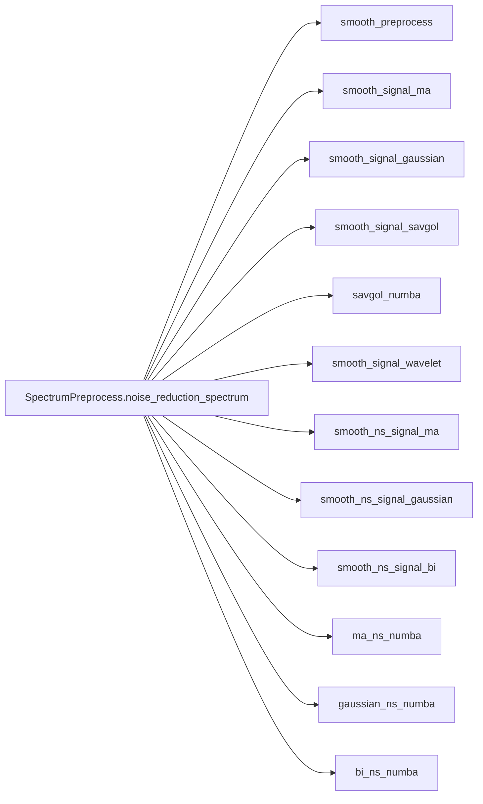

# MassFlow 

本文介绍 MassFlow 中的噪声抑制与平滑模块，重点包括：
- `preprocess/filter_helper.py` 中的各类平滑/降噪函数
- 光谱级入口 `SpectrumPreprocess.noise_reduction_spectrum`
- 数据管理器级入口 `Preprocess.noise_reduction`

内容涵盖：API 说明、示例代码、参数与调参建议、适用场景以及常见问题。

## 概述

- 输入与输出
  - 光谱级：输入 `massflow.module.spectrum.Spectrum`（或 `SpectrumImzML`），其 `intensity` 为一维数组，可选 `mz_list`；输出为 `SpectrumPreprocess.noise_reduction_spectrum` 返回的新的 `SpectrumImzML`。
  - 数据管理器级：输入 `massflow.module.ms_data_manager_imzml.MSDataManagerImzML`；输出为新的 `MSDataManagerImzML`，其中所有光谱的强度已通过 `Preprocess.noise_reduction` 去噪，数据通过流式写盘控制内存使用。

- 算法类别
  - 时域卷积平滑：`smooth_signal_ma`（移动平均/自定义卷积核）、`smooth_signal_gaussian`（离散高斯平滑）
  - 多项式拟合平滑：`smooth_signal_savgol`（Savitzky-Golay），以及其 Numba 加速版本 `savgol_numba`（支持一维与二维/批量输入）
  - 小波去噪：`smooth_signal_wavelet`（基于 PyWavelets 的阈值去噪）
  - 基于 m/z 邻域搜索的平滑：`smooth_ns_signal_ma`、`smooth_ns_signal_gaussian`、`smooth_ns_signal_bi`（双边过滤），及其 Numba 加速版本 `ma_ns_numba`、`gaussian_ns_numba`、`bi_ns_numba`

- 预处理辅助
  - `smooth_preprocess`：将负强度置零的简单预处理函数；为可选工具函数，不会被 `noise_reduction_spectrum` 自动调用。

### 函数关系示意图



## 核心 API

### Preprocess.noise_reduction（数据管理器级）

```python
preprocess.dm_pre_fun.Preprocess.noise_reduction(
  data_manager: MSDataManager,
  method: str = "ma",
  window: int = 5,
  sd: float | None = None,
  sd_intensity: float | None = None,
  p: int = 2,
  coef: np.ndarray | None = None,
  polyorder: int = 3,
  deriv: int = 0,
  delta: float = 1.0,
  wavelet: str = "db4",
  threshold_mode: str = "soft",
  batch_size: int = 256,
  temp_dir: str = "./temp_noise_data",
) -> MSDataManagerImzML
```

- 描述：数据管理器级去噪入口。对一个 `MSDataManager` 中的所有光谱应用与光谱级 API 相同的算法，通过批处理流式写盘完成去噪。
- 输入：包含待去噪光谱的 `MSDataManagerImzML`（或其子类）。
- 输出：新的 `MSDataManagerImzML`，其光谱的 `mz_list` 和坐标与原始数据一致，`intensity` 被替换为平滑后的值。
- 说明：
  - 内部使用批处理层限制内存占用；该批处理层在正常使用中不建议直接调用。
  - 按批次处理时，会清理内存中的光谱数据，并将去噪结果换出到磁盘，从而在无需手动管理内存的情况下处理大规模数据。

示例（数据管理器级）：

```python
import sys
import os
from pathlib import Path
from massflow.module.mass_spectrum_set import MassSpectrumSet
from massflow.module.ms_data_manager_imzml import MSDataManagerImzML
from massflow.preprocess.dm_pre_fun import Preprocess
from massflow.tools.plot import plot_spectrum

FILE_PATH = "data/example.imzML"
ms = MassSpectrumSet()
dm = MSDataManagerImzML(ms, filepath=FILE_PATH)
dm.load_full_data_from_file()

# 可以使用经典方法（如 "savgol"），也可以使用 Numba 加速方法（如 "savgol_numba"）
dm_denoised = Preprocess.noise_reduction(
    data_manager=dm,
    method="savgol_numba",
    window=11,
    polyorder=3,
    batch_size=256,
)

sp_orig = dm.ms[0]
sp_denoised = dm_denoised.ms[0]

plot_spectrum(
    base=sp_orig,
    target=sp_denoised,
    mz_range=(500.0, 510.0),
    intensity_range=(0.0, 1.5),
    metrics_box=True,
    title_suffix="DM_SavgolNumba",
)

dm.close()
dm_denoised.close()
```

### SpectrumPreprocess.noise_reduction_spectrum（光谱级）

```python
massflow.preprocess.spectrum_pre_fun.SpectrumPreprocess.noise_reduction_spectrum(
  data: Spectrum | SpectrumImzML,
  method: str = "ma",
  window: int = 5,
  sd: float | None = None,
  sd_intensity: float | None = None,
  p: int = 2,
  coef: np.ndarray | None = None,
  polyorder: int = 3,
  deriv: int = 0,
  delta: float = 1.0,
  wavelet: str = "db4",
  threshold_mode: str = "soft",
) -> SpectrumImzML
```

- 描述：单条光谱去噪的统一入口。根据 `method` 分发到具体滤波实现，返回一个新的光谱对象，其坐标与输入光谱一致，`intensity` 为平滑后的结果。
- 说明：
  - 此光谱级 API 不会自动进行内存清理，只是简单返回一个新的光谱实例。若在大数据集上反复调用，需要自行管理内存，或优先使用数据管理器级 `Preprocess.noise_reduction`。
- 支持的 `method`：
  - 经典方法：`ma`、`gaussian`、`savgol`、`wavelet`、`ma_ns`、`gaussian_ns`、`bi_ns`
  - Numba 加速方法：`savgol_numba`、`ma_ns_numba`、`gaussian_ns_numba`、`bi_ns_numba`
- 返回值：新的 `SpectrumImzML` 实例，`mz_list` 和坐标保持不变，`intensity` 为平滑后的结果。
- 异常：
  - `ValueError`：不支持的 `method`
  - `TypeError`：输入类型非法

---

### smooth_signal_ma

```python
preprocess.filter_helper.smooth_signal_ma(
  intensity: np.ndarray,
  coef: np.ndarray | None = None,
  window: int = 5,
) -> np.ndarray
```

- 说明：当传入 `coef` 时，会自动进行归一化；其长度决定有效窗长。
- 描述：移动平均（或自定义卷积核）平滑。对一维边界使用 `edge` 填充，并自动归一化权重。
- 参数（注意实际起作用的只有以下参数，其余参数不会影响该平滑方法效果）：
  - `coef`：卷积核；若为 `None`，则使用长度为 `window` 的均匀核。
  - `window`：窗口长度（正整数）；若 `coef is None` 且为偶数，则会自动调整为奇数，以保持居中对齐。
- 返回值：与输入长度相同的一维 `intensity` 数组。
- 异常：
  - `ValueError`：`window <= 0`，或 `intensity` 非一维数组。
  - `TypeError`：在 `coef is None` 时 `window` 必须为整数；提供 `coef` 时必须为非空一维 numpy 数组。

示例（直接调用光谱级 API）：

```python
from massflow.preprocess.spectrum_pre_fun import SpectrumPreprocess

denoised_spectrum = SpectrumPreprocess.noise_reduction_spectrum(
    data=sp,
    method="ma",
    window=7,
)
```

示例（完整流程，含数据加载与绘图）：

```python
import sys
import os
from pathlib import Path
import numpy as np
import matplotlib.pyplot as plt
from massflow.module.mass_spectrum_set import MassSpectrumSet
from massflow.module.ms_data_manager_imzml import MSDataManagerImzML
from massflow.preprocess.spectrum_pre_fun import SpectrumPreprocess
from massflow.tools.plot import plot_spectrum

# 数据加载（后续示例共用）
FILE_PATH = "data/example.imzML"
ms = MassSpectrumSet()
ms_md = MSDataManagerImzML(ms, filepath=FILE_PATH)
ms_md.load_full_data_from_file()
sp = ms[0]

# 去噪处理（直接设置窗口大小）
denoised_spectrum = SpectrumPreprocess.noise_reduction_spectrum(
    data=sp,
    method="ma",
    window=7,  # 移动平均窗口大小
)

# 绘图（叠加原始与去噪光谱）
plot_spectrum(
    base=sp,
    target=denoised_spectrum,
    mz_range=(500.0, 510.0),
    intensity_range=(0.0, 1.5),
    metrics_box=True,
    title_suffix="MA",
)
```


---

### smooth_signal_gaussian

```python
preprocess.filter_helper.smooth_signal_gaussian(
  intensity: np.ndarray,
  sd: float | None = None,
  window: int = 5,
) -> np.ndarray
```

- 描述：离散高斯核平滑；默认 `sd = window / 4`。
- 参数（注意实际起作用的只有以下参数，其余参数不会影响该平滑方法效果）：
  - `sd`：高斯标准差，默认 `sd = window / 4.0`
  - `window`：窗口长度（奇数），默认 5
- 返回值：与输入长度相同的一维 `intensity` 数组。
- 异常：
  - `ValueError`：`window <= 0` 或为偶数；`sd` 必须为正的有限数；或 `intensity` 非一维数组。
  - `TypeError`：`window` 必须为整数。

示例：

```python
denoised = SpectrumPreprocess.noise_reduction_spectrum(
    data=sp,
    method="gaussian",
    window=7,
    # 如果不指定 sd，则默认设置为 window / 4.0
    # sd=None
    )
```


---

### smooth_signal_savgol

```python
preprocess.filter_helper.smooth_signal_savgol(
  intensity: np.ndarray,
  window: int = 5,
  polyorder: int = 2,
) -> np.ndarray
```

- 描述：Savitzky-Golay 多项式拟合平滑；会自动保证 `window` 为奇数且不小于 3。`polyorder` 必须严格小于 `window`，否则会抛出错误。
- 参数：
  - `window`：奇数窗口大小，最小为 3。
  - `polyorder`：多项式阶数，必须 `< window`。
- 返回值：与输入长度相同的一维 `intensity` 数组。
- 异常：
  - `ValueError`：`window <= 0` 或为偶数；`polyorder` 不小于 `window`；或 `intensity` 非一维数组。
  - `TypeError`：`window` 和 `polyorder` 必须为整数。

示例：

```python
denoised = SpectrumPreprocess.noise_reduction_spectrum(
    data=sp,
    method="savgol",
    window=10,
    polyorder=1
    
)
```


window=3, polyorder=1 时：


---

### smooth_signal_wavelet

```python
preprocess.filter_helper.smooth_signal_wavelet(
  intensity: np.ndarray,
  wavelet: str = "db4",
  threshold_mode: str = "soft",
) -> np.ndarray
```

- 描述：小波阈值去噪。使用 Donoho-Johnstone 通用阈值自适应估计噪声，并根据 `threshold_mode` 采用软/硬阈值。通过适当的小波重构保证输出长度与输入一致。
- 参数（注意实际起作用的只有以下参数，其余参数不会影响该平滑方法效果）：
  - `wavelet`：小波基（例如 `db4`、`db8`、`haar`、`coif2`），默认 `db4`。
  - `threshold_mode`：阈值模式，`"soft"` 或 `"hard"`，默认 `"soft"`。
- 返回值：与输入长度相同的一维 `intensity` 数组。
- 异常：
  - `ImportError`：未安装 PyWavelets（`pywt`）。
  - `ValueError`：`threshold_mode` 不是 `'soft'` 或 `'hard'`；或 `intensity` 非一维数组。

示例：

```python
denoised = SpectrumPreprocess.noise_reduction_spectrum(
    data=sp,
    method="wavelet",
)
```


---

### smooth_ns_signal_ma

```python
preprocess.filter_helper.smooth_ns_signal_ma(
  intensity: np.ndarray,
  index: np.ndarray,
  k: int = 5,
  p: int = 2,
) -> np.ndarray
```

- 描述：在 `k` 个最近邻上做均匀邻域平滑（按行取均值）。索引的验证与回退逻辑在上游完成。
- 参数（注意实际起作用的只有以下参数，其余参数不会影响该平滑方法效果）：
  - `k`：邻居数量，默认 5。
  - `p`：距离度量的 Minkowski 指数，默认 2。
- 返回值：与输入长度相同的一维 `intensity` 数组。
- 异常：
  - `ValueError`：`k < 1` 或 `p < 1`；或 `intensity` 非一维数组。
  - `TypeError`：`k` 和 `p` 必须为整数。

示例：

```python
denoised = SpectrumPreprocess.noise_reduction_spectrum(
    data=sp,
    method="ma_ns",
    window=10,  # window 映射为 k
    p=2
)
```


---

### smooth_ns_signal_gaussian

```python
preprocess.filter_helper.smooth_ns_signal_gaussian(
  intensity: np.ndarray,
  index: np.ndarray,
  k: int = 5,
  p: int = 2,
  sd: float | None = None,
) -> np.ndarray
```

- 描述：对邻域距离应用高斯加权；指数项会被裁剪以避免下溢，按行归一化权重以避免除零。
- 默认设置：`sd = median(max_row_distance) / 2.0`（基于邻域最大距离的中位数，自适应估计）。
- 参数：
  - `index`：与 `intensity` 对齐的一维坐标。
  - `k`：邻居数量（>=1）。
  - `p`：Minkowski 距离参数（>=1）。
  - `sd`：基于邻域距离的高斯尺度；为 `None` 时自动估计。
- 返回值：与输入长度相同的一维 `intensity` 数组。
- 异常：
  - `ValueError`：`k < 1` 或 `p < 1`；或 `intensity` 非一维数组。
  - `TypeError`：`k` 和 `p` 必须为整数。
- 说明：若 `index` 为 `None` 或长度不匹配，会发出 `logger.warning`，并回退到 `np.arange(...)` 生成的索引进行 KD-tree 查询。

示例：

```python
denoised = SpectrumPreprocess.noise_reduction_spectrum(
    data=sp,
    method="gaussian_ns",
    window=10,  # window 映射为 k
    p=2,
    sd=None
)
```


---

### smooth_ns_signal_bi（双边滤波）

```python
preprocess.filter_helper.smooth_ns_signal_bi(
  intensity: np.ndarray,
  index: np.ndarray,
  k: int = 5,
  p: int = 2,
  sd_dist: float | None = None,
  sd_intensity: float | None = None,
) -> np.ndarray
```

- 描述：同时考虑 m/z 距离与强度差异的双边权重平滑，适合边缘保留型平滑。
- 参数：
  - `index`：与 `intensity` 对齐的一维坐标。
  - `k`：邻居数量（>=1）。
  - `p`：Minkowski 距离参数。
  - `sd_dist`：距离方向的高斯尺度，默认 `median(max_row_distance)/2`。
  - `sd_intensity`：强度方向的高斯尺度，默认 `stats.median_abs_deviation(intensity, scale="normal")`。
- 返回值：与输入长度相同的一维 `intensity` 数组。
- 异常：
  - `ValueError`：`k < 1` 或 `p < 1`；或 `intensity` 非一维数组。
  - `TypeError`：`k` 和 `p` 必须为整数。
- 说明：两个指数项都会被裁剪以避免数值下溢，权重按行归一化。

示例：

```python
denoised = SpectrumPreprocess.noise_reduction_spectrum(
    data=sp,
    method="bi_ns",
    window=10,  # window 映射为 k
    p=2
)
```

window = 10:


window = 20:


---

## 参数说明与调参建议

- `window`（卷积/SG 窗口或 NS 方法中的邻居数量 `k`）
  - 必须为正整数。对于 Savitzky-Golay，会自动调整为奇数且至少为 3；对于移动平均/高斯，当为偶数时会自动调整为奇数，以保证居中对齐。
  - 建议范围：5–15，可根据峰宽和噪声强度调节。

- `coef`（自定义卷积核）
  - 传入后会自动归一化；其长度决定有效窗口大小。

- `sd`（高斯核尺度）
  - 卷积平滑中默认 `sd = window / 4.0`。
  - 邻域高斯平滑中默认 `sd = median(max_row_distance) / 2.0`（数据自适应）。

- `polyorder`（SG 平滑的多项式阶数）
  - 必须小于 `window`；推荐 1–2。必要时会自动下调。

- `wavelet` 与 `threshold_mode`
  - 推荐组合：`db4` + `soft`。对于噪声很强的情况，可以尝试 `hard`。

- `k`（邻域搜索中的邻居数量）
  - 需要满足 `k >= 1`；过大容易导致过度平滑，一般建议 5–11。

- `p`（Minkowski 距离指数）
  - `p=1` 为曼哈顿距离，`p=2` 为欧氏距离；更大的 `p` 会更强调距离差异。

- `sd_intensity`（双边滤波中强度差尺度）
  - 默认值为 `median_abs_deviation(intensity, scale="normal")`，即基于 MAD 的自适应强度尺度。

---

## 参考

（核心实现与入口文件）

- `preprocess/filter_helper.py`：滤波/降噪核心实现
- `preprocess/dm_pre_fun.py`：数据管理器级预处理入口（包括噪声抑制）
- `preprocess/spectrum_pre_fun.py`：光谱级入口及参数分发
- `module/spectrum.py` 与 `module/mass_spectrum_set.py`：Spectrum 与 MassSpectrumSet 数据结构
- `src/massflow/tools/plot.py`：用于 Spectrum/MassSpectrumSet 的绘图工具

## 错误处理与日志

- 所有输入验证错误在抛出 `TypeError` 或 `ValueError` 前都会通过 `logger.error` 记录。
- Savitzky-Golay：
  - `window` 会被自动调整为奇数；若 `polyorder >= window`，会记录错误并抛出 `ValueError`。
- 高斯和平滑移动平均：
  - `window` 必须为正整数；若为偶数，会自动调整为奇数。`sd` 必须为正值。
- 邻域方法：
  - 当 `index` 缺失或长度不匹配时，会发出 `logger.warning`，并回退到 `np.arange(len(intensity))` 生成的索引用于 KD-tree 查询。