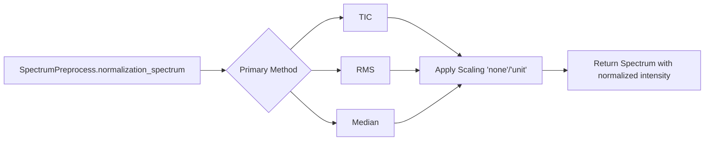

# MassFlow

本文介绍 MassFlow 中的归一化（normalization）模块，重点包括光谱级统一入口 `SpectrumPreprocess.normalization_spectrum` 以及 `preprocess/normalizer_helper.py` 中的辅助函数。内容包含概述、API 说明、示例代码、参数说明与调参建议，以及常见问题排查。

## 概述
- 输入与输出
  - 输入：`massflow.module.spectrum.Spectrum` 或 `SpectrumImzML`（`intensity` 为一维数组，`mz_list` 可选/或已有）。
  - 输出：新的 `SpectrumImzML`，其 `mz_list` 与坐标保持不变；`intensity` 替换为归一化后的值（并可选进行缩放）。
- 方法
  - TIC（Total Ion Current）归一化：将强度缩放使总和（sum）等于 1。
  - RMS（Root Mean Square）归一化：将强度缩放使均方根（RMS）等于 1。
  - Median（中位数）归一化：将强度缩放使中位数（median）等于 1。

### 函数关系示意图



## 核心 API

### Preprocess.normalization（数据管理器级）

```python
massflow.preprocess.dm_pre_fun.Preprocess.normalization(
  data_manager: MSDataManager,
  scale_method: str = "none",
  method: str = "tic",
  scale: float = 1.0,
  batch_size: int = 256,
  temp_dir: str = "./temp_normalization_data",
) -> MSDataManagerImzML
```
- 描述：数据管理器级归一化入口。对 `MSDataManager` 中所有光谱应用与光谱级 API 相同的归一化方法，按批次流式处理并将结果写入磁盘。
- 输入：包含待归一化光谱的 `MSDataManagerImzML`（或其子类）。
- 输出：新的 `MSDataManagerImzML`，其 `mz_list`/坐标与原始数据一致，`intensity` 为归一化后的结果。
- 说明：
  - 内部通过 `BatchPreprocess.normalization_batch` 在批次上应用 `SpectrumPreprocess.normalization_spectrum`。
  - 按批次处理会清理内存中的光谱数据并将归一化结果换出到磁盘，支持大规模数据在有限内存下运行。

示例（数据管理器级）：

```python
import numpy as np
from massflow.module.mass_spectrum_set import MassSpectrumSet
from massflow.module.ms_data_manager_imzml import MSDataManagerImzML
from massflow.preprocess.dm_pre_fun import Preprocess
from massflow.tools.plot import plot_spectrum

FILE_PATH = "data/example.imzML"
ms = MassSpectrumSet()
dm = MSDataManagerImzML(ms, filepath=FILE_PATH)
dm.load_full_data_from_file()

# 使用 TIC（sum=1）对所有光谱归一化，不进行额外缩放
dm_norm = Preprocess.normalization(
    data_manager=dm,
    method="tic",
    scale_method="none",
    scale=1.0,
    batch_size=256,
)

sp_orig = dm.ms[0]
sp_norm = dm_norm.ms[0]

plot_spectrum(
    base=sp_orig,
    target=sp_norm,
    mz_range=(500.0, 510.0),
    intensity_range=(0.0, 1.5),
    metrics_box=True,
    title_suffix="DM_TIC",
)

dm.close()
dm_norm.close()
```

### SpectrumPreprocess.normalization_spectrum（光谱级）

```python
massflow.preprocess.spectrum_pre_fun.SpectrumPreprocess.normalization_spectrum(
  data: Spectrum | SpectrumImzML,
  scale_method: str = "none",
  method: str = "tic",
  scale: float = 1.0,
) -> SpectrumImzML
```
- 描述：单条光谱归一化的统一入口。根据 `method` 分发到 TIC/RMS/Median，并可选进行后续缩放，返回新的光谱对象（`mz_list` 与坐标保持不变，`intensity` 为归一化后的结果）。
- 说明：
  - 此光谱级 API 不会自动进行内存清理，只是返回新的光谱实例。对大数据集建议使用数据管理器级 `Preprocess.normalization`。
- 方法：
  - `'tic'`（sum 等于 1）
  - `'rms'`（RMS 等于 1）
  - `'median'`（median 等于 1）
- 参数：
  - `scale`：归一化后再乘的幅度缩放因子（默认 1.0）。

### normalizer

```python
preprocess.normalizer_helper.normalizer(
  intensity: np.ndarray,
  scale_method: str = "none",
  method: str = "tic",
  scale: float = 1.0
) -> np.ndarray
```
- 描述：归一化统一分发器。对输入进行校验后分发到 `'tic'`、`'rms'` 或 `'median'`，然后应用幅度缩放 `scale` 与可选的 `'unit'`（min-max 到 [0,1]）缩放。
- 参数：
  - `intensity`：待归一化的一维 numpy 数组。
  - `scale_method`：`'none' | 'unit'`（主归一化之后应用）。
  - `method`：`'tic' | 'rms' | 'median'`（主归一化方法）。
  - `scale`：主归一化之后应用的幅度缩放因子（默认 1.0）。
    - 必须为有限且非负的数。
  - 说明：
    - `scale_method` 不区分大小写，仅支持 `'none'` 与 `'unit'`。
- 返回值：
  - `intensity`：归一化后的（并可选缩放的）一维 numpy 数组。
- 异常：
  - `ValueError`：不支持的 `method`/`scale_method`；`scale` 必须为有限且非负。
  - `TypeError`：输入不是非空的一维数组。

### tic_normalize

```python
preprocess.normalizer_helper.tic_normalize(
  intensity: np.ndarray,
  scale_method: str = "none",
  scale: float = 1.0
) -> np.ndarray
```
- 描述：按总离子流（sum）归一化。当 TIC > 0 时，先除以 sum（使 sum=1），再应用幅度缩放 `scale`，最后可选 `'unit'` min-max 缩放。
- 参数：
  - `scale_method`：`'none' | 'unit'`（归一化后可选 min-max 到 [0,1]）
  - `scale`：归一化后幅度缩放因子（默认 1.0）
    - 必须为有限且非负的数。
- 返回值：
  - `intensity`：一维数组；在幅度缩放/可选 unit 缩放之前其 sum 等于 1
- 异常：
  - `ValueError`：TIC ≤ 0；不支持的 `scale_method`。
  - `TypeError`：输入不是非空的一维数组。

示例（先降噪再做 TIC 归一化）：

```python
import sys
import os
import numpy as np
from massflow.module.mass_spectrum_set import MassSpectrumSet
from massflow.module.ms_data_manager_imzml import MSDataManagerImzML
from massflow.preprocess.spectrum_pre_fun import SpectrumPreprocess
from massflow.tools.plot import plot_spectrum

FILE_PATH = "data/example.imzML"
ms = MassSpectrumSet()
ms_md = MSDataManagerImzML(ms, filepath=FILE_PATH)
ms_md.load_full_data_from_file()
sp = ms[0]

# 先降噪再归一化
denoised = SpectrumPreprocess.noise_reduction_spectrum(
    data=sp,
    method="savgol",
    window=11,
    polyorder=3,
)
normalized_tic = SpectrumPreprocess.normalization_spectrum(
    data=denoised,
    method="tic",
    scale_method="none",
)

tic_origin = float(np.sum(denoised.intensity))
tic_after = float(np.sum(normalized_tic.intensity))
print(f"TIC normalized sum={tic_after:.6f}")

plot_spectrum(
    base=denoised,
    mz_range=(500.0, 510.0),
    intensity_range=(0.0, 1.5),
    title_suffix="Savgol_denoised",
)

plot_spectrum(
    base=normalized_tic,
    mz_range=(500.0, 510.0),
    intensity_range=(0.0, 1.5 / tic_origin),
    title_suffix="TIC_normalized_none",
)
```


### rms_normalize

```python
preprocess.normalizer_helper.rms_normalize(
  intensity: np.ndarray,
  scale_method: str = "none",
  scale: float = 1.0
) -> np.ndarray
```
- 描述：按均方根（RMS）归一化。当 RMS > 0 时除以 RMS（使 RMS=1）；若 RMS ≤ 0（或为 NaN），则抛出 `ValueError`。之后应用幅度缩放 `scale`，并可选 `'unit'` 缩放。
- 参数：
  - `scale_method`：`'none' | 'unit'`
  - `scale`：归一化后的幅度缩放因子（默认 1.0）
    - 必须为有限且非负的数。
- 返回值：
  - `intensity`：一维数组；在幅度缩放/可选 unit 缩放之前其 RMS 等于 1
- 说明：
  - 实现匹配 R 风格：`b = sqrt(mean(x^2))`；若 `b > 0` 则 `y = scale * x / b`，否则抛出错误。
- 异常：
  - `ValueError`：RMS ≤ 0；不支持的 `scale_method`。
  - `TypeError`：输入不是非空的一维数组。

示例（先降噪再做 RMS 归一化）：

```python
# 先降噪再归一化（与 TIC 示例一致）
denoised = SpectrumPreprocess.noise_reduction_spectrum(
    data=sp,
    method="savgol",
    window=11,
    polyorder=3,
)

normalized_rms = SpectrumPreprocess.normalization_spectrum(
    data=denoised,
    method="rms",
    scale_method="none",
)

# 归一化前后 RMS（输入 RMS > 0 时，归一化后 RMS 等于 1）
rms_origin = float(np.sqrt(np.nanmean(np.square(denoised.intensity))))
rms_after = float(np.sqrt(np.nanmean(np.square(normalized_rms.intensity))))
print(f"RMS normalized value={rms_after:.6f}")

# 绘图时用原始 RMS 缩放 y 轴范围以便观察
plot_spectrum(
    base=normalized_rms,
    mz_range=(500.0, 510.0),
    intensity_range=(0.0, 1.5 / max(rms_origin, 1e-12)),
    title_suffix="RMS_normalized_none",
)
```


### apply_scaling

```python
preprocess.normalizer_helper.apply_scaling(
  intensity: np.ndarray,
  scale_method: str
) -> np.ndarray
```
- 描述：主归一化之后应用缩放变换。
  - `'none'`：返回原值
  - `'unit'`：min-max 缩放到 `[0, 1]`
- 参数：
  - `scale_method`：`'none' | 'unit'`（不区分大小写）
- 返回值：
  - `intensity`：缩放后的一维 numpy 数组
- 异常：
  - `ValueError`：不支持的 `scale_method`。
  - `TypeError`：输入不是非空的一维数组。

### 可选 0–1 缩放（unit scaling）
```python
normalized_unit = SpectrumPreprocess.normalization_spectrum(
    data=denoised,
  method="tic",          # 或 "rms"
    scale_method="unit"    # min-max 缩放到 [0, 1]
)
plot_spectrum(
        base = normalized_unit,
        mz_range=(500.0, 510.0),
        intensity_range=(0.0, 0.1),
        title_suffix='TIC_normalized_unit'     
    )
```


- 使用 `'unit'` 可以将归一化后的强度缩放到 `[0, 1]`，便于跨光谱可视化与比较。

## 参数与调参建议
- 通用
  - 需要像素间总强度可比、适合可视化/相对定量时，优先选 `'tic'`。
  - 希望降低极端值影响、对噪声更稳健时，优先选 `'median'`。
  - `'unit'` 缩放主要用于绘图/UI 统一化；如果你需要保持 sum=1 或 median=1 这类可解释的数值属性，建议不要再叠加 `'unit'`。
- TIC
  - 对大峰更敏感；必要时先做降噪/基线校正再归一化。
- Median
  - 对长尾分布更稳健；能较好保留相对排序结构。

## Troubleshooting（常见问题排查）
- `ValueError: TIC value is not greater than 0`  
  确保预处理后光谱的总和不为 0；避免使用全零或被强烈裁剪后的空光谱。
- `ValueError: Median value is not greater than 0`  
  确保强度不全为 0；必要时先做基线校正或避免过于激进的裁剪。
- `ValueError: RMS value is not greater than 0`  
  检查是否为空/常数光谱，或是否存在全 NaN；确保预处理保留有效信号。
- 不支持的 method 或 scale_method  
  检查拼写：`method='tic'|'median'|'rms'`，`scale_method='none'|'unit'`。

## References
- `preprocess/normalizer_helper.py`（TIC/RMS/median 的实现与缩放逻辑）
- `preprocess/spectrum_pre_fun.py`（光谱级入口与参数分发）
- `preprocess/dm_pre_fun.py`（数据管理器级归一化入口）
- `module/spectrum.py` 与 `module/mass_spectrum_set.py`（Spectrum 与 MassSpectrumSet 数据结构）
- `src/massflow/tools/plot.py`（Spectrum/MassSpectrumSet 的绘图工具）