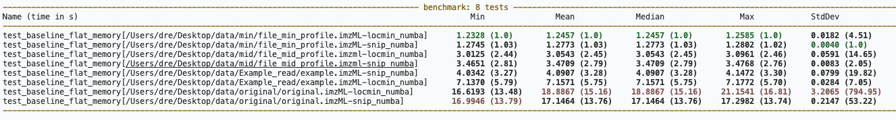
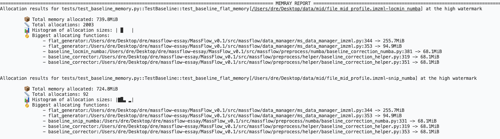
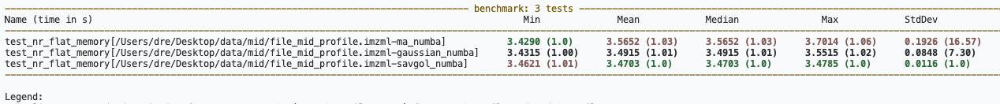
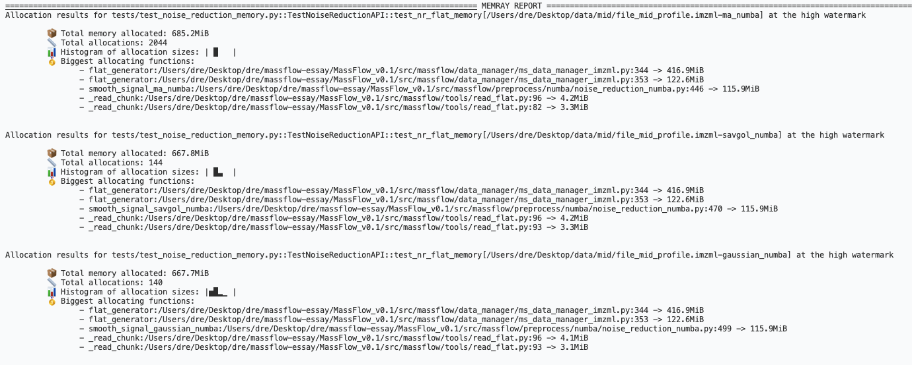
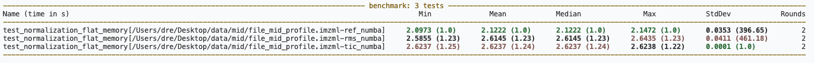
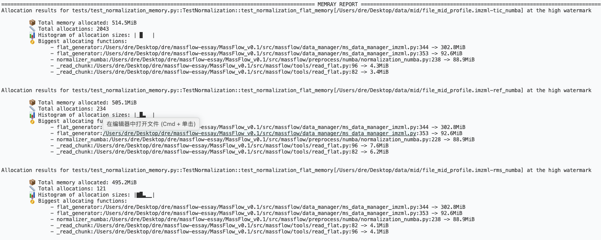
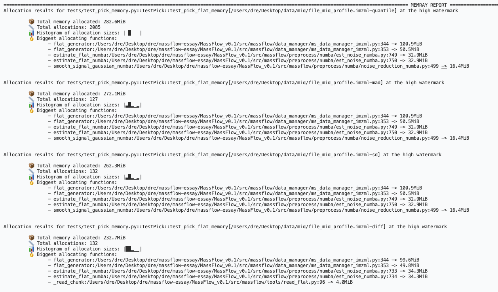
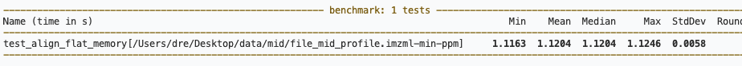
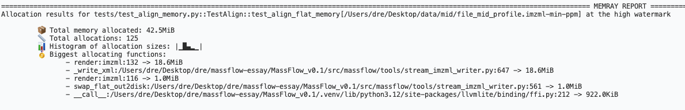

## baseline

## Baseline Correction

Time commands:

```bash
pytest tests/test_baseline_memory.py::TestBaseline::test_baseline_flat_memory --benchmark-only --benchmark-columns=min,mean,median,max,stddev,rounds -q
```
### result

> 重测说明：此前 `snip_numba` 测试未显式传 `m` 参数，导致 `baseline_snip_numba` 内 `m=None` 触发默认逻辑 `min(100, max(10, n//10))`，SNIP 迭代窗口被放大到约 100 而非预期的 5，使 snip 耗时被人为拉高（mid: 10.56s）。修复测试在 `snip_numba` 时显式传 `m=5` 后，对全部 4 个数据集（min/mid/max/ultra）的 locmin 与 snip 重新计时。locmin 不受该 bug 影响，作为对照一并重测。

| Name (time in s) | Min | Mean | Median | Max | StdDev | Rounds |
| --- | --- | --- | --- | --- | --- | --- |
| test_baseline_flat_memory[.../file_min_profile.imzML-locmin_numba] | 1.2328 | 1.2457 | 1.2457 | 1.2585 | 0.0182 | 2 |
| test_baseline_flat_memory[.../file_min_profile.imzML-snip_numba] | 1.2745 | 1.2773 | 1.2773 | 1.2802 | 0.0040 | 2 |
| test_baseline_flat_memory[.../file_mid_profile.imzml-locmin_numba] | 3.0125 | 3.0543 | 3.0543 | 3.0961 | 0.0591 | 2 |
| test_baseline_flat_memory[.../file_mid_profile.imzml-snip_numba] | 3.4651 | 3.4709 | 3.4709 | 3.4768 | 0.0083 | 2 |
| test_baseline_flat_memory[.../example.imzML-snip_numba] | 4.0342 | 4.0907 | 4.0907 | 4.1472 | 0.0799 | 2 |
| test_baseline_flat_memory[.../example.imzML-locmin_numba] | 7.1370 | 7.1571 | 7.1571 | 7.1772 | 0.0284 | 2 |
| test_baseline_flat_memory[.../original.imzML-locmin_numba] | 16.6193 | 18.8867 | 18.8867 | 21.1541 | 3.2065 | 2 |
| test_baseline_flat_memory[.../original.imzML-snip_numba] | 16.9946 | 17.1464 | 17.1464 | 17.2982 | 0.2147 | 2 |


Memory commands:

```bash
pytest tests/test_baseline_memory.py::TestBaseline::test_baseline_flat_memory --memray --benchmark-disable --most-allocations=10 -q
```

### result

| dataset | implementation | method | total memory allocated | allocations | main allocator | notes |
| --- | --- | --- | --- | --- | --- | --- |
| mid | flat | locmin_numba | 739.8 MiB | 2003 | flat_generator (255.7MiB) | biggest: flat_generator:344 (255.7MiB), flat_generator:353 (94.9MiB), baseline_locmin_numba:381 (68.1MiB), baseline_corrector:319 (68.1MiB), baseline_corrector:351 (68.1MiB) |
| mid | flat | snip_numba | 724.8 MiB | 92 | flat_generator (255.7MiB) | biggest: flat_generator:344 (255.7MiB), flat_generator:353 (94.9MiB), baseline_snip_numba:331 (68.1MiB), baseline_corrector:319 (68.1MiB), baseline_corrector:353 (68.1MiB) |




## Noise Reduction

Time commands:

```bash
pytest tests/test_noise_reduction_memory.py::TestNoiseReductionAPI::test_nr_flat_memory --benchmark-only --benchmark-columns=min,mean,median,max,stddev,rounds -q
```
### result

| Name (time in s) | Min | Mean | Median | Max | StdDev | Rounds |
| --- | --- | --- | --- | --- | --- | --- |
| test_nr_flat_memory[.../file_mid_profile.imzml-ma_numba] | 3.4290 | 3.5652 | 3.5652 | 3.7014 | 0.1926 | 2 |
| test_nr_flat_memory[.../file_mid_profile.imzml-gaussian_numba] | 3.4315 | 3.4915 | 3.4915 | 3.5515 | 0.0848 | 2 |
| test_nr_flat_memory[.../file_mid_profile.imzml-savgol_numba] | 3.4621 | 3.4703 | 3.4703 | 3.4785 | 0.0116 | 2 |



Memory commands:

```bash
pytest tests/test_noise_reduction_memory.py::TestNoiseReductionAPI::test_nr_flat_memory --memray --benchmark-disable --most-allocations=10 -q
```
### result

| dataset | implementation | method | total memory allocated | allocations | main allocator | notes |
| --- | --- | --- | --- | --- | --- | --- |
| mid | flat | ma_numba | 685.2 MiB | 2044 | flat_generator (416.9MiB) | biggest: flat_generator:344 (416.9MiB), flat_generator:353 (122.6MiB), smooth_signal_ma_numba:446 (115.9MiB), _read_chunk:96 (4.2MiB), _read_chunk:82 (3.3MiB) |
| mid | flat | savgol_numba | 667.8 MiB | 144 | flat_generator (416.9MiB) | biggest: flat_generator:344 (416.9MiB), flat_generator:353 (122.6MiB), smooth_signal_savgol_numba:470 (115.9MiB), _read_chunk:96 (4.2MiB), _read_chunk:93 (3.3MiB) |
| mid | flat | gaussian_numba | 667.7 MiB | 140 | flat_generator (416.9MiB) | biggest: flat_generator:344 (416.9MiB), flat_generator:353 (122.6MiB), smooth_signal_gaussian_numba:499 (115.9MiB), _read_chunk:96 (4.1MiB), _read_chunk:93 (3.1MiB) |



## Normalization

Time commands:

```bash
pytest tests/test_normalization_memory.py::TestNormalization::test_normalization_flat_memory --benchmark-only --benchmark-columns=min,mean,median,max,stddev,rounds -q
```
### result

| Name (time in s) | Min | Mean | Median | Max | StdDev | Rounds |
| --- | --- | --- | --- | --- | --- | --- |
| test_normalization_flat_memory[.../file_mid_profile.imzml-ref_numba] | 2.0973 | 2.1222 | 2.1222 | 2.1472 | 0.0353 | 2 |
| test_normalization_flat_memory[.../file_mid_profile.imzml-rms_numba] | 2.5855 | 2.6145 | 2.6145 | 2.6435 | 0.0411 | 2 |
| test_normalization_flat_memory[.../file_mid_profile.imzml-tic_numba] | 2.6237 | 2.6237 | 2.6237 | 2.6238 | 0.0001 | 2 |



Memory commands:

```bash
pytest tests/test_normalization_memory.py::TestNormalization::test_normalization_flat_memory --memray --benchmark-disable --most-allocations=10 -q
```
### result

| dataset | implementation | method | total memory allocated | allocations | main allocator | notes |
| --- | --- | --- | --- | --- | --- | --- |
| mid | flat | tic_numba | 514.5 MiB | 2043 | flat_generator (302.8MiB) | |
| mid | flat | ref_numba | 505.1 MiB | 234 | flat_generator (302.8MiB) | |
| mid | flat | rms_numba | 495.2 MiB | 121 | flat_generator (302.8MiB) | |



## Peak Pick

Time commands:

```bash
pytest tests/test_pick_memory.py::TestPick::test_pick_flat_memory --benchmark-only --benchmark-columns=min,mean,median,max,stddev,rounds -q
```
### result

| Name (time in s) | Min | Mean | Median | Max | StdDev | Rounds |
| --- | --- | --- | --- | --- | --- | --- |
| test_pick_flat_memory[.../file_mid_profile.imzml-diff] | 2.5463 | 2.5713 | 2.5713 | 2.5962 | 0.0353 | 2 |
| test_pick_flat_memory[.../file_mid_profile.imzml-sd] | 3.2187 | 3.2416 | 3.2416 | 3.2646 | 0.0325 | 2 |
| test_pick_flat_memory[.../file_mid_profile.imzml-quantile] | 9.9535 | 9.9685 | 9.9685 | 9.9836 | 0.0213 | 2 |
| test_pick_flat_memory[.../file_mid_profile.imzml-mad] | 16.5495 | 16.5783 | 16.5783 | 16.6072 | 0.0408 | 2 |


Memory commands:

```bash
pytest tests/test_pick_memory.py::TestPick::test_pick_flat_memory --memray --benchmark-disable --most-allocations=10 -q
```
### result

| dataset | implementation | method | total memory allocated | allocations | main allocator | notes |
| --- | --- | --- | --- | --- | --- | --- |
| mid | flat | quantile | 282.6 MiB | 2085 | flat_generator (100.9MiB) | biggest: flat_generator:344 (100.9MiB), flat_generator:353 (50.5MiB), estimate_flat_numba:749 (32.9MiB), estimate_flat_numba:750 (32.9MiB), smooth_signal_gaussian_numba:499 (16.4MiB) |
| mid | flat | mad | 272.1 MiB | 127 | flat_generator (100.9MiB) | biggest: flat_generator:344 (100.9MiB), flat_generator:353 (50.5MiB), estimate_flat_numba:749 (32.9MiB), estimate_flat_numba:750 (32.9MiB), smooth_signal_gaussian_numba:499 (16.4MiB) |
| mid | flat | sd | 262.3 MiB | 132 | flat_generator (100.9MiB) | biggest: flat_generator:344 (100.9MiB), flat_generator:353 (50.5MiB), estimate_flat_numba:749 (32.9MiB), estimate_flat_numba:750 (32.9MiB), smooth_signal_gaussian_numba:499 (16.4MiB) |
| mid | flat | diff | 232.7 MiB | 132 | flat_generator (99.6MiB) | biggest: flat_generator:344 (99.6MiB), flat_generator:353 (49.8MiB), estimate_flat_numba:733 (34.3MiB), estimate_flat_numba:734 (34.3MiB), _read_chunk:96 (4.0MiB) |



## Peak Align

Time commands:

```bash
pytest tests/test_align_memory.py::TestAlign::test_align_flat_memory --benchmark-only --benchmark-columns=min,mean,median,max,stddev,rounds -q
```
### result

| Name (time in s) | Min | Mean | Median | Max | StdDev | Rounds |
| --- | --- | --- | --- | --- | --- | --- |
| test_align_flat_memory[.../file_mid_profile.imzml-min-ppm] | 1.1163 | 1.1204 | 1.1204 | 1.1246 | 0.0058 | 2 |



Memory commands:

```bash
pytest tests/test_align_memory.py::TestAlign::test_align_flat_memory --memray --benchmark-disable --most-allocations=10 -q
```
### result

| dataset | implementation | method | total memory allocated | allocations | main allocator | notes |
| --- | --- | --- | --- | --- | --- | --- |
| mid | flat | min-ppm | 42.5 MiB | 125 | render:imzml:132 (18.6MiB) | biggest: render:imzml:132 (18.6MiB), _write_xml:647 (18.6MiB), render:imzml:116 (1.0MiB), swap_flat_out2disk:561 (1.0MiB), __call__:ffi.py:212 (922.0KiB) |

