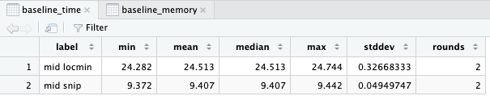
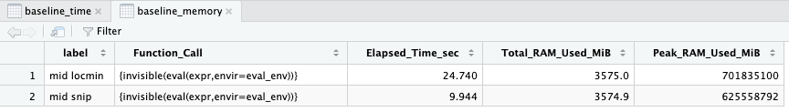
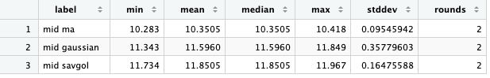
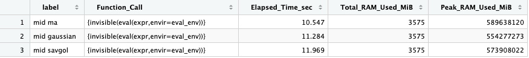
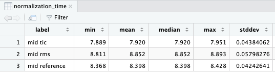
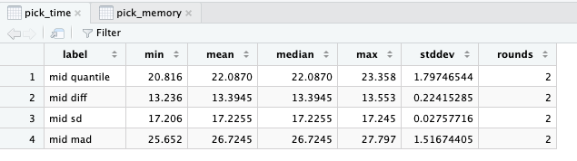
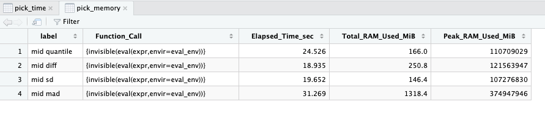

```r
library(Cardinal)

FILE_MID <- '/Users/dre/Desktop/data/mid/file_mid_profile.imzml'
FILES <- c(mid = FILE_MID)
ROUNDS <- 2

bench_time <- function(label, expr, rounds = ROUNDS, warmup = 1) {
  expr <- substitute(expr)
  for (i in seq_len(warmup)) invisible(eval(expr, parent.frame()))
  elapsed <- numeric(rounds)
  for (i in seq_len(rounds)) {
    gc()
    elapsed[[i]] <- system.time(invisible(eval(expr, parent.frame())))[["elapsed"]]
  }
  data.frame(
    label = label,
    min = min(elapsed),
    mean = mean(elapsed),
    median = median(elapsed),
    max = max(elapsed),
    stddev = sd(elapsed),
    rounds = rounds
  )
}

bench_memory <- function(label, expr) {
  if (!requireNamespace("peakRAM", quietly = TRUE)) {
    stop("Install peakRAM first: install.packages('peakRAM')")
  }
  expr <- substitute(expr)
  eval_env <- parent.frame()
  gc(full = TRUE)
  result <- peakRAM::peakRAM({
    invisible(eval(expr, envir = eval_env))
  })
  gc(full = TRUE)
  cbind(label = label, result)
}

run_for_files <- function(fun) {
  do.call(rbind, lapply(names(FILES), function(dataset) {
    gc(full = TRUE)
    result <- fun(dataset, FILES[[dataset]])
    gc(full = TRUE)
    result
  }))
}

read_arrays <- function(file) {
  as(readImzML(file), "MSImagingArrays")
}
```

## Baseline Correction

Time command:

```r
baseline_time <- rbind(
  run_for_files(function(dataset, file) {
    x <- readImzML(file)
    bench_time(paste(dataset, "locmin"), {
      process(reduceBaseline(x, method = "locmin", smooth = "none", span = 0.1, upper = FALSE))
    })
  }),
  run_for_files(function(dataset, file) {
    x <- readImzML(file)
    bench_time(paste(dataset, "snip"), {
      process(reduceBaseline(x, method = "snip", width = 5, decreasing = TRUE))
    })
  })
)
baseline_time
```

### result

| label | min | mean | median | max | stddev | rounds |
| --- | --- | --- | --- | --- | --- | --- |
| mid locmin | 24.282 | 24.513 | 24.513 | 24.744 | 0.32668333 | 2 |
| mid snip | 9.372 | 9.407 | 9.407 | 9.442 | 0.04949747 | 2 |



Memory command:

```r
baseline_memory <- rbind(
  run_for_files(function(dataset, file) {
      x <- readImzML(file)
      bench_memory(paste(dataset, "locmin"), {
          process(reduceBaseline(x, method = "locmin", smooth = "none", span = 0.1, upper = FALSE))
      })
  }),
  run_for_files(function(dataset, file) {
      x <- readImzML(file)
      bench_memory(paste(dataset, "snip"), {
          process(reduceBaseline(x, method = "snip", width = 5, decreasing = TRUE))
      })
  })
)
baseline_memory
```

### result

| label | Function_Call | Elapsed_Time_sec | Total_RAM_Used_MiB | Peak_RAM_Used_MiB |
| --- | --- | --- | --- | --- |
| mid locmin | {invisible(eval(expr,envir=eval_env))} | 24.740 | 3575.0 | 701835100 |
| mid snip | {invisible(eval(expr,envir=eval_env))} | 9.944 | 3574.9 | 625558792 |



## Noise Reduction

Time command:

```r
noise_time <- rbind(
  run_for_files(function(dataset, file) {
    x <- readImzML(file)
    bench_time(paste(dataset, "ma"), {
      process(Cardinal::smooth(x, method = "ma", width = 5))
    })
  }),
  run_for_files(function(dataset, file) {
    x <- readImzML(file)
    bench_time(paste(dataset, "gaussian"), {
      process(Cardinal::smooth(x, method = "gaussian", width = 5))
    })
  }),
  run_for_files(function(dataset, file) {
    x <- readImzML(file)
    bench_time(paste(dataset, "savgol"), {
      process(Cardinal::smooth(x, method = "sgolay", width = 5, order = 3, deriv = 0, delta = 1.0))
    })
  })
)
noise_time
```

### result

| label | min | mean | median | max | stddev | rounds |
| --- | --- | --- | --- | --- | --- | --- |
| mid ma | 10.283 | 10.3505 | 10.3505 | 10.418 | 0.09545942 | 2 |
| mid gaussian | 11.343 | 11.5960 | 11.5960 | 11.849 | 0.35779603 | 2 |
| mid savgol | 11.734 | 11.8505 | 11.8505 | 11.967 | 0.16475588 | 2 |



Memory command:

```r
noise_memory <- rbind(
  run_for_files(function(dataset, file) {
    x <- readImzML(file)
    bench_memory(paste(dataset, "ma"), {
      process(Cardinal::smooth(x, method = "ma", width = 5))
    })
  }),
  run_for_files(function(dataset, file) {
    x <- readImzML(file)
    bench_memory(paste(dataset, "gaussian"), {
      process(Cardinal::smooth(x, method = "gaussian", width = 5))
    })
  }),
  run_for_files(function(dataset, file) {
    x <- readImzML(file)
    bench_memory(paste(dataset, "savgol"), {
      process(Cardinal::smooth(x, method = "sgolay", width = 5, order = 3, deriv = 0, delta = 1.0))
    })
  })
)
noise_memory
```

### result

| label | Function_Call | Elapsed_Time_sec | Total_RAM_Used_MiB | Peak_RAM_Used_MiB |
| --- | --- | --- | --- | --- |
| mid ma | {invisible(eval(expr,envir=eval_env))} | 10.547 | 3575 | 589638120 |
| mid gaussian | {invisible(eval(expr,envir=eval_env))} | 11.284 | 3575 | 554277273 |
| mid savgol | {invisible(eval(expr,envir=eval_env))} | 11.969 | 3575 | 573908022 |



## Normalization

Time command:

```r
normalization_time <- rbind(
  run_for_files(function(dataset, file) {
    x <- readImzML(file)
    bench_time(paste(dataset, "tic"), {
      process(Cardinal::normalize(x, method = "tic"))
    })
  }),
  run_for_files(function(dataset, file) {
    x <- readImzML(file)
    bench_time(paste(dataset, "rms"), {
      process(Cardinal::normalize(x, method = "rms"))
    })
  }),
  run_for_files(function(dataset, file) {
    x <- readImzML(file)
    
    # 兼容性修复：提取 m/z 向量
    # 如果是 MSImagingArrays (Processed 数据)，先提取第一个像素的 m/z 列表
    mz_vec <- if (inherits(x, "MSImagingArrays")) mz(x)[[1]] else mz(x)
    
    # 然后从向量中提取中间的数值作为 reference
    ref <- mz_vec[ceiling(length(mz_vec) / 2)]
    
    bench_time(paste(dataset, "reference"), {
        process(Cardinal::normalize(x, method = "reference", ref = ref))
    })
	})
)
normalization_time
```
### result

| label | min | mean | median | max | stddev | rounds |
| --- | --- | --- | --- | --- | --- | --- |
| mid tic | 7.889 | 7.920 | 7.920 | 7.951 | 0.04384062 | 2 |
| mid rms | 8.811 | 8.852 | 8.852 | 8.893 | 0.05798276 | 2 |
| mid reference | 8.368 | 8.398 | 8.398 | 8.428 | 0.04242641 | 2 |



Memory command:

```r
normalization_memory <- rbind(
  run_for_files(function(dataset, file) {
    x <- readImzML(file)
    bench_memory(paste(dataset, "tic"), {
      process(Cardinal::normalize(x, method = "tic"))
    })
  }),
  run_for_files(function(dataset, file) {
    x <- readImzML(file)
    bench_memory(paste(dataset, "rms"), {
      process(Cardinal::normalize(x, method = "rms"))
    })
  }),
  run_for_files(function(dataset, file) {
    x <- readImzML(file)
    mz_vec <- if (inherits(x, "MSImagingArrays")) mz(x)[[1]] else mz(x)
    ref <- mz_vec[ceiling(length(mz_vec) / 2)]
    bench_memory(paste(dataset, "reference"), {
      process(Cardinal::normalize(x, method = "reference", ref = ref))
    })
  })
)
normalization_memory
```
### result

| label | Function_Call | Elapsed_Time_sec | Total_RAM_Used_MiB | Peak_RAM_Used_MiB |
| --- | --- | --- | --- | --- |
| mid tic | {invisible(eval(expr,envir=eval_env))} | 9.097 | 3575.1 | 605449785 |
| mid rms | {invisible(eval(expr,envir=eval_env))} | 9.230 | 3575.0 | 631568324 |
| mid reference | {invisible(eval(expr,envir=eval_env))} | 8.509 | 3574.9 | 573324583 |


## Peak Pick

Time command:

```r
pick_time <- rbind(
  run_for_files(function(dataset, file) {
    x <- read_arrays(file)
    bench_time(paste(dataset, "quantile"), {
      process(peakPick(x, width = 5, method = "quantile", SNR = 2.0, type = "height", nbins = 1, overlap = 0.5))
    })
  }),
  run_for_files(function(dataset, file) {
    x <- read_arrays(file)
    bench_time(paste(dataset, "diff"), {
      process(peakPick(x, width = 5, method = "diff", SNR = 2.0, type = "height", nbins = 1, overlap = 0.5))
    })
  }),
  run_for_files(function(dataset, file) {
    x <- read_arrays(file)
    bench_time(paste(dataset, "sd"), {
      process(peakPick(x, width = 5, method = "sd", SNR = 2.0, type = "height", nbins = 1, overlap = 0.5))
    })
  }),
  run_for_files(function(dataset, file) {
    x <- read_arrays(file)
    bench_time(paste(dataset, "mad"), {
      process(peakPick(x, width = 5, method = "mad", SNR = 2.0, type = "height", nbins = 1, overlap = 0.5))
    })
  })
)
pick_time
```

### result

| label | min | mean | median | max | stddev | rounds |
| --- | --- | --- | --- | --- | --- | --- |
| mid quantile | 20.816 | 22.0870 | 22.0870 | 23.358 | 1.79746544 | 2 |
| mid diff | 13.236 | 13.3945 | 13.3945 | 13.553 | 0.22415285 | 2 |
| mid sd | 17.206 | 17.2255 | 17.2255 | 17.245 | 0.02757716 | 2 |
| mid mad | 25.652 | 26.7245 | 26.7245 | 27.797 | 1.51674405 | 2 |



Memory command:

```r
pick_memory <- rbind(
  run_for_files(function(dataset, file) {
    x <- read_arrays(file)
    bench_memory(paste(dataset, "quantile"), {
      process(peakPick(x, width = 5, method = "quantile", SNR = 2.0, type = "height", nbins = 1, overlap = 0.5))
    })
  }),
  run_for_files(function(dataset, file) {
    x <- read_arrays(file)
    bench_memory(paste(dataset, "diff"), {
      process(peakPick(x, width = 5, method = "diff", SNR = 2.0, type = "height", nbins = 1, overlap = 0.5))
    })
  }),
  run_for_files(function(dataset, file) {
    x <- read_arrays(file)
    bench_memory(paste(dataset, "sd"), {
      process(peakPick(x, width = 5, method = "sd", SNR = 2.0, type = "height", nbins = 1, overlap = 0.5))
    })
  }),
  run_for_files(function(dataset, file) {
    x <- read_arrays(file)
    bench_memory(paste(dataset, "mad"), {
      process(peakPick(x, width = 5, method = "mad", SNR = 2.0, type = "height", nbins = 1, overlap = 0.5))
    })
  })
)
pick_memory
```

### result

| label | Function_Call | Elapsed_Time_sec | Total_RAM_Used_MiB | Peak_RAM_Used_MiB |
| --- | --- | --- | --- | --- |
| mid quantile | {invisible(eval(expr,envir=eval_env))} | 24.526 | 166.0 | 110709029 |
| mid diff | {invisible(eval(expr,envir=eval_env))} | 18.935 | 250.8 | 121563947 |
| mid sd | {invisible(eval(expr,envir=eval_env))} | 19.652 | 146.4 | 107276830 |
| mid mad | {invisible(eval(expr,envir=eval_env))} | 31.269 | 1318.4 | 374947946 |



## Peak Align

Run these directly in a fresh R session.

```r
library(Cardinal)

FILE_MID <- "/Users/dre/Desktop/data/mid/file_mid_profile.imzML"
FILES <- c(mid = FILE_MID)

ROUNDS <- 3
ALIGN_BINFUNS <- c("min")

read_arrays <- function(file) {
  as(readImzML(file), "MSImagingArrays")
}

normalize_peakram_units <- function(result) {
  peak_col <- "Peak_RAM_Used_MiB"
  if (peak_col %in% names(result)) {
    peak_raw <- result[[peak_col]]
    result$Peak_RAM_Used_Raw <- peak_raw
    result$Peak_RAM_Normalized_MiB <- ifelse(
      peak_raw > 100000,
      peak_raw * 8 / (1024 * 1024),
      peak_raw
    )
  }
  result
}

bench_time <- function(label, expr, rounds = ROUNDS, warmup = 1) {
  expr <- substitute(expr)
  for (i in seq_len(warmup)) invisible(eval(expr, parent.frame()))
  elapsed <- numeric(rounds)
  for (i in seq_len(rounds)) {
    gc(full = TRUE)
    elapsed[[i]] <- system.time(invisible(eval(expr, parent.frame())))[["elapsed"]]
  }
  data.frame(
    label = label,
    min = min(elapsed),
    mean = mean(elapsed),
    median = median(elapsed),
    max = max(elapsed),
    stddev = sd(elapsed),
    rounds = rounds
  )
}

bench_memory <- function(label, expr) {
  if (!requireNamespace("peakRAM", quietly = TRUE)) {
    stop("Install peakRAM first: install.packages('peakRAM')")
  }
  expr <- substitute(expr)
  eval_env <- parent.frame()
  gc(full = TRUE)
  result <- peakRAM::peakRAM({
    invisible(eval(expr, envir = eval_env))
  })
  gc(full = TRUE)
  normalize_peakram_units(cbind(label = label, result))
}

run_for_files <- function(fun) {
  do.call(rbind, lapply(names(FILES), function(dataset) {
    gc(full = TRUE)
    result <- fun(dataset, FILES[[dataset]])
    gc(full = TRUE)
    result
  }))
}

run_align_time <- function(binfun_values = ALIGN_BINFUNS) {
  do.call(rbind, lapply(binfun_values, function(binfun) {
    run_for_files(function(dataset, file) {
      x <- read_arrays(file)
      picked <- process(peakPick(
        x,
        width = 5,
        method = "quantile",
        SNR = 2.0,
        type = "height",
        nbins = 1,
        overlap = 0.5
      ))

      bench_time(paste(dataset, binfun), {
        process(peakAlign(
          picked,
          units = "ppm",
          binfun = binfun,
          binratio = 2.0
        ))
      })
    })
  }))
}

run_align_memory <- function(binfun_values = ALIGN_BINFUNS) {
  do.call(rbind, lapply(binfun_values, function(binfun) {
    run_for_files(function(dataset, file) {
      x <- read_arrays(file)
      picked <- process(peakPick(
        x,
        width = 5,
        method = "quantile",
        SNR = 2.0,
        type = "height",
        nbins = 1,
        overlap = 0.5
      ))

      bench_memory(paste(dataset, binfun), {
        process(peakAlign(
          picked,
          units = "ppm",
          binfun = binfun,
          binratio = 2.0
        ))
      })
    })
  }))
}

align_time <- run_align_time()
align_time
```

### result

| label | min | mean | median | max | stddev | rounds |
| --- | --- | --- | --- | --- | --- | --- |
| mid min | 3.681 | 3.718667 | 3.682 | 3.793 | 0.0643765 | 3 |


align_memory <- run_align_memory()
align_memory
```

### result

| label | Function_Call | Elapsed_Time_sec | Total_RAM_Used_MiB | Peak_RAM_Used_MiB | Peak_RAM_Used_Raw | Peak_RAM_Normalized_MiB |
| --- | --- | --- | --- | --- | --- | --- |
| mid min | {invisible(eval(expr,envir=eval_env))} | 3.666 | 0.3 | 59773931 | 59773931 | 456.0389 |


