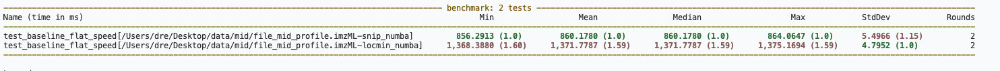
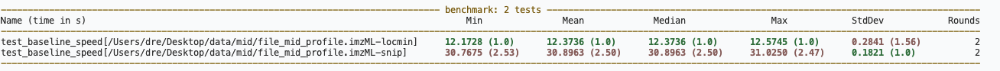
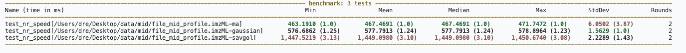
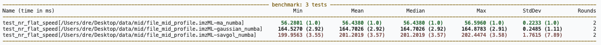
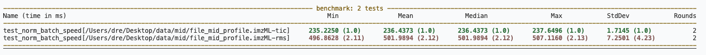
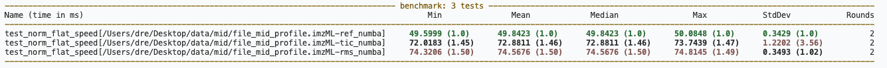
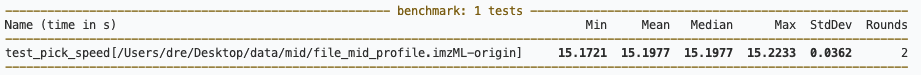
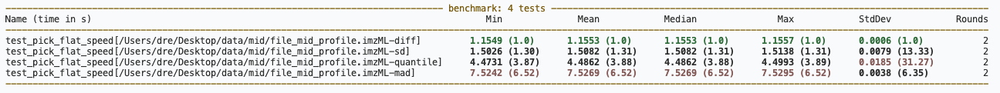
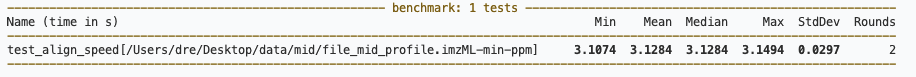
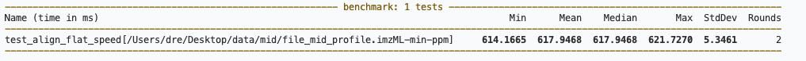

## Baseline Correction

Time commands:

```bash
pytest tests/test_baseline_speed.py::TestBaseline::test_baseline_speed --benchmark-only --benchmark-columns=min,mean,median,max,stddev,rounds -q
pytest tests/test_baseline_speed.py::TestBaseline::test_baseline_flat_speed --benchmark-only --benchmark-columns=min,mean,median,max,stddev,rounds -q
```
### result

test_baseline_speed (batch)

| method | min (s) | mean (s) | median (s) | max (s) | stddev (s) | rounds |
|---|---|---|---|---|---|---|
| locmin | 12.1728 | 12.3736 | 12.3736 | 12.5745 | 0.2841 | 2 |
| snip   | 30.7675 | 30.8963 | 30.8963 | 31.0250 | 0.1821 | 2 |


test_baseline_flat_speed (flat, time in ms)

| method | min (ms) | mean (ms) | median (ms) | max (ms) | stddev (ms) | rounds |
|---|---|---|---|---|---|---|
| snip_numba   | 856.2913 | 860.1780 | 860.1780 | 864.0647 | 5.4966 | 2 |
| locmin_numba | 1368.3880 | 1371.7787 | 1371.7787 | 1375.1694 | 4.7952 | 2 |


## Noise Reduction

Time commands:

```bash
pytest tests/test_noise_reduction_speed.py::TestNoiseReductionAPI::test_nr_speed --benchmark-only --benchmark-columns=min,mean,median,max,stddev,rounds -q
pytest tests/test_noise_reduction_speed.py::TestNoiseReductionAPI::test_nr_flat_speed --benchmark-only --benchmark-columns=min,mean,median,max,stddev,rounds -q
```
### result

test_nr_speed (batch)

| method | min (ms) | mean (ms) | median (ms) | max (ms) | stddev (ms) | rounds |
|---|---|---|---|---|---|---|
| ma       | 463.1910 | 467.4691 | 467.4691 | 471.7472 | 6.0502 | 2 |
| gaussian | 576.6862 | 577.7913 | 577.7913 | 578.8964 | 1.5629 | 2 |
| savgol   | 1447.5219 | 1449.0980 | 1449.0980 | 1450.6740 | 2.2289 | 2 |


test_nr_flat_speed (flat)

| method | min (ms) | mean (ms) | median (ms) | max (ms) | stddev (ms) | rounds |
|---|---|---|---|---|---|---|
| ma_numba       | 56.2801 | 56.4380 | 56.4380 | 56.5960 | 0.2233 | 2 |
| gaussian_numba | 164.5270 | 164.7026 | 164.7026 | 164.8783 | 0.2485 | 2 |
| savgol_numba   | 199.9563 | 201.2019 | 201.2019 | 202.4474 | 1.7615 | 2 |


## Normalization

Time commands:

```bash
pytest tests/test_normalization_speed.py::TestNormalizationAPI::test_norm_batch_speed --benchmark-only --benchmark-columns=min,mean,median,max,stddev,rounds -q
pytest tests/test_normalization_speed.py::TestNormalizationAPI::test_norm_flat_speed --benchmark-only --benchmark-columns=min,mean,median,max,stddev,rounds -q
```
### result

test_norm_batch_speed (batch)

| method | min (ms) | mean (ms) | median (ms) | max (ms) | stddev (ms) | rounds |
|---|---|---|---|---|---|---|
| tic | 235.2250 | 236.4373 | 236.4373 | 237.6496 | 1.7145 | 2 |
| rms | 496.8628 | 501.9894 | 501.9894 | 507.1160 | 7.2501 | 2 |


test_norm_flat_speed (flat)

| method | min (ms) | mean (ms) | median (ms) | max (ms) | stddev (ms) | rounds |
|---|---|---|---|---|---|---|
| ref_numba | 49.5999 | 49.8423 | 49.8423 | 50.0848 | 0.3429 | 2 |
| tic_numba | 72.0183 | 72.8811 | 72.8811 | 73.7439 | 1.2202 | 2 |
| rms_numba | 74.3206 | 74.5676 | 74.5676 | 74.8145 | 0.3493 | 2 |


## Peak Pick

Time commands:

```bash
pytest tests/test_pick_speed.py::TestPick::test_pick_speed --benchmark-only --benchmark-columns=min,mean,median,max,stddev,rounds -q
pytest tests/test_pick_speed.py::TestPick::test_pick_flat_speed --benchmark-only --benchmark-columns=min,mean,median,max,stddev,rounds -q
```
### result

test_pick_speed (batch, time in s)

| method | min (s) | mean (s) | median (s) | max (s) | stddev (s) | rounds |
|---|---|---|---|---|---|---|
| origin | 15.1721 | 15.1977 | 15.1977 | 15.2233 | 0.0362 | 2 |


test_pick_flat_speed (flat, time in s)

| method | min (s) | mean (s) | median (s) | max (s) | stddev (s) | rounds |
|---|---|---|---|---|---|---|
| diff      | 1.1549 | 1.1553 | 1.1553 | 1.1557 | 0.0006 | 2 |
| sd        | 1.5026 | 1.5082 | 1.5082 | 1.5138 | 0.0079 | 2 |
| quantile  | 4.4731 | 4.4862 | 4.4862 | 4.4993 | 0.0185 | 2 |
| mad       | 7.5242 | 7.5269 | 7.5269 | 7.5295 | 0.0038 | 2 |


## Peak Align

Time commands:

```bash
pytest tests/test_align_speed.py::TestAlign::test_align_speed --benchmark-only --benchmark-columns=min,mean,median,max,stddev,rounds -q
pytest tests/test_align_speed.py::TestAlign::test_align_flat_speed --benchmark-only --benchmark-columns=min,mean,median,max,stddev,rounds -q
```
### result

test_align_speed (batch, time in s)

| method | min (s) | mean (s) | median (s) | max (s) | stddev (s) | rounds |
|---|---|---|---|---|---|---|
| min-ppm | 3.1074 | 3.1284 | 3.1284 | 3.1494 | 0.0297 | 2 |


test_align_flat_speed (flat, time in ms)

| method | min (ms) | mean (ms) | median (ms) | max (ms) | stddev (ms) | rounds |
|---|---|---|---|---|---|---|
| min-ppm | 614.1665 | 617.9468 | 617.9468 | 621.7270 | 5.3461 | 2 |

