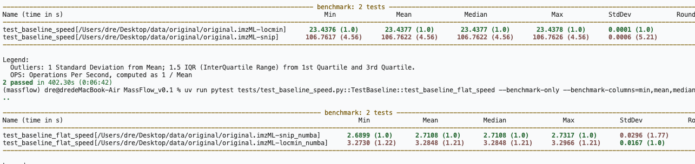
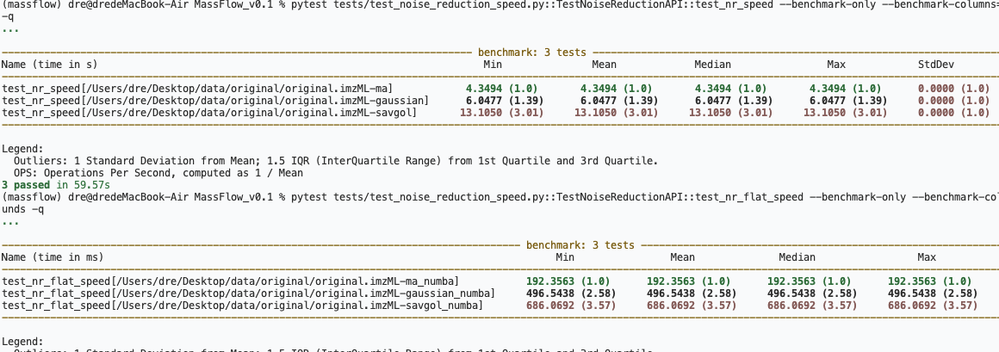
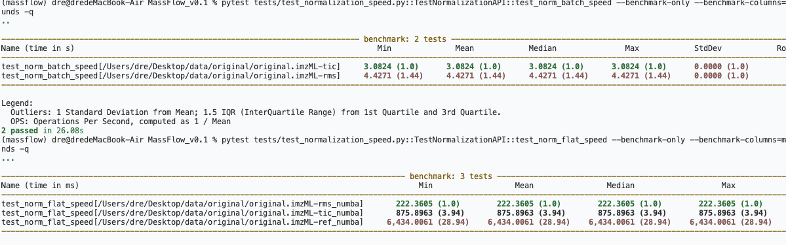
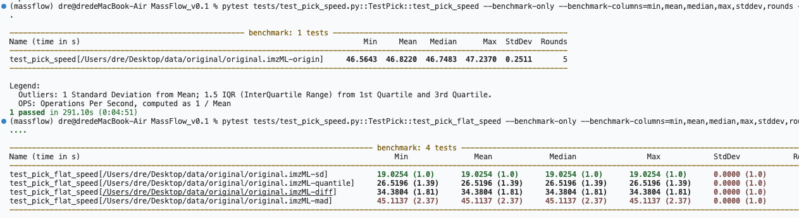
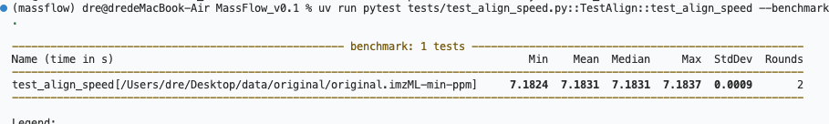
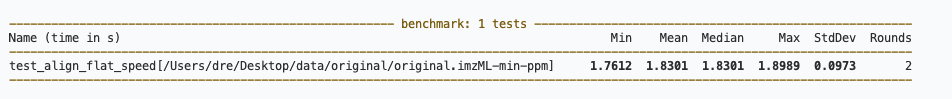

## Baseline Correction

Time commands:

```bash
pytest tests/test_baseline_speed.py::TestBaseline::test_baseline_speed --benchmark-only --benchmark-columns=min,mean,median,max,stddev,rounds -q
pytest tests/test_baseline_speed.py::TestBaseline::test_baseline_flat_speed --benchmark-only --benchmark-columns=min,mean,median,max,stddev,rounds -q
```
### result

test_baseline_speed (batch, time in s)

| method | min (s) | mean (s) | median (s) | max (s) | stddev (s) | rounds |
|---|---|---|---|---|---|---|
| locmin | 23.4376 | 23.4377 | 23.4377 | 23.4378 | 0.0001 | 2 |
| snip   | 106.7617 | 106.7622 | 106.7622 | 106.7626 | 0.0006 | 2 |

test_baseline_flat_speed (flat, time in s)

| method | min (s) | mean (s) | median (s) | max (s) | stddev (s) | rounds |
|---|---|---|---|---|---|---|
| snip_numba   | 2.6899 | 2.7108 | 2.7108 | 2.7317 | 0.0296 | 2 |
| locmin_numba | 3.2730 | 3.2848 | 3.2848 | 3.2966 | 0.0167 | 2 |



## Noise Reduction

Time commands:

```bash
pytest tests/test_noise_reduction_speed.py::TestNoiseReductionAPI::test_nr_speed --benchmark-only --benchmark-columns=min,mean,median,max,stddev,rounds -q
pytest tests/test_noise_reduction_speed.py::TestNoiseReductionAPI::test_nr_flat_speed --benchmark-only --benchmark-columns=min,mean,median,max,stddev,rounds -q
```
### result

| Name (time in s) | Min | Mean | Median | Max | StdDev | Rounds |
| --- | --- | --- | --- | --- | --- | --- |
| test_nr_speed[.../original.imzML-ma] | 4.3494 | 4.3494 | 4.3494 | 4.3494 | 0.0000 | 1 |
| test_nr_speed[.../original.imzML-gaussian] | 6.0477 | 6.0477 | 6.0477 | 6.0477 | 0.0000 | 1 |
| test_nr_speed[.../original.imzML-savgol] | 13.1050 | 13.1050 | 13.1050 | 13.1050 | 0.0000 | 1 |

| Name (time in ms) | Min | Mean | Median | Max | StdDev | Rounds |
| --- | --- | --- | --- | --- | --- | --- |
| test_nr_flat_speed[.../original.imzML-ma_numba] | 192.3563 | 192.3563 | 192.3563 | 192.3563 | 0.0000 | 1 |
| test_nr_flat_speed[.../original.imzML-gaussian_numba] | 496.5438 | 496.5438 | 496.5438 | 496.5438 | 0.0000 | 1 |
| test_nr_flat_speed[.../original.imzML-savgol_numba] | 686.0692 | 686.0692 | 686.0692 | 686.0692 | 0.0000 | 1 |



## Normalization

Time commands:

```bash
pytest tests/test_normalization_speed.py::TestNormalizationAPI::test_norm_batch_speed --benchmark-only --benchmark-columns=min,mean,median,max,stddev,rounds -q
pytest tests/test_normalization_speed.py::TestNormalizationAPI::test_norm_flat_speed --benchmark-only --benchmark-columns=min,mean,median,max,stddev,rounds -q
```
### result

| Name (time in s) | Min | Mean | Median | Max | StdDev | Rounds |
| --- | --- | --- | --- | --- | --- | --- |
| test_norm_batch_speed[.../original.imzML-tic] | 3.0824 | 3.0824 | 3.0824 | 3.0824 | 0.0000 | 1 |
| test_norm_batch_speed[.../original.imzML-rms] | 4.4271 | 4.4271 | 4.4271 | 4.4271 | 0.0000 | 1 |

| Name (time in ms) | Min | Mean | Median | Max | StdDev | Rounds |
| --- | --- | --- | --- | --- | --- | --- |
| test_norm_flat_speed[.../original.imzML-rms_numba] | 222.3605 | 222.3605 | 222.3605 | 222.3605 | 0.0000 | 1 |
| test_norm_flat_speed[.../original.imzML-tic_numba] | 875.8963 | 875.8963 | 875.8963 | 875.8963 | 0.0000 | 1 |
| test_norm_flat_speed[.../original.imzML-ref_numba] | 6,434.0061 | 6,434.0061 | 6,434.0061 | 6,434.0061 | 0.0000 | 1 |




## Peak Pick

Time commands:

```bash
pytest tests/test_pick_speed.py::TestPick::test_pick_speed --benchmark-only --benchmark-columns=min,mean,median,max,stddev,rounds -q
pytest tests/test_pick_speed.py::TestPick::test_pick_flat_speed --benchmark-only --benchmark-columns=min,mean,median,max,stddev,rounds -q
```
### result

| Name (time in s) | Min | Mean | Median | Max | StdDev | Rounds |
| --- | --- | --- | --- | --- | --- | --- |
| test_pick_speed[.../original.imzML-origin] | 46.5643 | 46.8220 | 46.7483 | 47.2370 | 0.2511 | 5 |

| Name (time in s) | Min | Mean | Median | Max | StdDev | Rounds |
| --- | --- | --- | --- | --- | --- | --- |
| test_pick_flat_speed[.../original.imzML-sd] | 19.0254 | 19.0254 | 19.0254 | 19.0254 | 0.0000 | 1 |
| test_pick_flat_speed[.../original.imzML-quantile] | 26.5196 | 26.5196 | 26.5196 | 26.5196 | 0.0000 | 1 |
| test_pick_flat_speed[.../original.imzML-diff] | 34.3804 | 34.3804 | 34.3804 | 34.3804 | 0.0000 | 1 |
| test_pick_flat_speed[.../original.imzML-mad] | 45.1137 | 45.1137 | 45.1137 | 45.1137 | 0.0000 | 1 |




## Peak Align

Time commands:

```bash
pytest tests/test_align_speed.py::TestAlign::test_align_speed --benchmark-only --benchmark-columns=min,mean,median,max,stddev,rounds -q
pytest tests/test_align_speed.py::TestAlign::test_align_flat_speed --benchmark-only --benchmark-columns=min,mean,median,max,stddev,rounds -q
```
### result

| Name (time in s) | Min | Mean | Median | Max | StdDev | Rounds |
| --- | --- | --- | --- | --- | --- | --- |
| test_align_speed[.../original.imzML-min-ppm] | 7.1824 | 7.1831 | 7.1831 | 7.1837 | 0.0009 | 2 |
| test_align_flat_speed[.../original.imzML-min-ppm] | 1.7612 | 1.8301 | 1.8301 | 1.8989 | 0.0973 | 2 |


