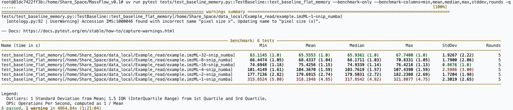
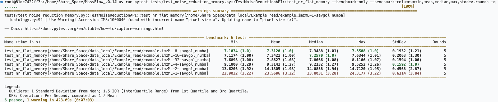
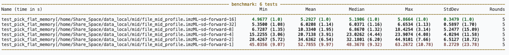
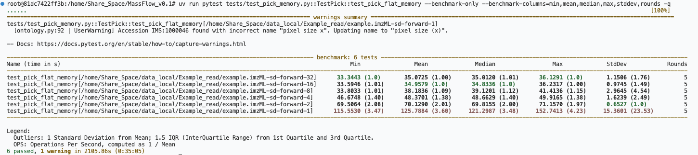
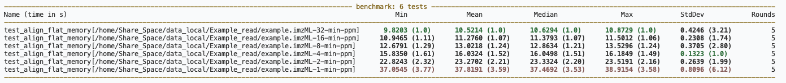

## Baseline

``` bash
pytest tests/test_baseline_memory.py::TestBaseline::test_baseline_flat_memory --benchmark-only --benchmark-columns=min,mean,median,max,stddev,rounds -q
```
### result

#### Example_read/example.imzML

| Name (time in s) | Min | Mean | Median | Max | StdDev | Rounds |
| --- | --- | --- | --- | --- | --- | --- |
| test_baseline_flat_memory[...example.imzML-32-snip_numba] | 63.1145 (1.0) | 65.5553 (1.0) | 65.9361 (1.0) | 67.7400 (1.0) | 1.9267 (2.22) | 5 |
| test_baseline_flat_memory[...example.imzML-8-snip_numba] | 66.4474 (1.05) | 68.4337 (1.04) | 68.1711 (1.03) | 70.8331 (1.05) | 1.7900 (2.06) | 5 |
| test_baseline_flat_memory[...example.imzML-16-snip_numba] | 74.6948 (1.18) | 75.4256 (1.15) | 74.9339 (1.14) | 76.4216 (1.13) | 0.8676 (1.0) | 5 |
| test_baseline_flat_memory[...example.imzML-4-snip_numba] | 101.4149 (1.61) | 104.3670 (1.59) | 103.7619 (1.57) | 107.4390 (1.59) | 2.5986 (3.00) | 5 |
| test_baseline_flat_memory[...example.imzML-2-snip_numba] | 177.7136 (2.82) | 179.6915 (2.74) | 179.5031 (2.72) | 182.2308 (2.69) | 1.7204 (1.98) | 5 |
| test_baseline_flat_memory[...example.imzML-1-snip_numba] | 315.8524 (5.00) | 318.1948 (4.85) | 317.8542 (4.82) | 321.8077 (4.75) | 2.3019 (2.65) | 5 |


## Noise Reduction

```bash
pytest tests/test_noise_reduction_memory.py::TestNoiseReductionAPI::test_nr_flat_memory --benchmark-only --benchmark-columns=min,mean,median,max,stddev,rounds -q
```
### result

#### Example_read/example.imzML

| Name (time in s) | Min | Mean | Median | Max | StdDev | Rounds |
| --- | --- | --- | --- | --- | --- | --- |
| test_nr_flat_memory[...example.imzML-8-savgol_numba] | 7.1034 (1.0) | 7.3120 (1.0) | 7.3488 (1.01) | 7.5508 (1.0) | 0.1932 (1.21) | 5 |
| test_nr_flat_memory[...example.imzML-16-savgol_numba] | 7.1174 (1.00) | 7.3421 (1.00) | 7.2570 (1.0) | 7.6344 (1.01) | 0.2063 (1.30) | 5 |
| test_nr_flat_memory[...example.imzML-32-savgol_numba] | 7.6893 (1.08) | 7.8627 (1.08) | 7.8066 (1.08) | 8.1106 (1.07) | 0.1594 (1.00) | 5 |
| test_nr_flat_memory[...example.imzML-4-savgol_numba] | 9.1800 (1.29) | 9.3141 (1.27) | 9.2132 (1.27) | 9.5252 (1.26) | 0.1592 (1.0) | 5 |
| test_nr_flat_memory[...example.imzML-2-savgol_numba] | 13.6206 (1.92) | 14.1305 (1.93) | 14.0858 (1.94) | 14.7120 (1.95) | 0.4568 (2.87) | 5 |
| test_nr_flat_memory[...example.imzML-1-savgol_numba] | 22.9032 (3.22) | 23.5606 (3.22) | 23.8031 (3.28) | 24.3177 (3.22) | 0.6114 (3.84) | 5 |


## Normalization

```bash
pytest tests/test_normalization_memory.py::TestNormalization::test_normalization_flat_memory --benchmark-only --benchmark-columns=min,mean,median,max,stddev,rounds -q
```
### result


## Peak Pick

```bash
pytest tests/test_pick_memory.py::TestPick::test_pick_flat_memory --benchmark-only --benchmark-columns=min,mean,median,max,stddev,rounds -q
```
### result

#### file_mid_profile.imzML

| Name (time in s) | Min | Mean | Median | Max | StdDev | Rounds |
| --- | --- | --- | --- | --- | --- | --- |
| test_pick_flat_memory[...file_mid_profile.imzML-sd-forward-16] | 4.9677 (1.0) | 5.2927 (1.0) | 5.1906 (1.0) | 5.8664 (1.0) | 0.3479 (1.0) | 5 |
| test_pick_flat_memory[...file_mid_profile.imzML-sd-forward-32] | 5.3500 (1.08) | 6.0208 (1.14) | 6.0371 (1.16) | 6.6534 (1.13) | 0.5897 (1.70) | 5 |
| test_pick_flat_memory[...file_mid_profile.imzML-sd-forward-8] | 6.7287 (1.35) | 10.3340 (1.95) | 6.8670 (1.32) | 18.4254 (3.14) | 5.2477 (15.09) | 5 |
| test_pick_flat_memory[...file_mid_profile.imzML-sd-forward-4] | 15.2255 (3.06) | 20.7138 (3.91) | 23.0262 (4.44) | 23.9074 (4.08) | 4.0294 (11.58) | 5 |
| test_pick_flat_memory[...file_mid_profile.imzML-sd-forward-2] | 28.4267 (5.72) | 34.6362 (6.54) | 32.1801 (6.20) | 44.9101 (7.66) | 6.5127 (18.72) | 5 |
| test_pick_flat_memory[...file_mid_profile.imzML-sd-forward-1] | 45.0356 (9.07) | 52.7855 (9.97) | 48.3678 (9.32) | 63.2672 (10.78) | 8.2729 (23.78) | 5 |


#### Example_read/example.imzML

| Name (time in s) | Min | Mean | Median | Max | StdDev | Rounds |
| --- | --- | --- | --- | --- | --- | --- |
| test_pick_flat_memory[...example.imzML-sd-forward-32] | 33.3443 (1.0) | 35.0725 (1.00) | 35.0120 (1.01) | 36.1291 (1.0) | 1.1506 (1.76) | 5 |
| test_pick_flat_memory[...example.imzML-sd-forward-16] | 33.5946 (1.01) | 34.9579 (1.0) | 34.8336 (1.0) | 36.2317 (1.00) | 0.9745 (1.49) | 5 |
| test_pick_flat_memory[...example.imzML-sd-forward-8] | 33.8033 (1.01) | 38.1836 (1.09) | 39.1201 (1.12) | 41.4136 (1.15) | 2.9645 (4.54) | 5 |
| test_pick_flat_memory[...example.imzML-sd-forward-4] | 46.6748 (1.40) | 48.3701 (1.38) | 48.6629 (1.40) | 49.9165 (1.38) | 1.6239 (2.49) | 5 |
| test_pick_flat_memory[...example.imzML-sd-forward-2] | 69.5064 (2.08) | 70.1290 (2.01) | 69.8155 (2.00) | 71.1570 (1.97) | 0.6527 (1.0) | 5 |
| test_pick_flat_memory[...example.imzML-sd-forward-1] | 115.5530 (3.47) | 125.7884 (3.60) | 121.2987 (3.48) | 152.7413 (4.23) | 15.3601 (23.53) | 5 |


## Peak Align

```bash
pytest tests/test_align_memory.py::TestAlign::test_align_flat_memory --benchmark-only --benchmark-columns=min,mean,median,max,stddev,rounds -q
```
### result

#### Example_read/example.imzML

| Name (time in s) | Min | Mean | Median | Max | StdDev | Rounds |
| --- | --- | --- | --- | --- | --- | --- |
| test_align_flat_memory[...example.imzML-32-min-ppm] | 9.8203 (1.0) | 10.5214 (1.0) | 10.6294 (1.0) | 10.8729 (1.0) | 0.4246 (3.21) | 5 |
| test_align_flat_memory[...example.imzML-16-min-ppm] | 10.9465 (1.11) | 11.2760 (1.07) | 11.3793 (1.07) | 11.5012 (1.06) | 0.2308 (1.74) | 5 |
| test_align_flat_memory[...example.imzML-8-min-ppm] | 12.6791 (1.29) | 13.0218 (1.24) | 12.8634 (1.21) | 13.5296 (1.24) | 0.3705 (2.80) | 5 |
| test_align_flat_memory[...example.imzML-4-min-ppm] | 15.8350 (1.61) | 16.0324 (1.52) | 16.0498 (1.51) | 16.1849 (1.49) | 0.1323 (1.0) | 5 |
| test_align_flat_memory[...example.imzML-2-min-ppm] | 22.8243 (2.32) | 23.2702 (2.21) | 23.3324 (2.20) | 23.5191 (2.16) | 0.2639 (1.99) | 5 |
| test_align_flat_memory[...example.imzML-1-min-ppm] | 37.0545 (3.77) | 37.8191 (3.59) | 37.4692 (3.53) | 38.9154 (3.58) | 0.8096 (6.12) | 5 |
