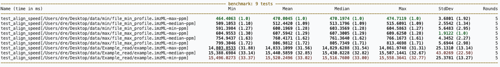
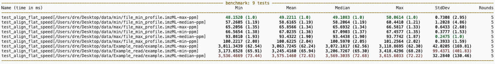
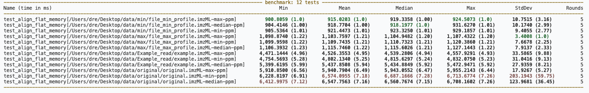
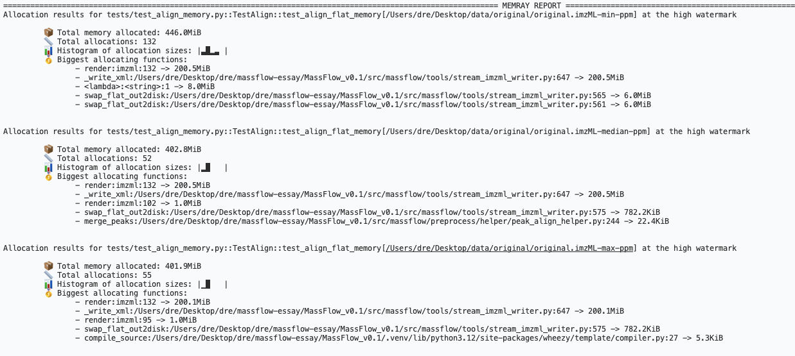
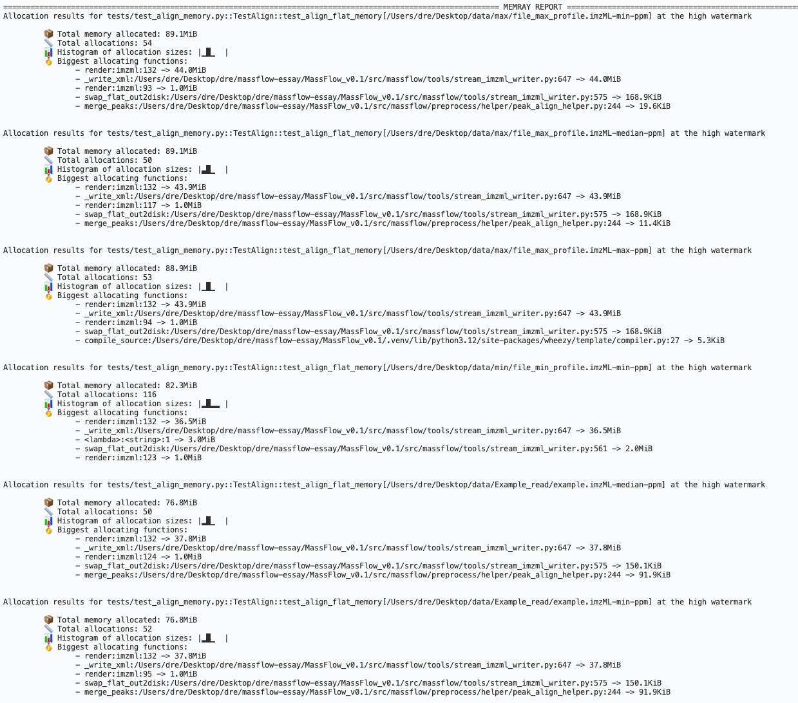
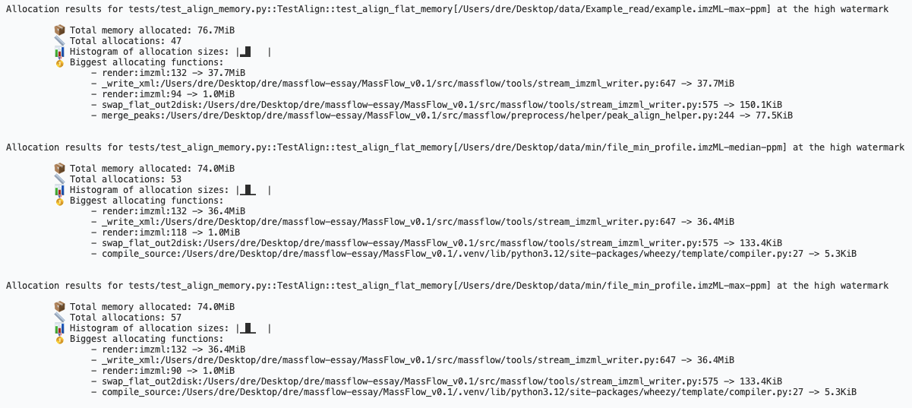
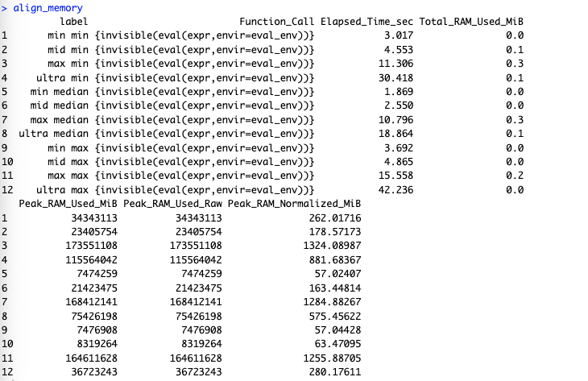

## Peak Align - ProjectName

Time commands:

```bash
pytest tests/test_align_speed.py::TestAlign::test_align_speed --benchmark-only --benchmark-columns=min,mean,median,max,stddev,rounds -q
pytest tests/test_align_speed.py::TestAlign::test_align_flat_speed --benchmark-only --benchmark-columns=min,mean,median,max,stddev,rounds -q
```
# result：

## test_align_speed

| Name | Dataset | Method | Min (ms) | Mean (ms) | Median (ms) | Max (ms) | StdDev (ms) | Rounds |
| --- | --- | --- | --- | --- | --- | --- | --- | --- |
| test_align_speed[.../file_min_profile.imzML-max-ppm] | min | max | 464.4063 | 470.0045 | 470.1974 | 474.7119 | 3.6801 | 5 |
| test_align_speed[.../file_min_profile.imzML-median-ppm] | min | median | 509.1053 | 512.4420 | 513.1796 | 515.6091 | 2.5542 | 5 |
| test_align_speed[.../file_min_profile.imzML-min-ppm] | min | min | 591.3984 | 600.1969 | 603.3569 | 604.5863 | 5.6483 | 5 |
| test_align_speed[.../file_max_profile.imzML-max-ppm] | mid | max | 604.9553 | 607.5942 | 607.3005 | 609.6250 | 1.9122 | 5 |
| test_align_speed[.../file_max_profile.imzML-median-ppm] | mid | median | 754.9437 | 760.4171 | 761.3640 | 766.1673 | 4.3452 | 5 |
| test_align_speed[.../file_max_profile.imzML-min-ppm] | mid | min | 799.3046 | 806.9812 | 805.7349 | 813.4698 | 5.6944 | 5 |
| test_align_speed[.../example.imzML-max-ppm] | max | max | 14,803.8533 | 14,833.1099 | 14,829.6288 | 14,861.9748 | 25.1310 | 5 |
| test_align_speed[.../example.imzML-median-ppm] | max | median | 15,388.6984 | 15,440.5859 | 15,430.8228 | 15,507.1441 | 43.0269 | 5 |
| test_align_speed[.../example.imzML-min-ppm] | max | min | 15,496.0273 | 15,520.2496 | 15,516.7600 | 15,558.3641 | 25.3781 | 5 |

9 passed, 13 warnings in 402.84s (0:06:42)


## test_align_flat_speed

| Name | Dataset | Method | Min (ms) | Mean (ms) | Median (ms) | Max (ms) | StdDev (ms) | Rounds |
| --- | --- | --- | --- | --- | --- | --- | --- | --- |
| test_align_flat_speed[.../file_min_profile.imzML-max-ppm] | min | max | 48.1520 | 49.2211 | 49.1083 | 50.0614 | 0.7308 | 5 |
| test_align_flat_speed[.../file_min_profile.imzML-median-ppm] | min | median | 57.2605 | 58.6165 | 58.2064 | 60.4410 | 1.2028 | 5 |
| test_align_flat_speed[.../file_max_profile.imzML-max-ppm] | mid | max | 65.2056 | 65.8566 | 65.6932 | 66.5817 | 0.6433 | 5 |
| test_align_flat_speed[.../file_min_profile.imzML-min-ppm] | min | min | 66.5654 | 67.0235 | 67.0903 | 67.4577 | 0.3777 | 5 |
| test_align_flat_speed[.../file_max_profile.imzML-median-ppm] | mid | median | 93.0810 | 93.4322 | 93.4438 | 93.7742 | 0.2475 | 5 |
| test_align_flat_speed[.../file_max_profile.imzML-min-ppm] | mid | min | 100.2217 | 100.6225 | 100.5970 | 101.2564 | 0.3933 | 5 |
| test_align_flat_speed[.../example.imzML-max-ppm] | max | max | 3,011.3439 | 3,063.7245 | 3,072.1817 | 3,118.8695 | 42.0205 | 5 |
| test_align_flat_speed[.../example.imzML-min-ppm] | max | min | 3,173.6528 | 3,245.4160 | 3,206.7267 | 3,418.4296 | 99.4371 | 5 |
| test_align_flat_speed[.../example.imzML-median-ppm] | max | median | 3,536.4669 | 3,575.1460 | 3,569.3035 | 3,615.6033 | 32.2840 | 5 |

9 passed, 13 warnings in 139.48s (0:02:19)


Memory commands:

```bash
pytest tests/test_align_memory.py::TestAlign::test_align_memory --memray --benchmark-disable --most-allocations=10 -q
pytest tests/test_align_memory.py::TestAlign::test_align_flat_memory --memray --benchmark-disable --most-allocations=10 -q
```
# result
## test_align_flat_memory -- time


| Name | Dataset | Method | Min (ms) | Mean (ms) | Median (ms) | Max (ms) | StdDev (ms) | Rounds |
| --- | --- | --- | --- | --- | --- | --- | --- | --- |
| test_align_flat_memory[.../file_min_profile.imzML-max-ppm] | min | max | 900.8059 | 915.0203 | 919.3358 | 924.5073 | 10.7515 | 5 |
| test_align_flat_memory[.../file_min_profile.imzML-median-ppm] | min | median | 904.4146 | 918.7704 | 918.1977 | 931.6270 | 10.1740 | 5 |
| test_align_flat_memory[.../file_min_profile.imzML-min-ppm] | min | min | 905.5364 | 921.4473 | 923.3250 | 929.1857 | 9.4055 | 5 |
| test_align_flat_memory[.../file_max_profile.imzML-max-ppm] | mid | max | 1,098.8740 | 1,103.7597 | 1,104.9482 | 1,107.4322 | 3.4008 | 5 |
| test_align_flat_memory[.../file_max_profile.imzML-min-ppm] | mid | min | 1,099.9598 | 1,109.7435 | 1,110.7323 | 1,120.3860 | 7.6678 | 5 |
| test_align_flat_memory[.../file_max_profile.imzML-median-ppm] | mid | median | 1,106.3932 | 1,115.7460 | 1,115.6026 | 1,127.1443 | 7.9137 | 5 |
| test_align_flat_memory[.../example.imzML-max-ppm] | max | max | 4,471.1444 | 4,526.3553 | 4,539.2806 | 4,557.9291 | 33.5865 | 5 |
| test_align_flat_memory[.../example.imzML-min-ppm] | max | min | 4,754.5693 | 4,802.1340 | 4,815.6297 | 4,832.0750 | 31.0416 | 5 |
| test_align_flat_memory[.../example.imzML-median-ppm] | max | median | 5,399.6195 | 5,437.8508 | 5,434.8849 | 5,472.9471 | 27.9359 | 5 |
| test_align_flat_memory[.../original.imzML-max-ppm] | ultra | max | 5,910.8500 | 5,940.7904 | 5,943.0552 | 5,955.2143 | 17.9267 | 5 |
| test_align_flat_memory[.../original.imzML-min-ppm] | ultra | min | 6,228.8197 | 6,574.0955 | 6,687.1666 | 6,713.6774 | 203.1943 | 5 |
| test_align_flat_memory[.../original.imzML-median-ppm] | ultra | median | 6,412.9975 | 6,547.7563 | 6,560.7674 | 6,708.1602 | 123.9681 | 5 |

12 passed




## test_align_flat_memory

| Dataset | Method | Total Memory (MiB) | Total Allocations | Top Allocation |
| --- | --- | --- | --- | --- |
| ultra (original.imzML) | min | 446.0 | 132 | 200.5MiB (render:imzml:132 / _write_xml) |
| ultra (original.imzML) | median | 402.8 | 52 | 200.5MiB (render:imzml:132 / _write_xml) |
| ultra (original.imzML) | max | 401.9 | 55 | 200.1MiB (render:imzml:132 / _write_xml) |
| mid (file_max_profile.imzML) | min | 89.1 | 54 | 44.0MiB (render:imzml:132 / _write_xml) |
| mid (file_max_profile.imzML) | median | 89.1 | 50 | 43.9MiB (render:imzml:132 / _write_xml) |
| mid (file_max_profile.imzML) | max | 88.9 | 53 | 43.9MiB (render:imzml:132 / _write_xml) |
| min (file_min_profile.imzML) | min | 82.3 | 116 | 36.5MiB (render:imzml:132 / _write_xml) |
| max (example.imzML) | median | 76.8 | 50 | 37.8MiB (render:imzml:132 / _write_xml) |
| max (example.imzML) | min | 76.8 | 52 | 37.8MiB (render:imzml:132 / _write_xml) |
| max (example.imzML) | max | 76.7 | 47 | 37.7MiB (render:imzml:132 / _write_xml) |
| min (file_min_profile.imzML) | median | 74.0 | 53 | 36.4MiB (render:imzml:132 / _write_xml) |
| min (file_min_profile.imzML) | max | 74.0 | 57 | 36.4MiB (render:imzml:132 / _write_xml) |

9 passed in 306.28s (0:05:06)




## test_align_flat_memory - batch_size = 128

| Dataset | Method | Total Memory (MiB) | Total Allocations | Top Allocation |
| --- | --- | --- | --- | --- |
| ultra (original.imzML) | min | 421.8 | 67 | 200.5MiB (render:imzml:132 / _write_xml) |
| ultra (original.imzML) | median | 402.8 | 53 | 200.5MiB (render:imzml:132 / _write_xml) |
| ultra (original.imzML) | max | 401.9 | 56 | 200.1MiB (render:imzml:132 / _write_xml) |
| mid (file_max_profile.imzML) | min | 89.1 | 52 | 44.0MiB (render:imzml:132 / _write_xml) |
| mid (file_max_profile.imzML) | median | 89.1 | 50 | 43.9MiB (render:imzml:132 / _write_xml) |
| mid (file_max_profile.imzML) | max | 88.9 | 54 | 43.9MiB (render:imzml:132 / _write_xml) |
| min (file_min_profile.imzML) | min | 83.3 | 129 | 36.5MiB (render:imzml:132 / _write_xml) |
| max (example.imzML) | min | 76.8 | 53 | 37.8MiB (render:imzml:132 / _write_xml) |
| max (example.imzML) | median | 76.8 | 48 | 37.8MiB (render:imzml:132 / _write_xml) |
| max (example.imzML) | max | 76.7 | 48 | 37.7MiB (render:imzml:132 / _write_xml) |
| min (file_min_profile.imzML) | median | — | — | — |
| min (file_min_profile.imzML) | max | — | — | — |

12 passed, 13 warnings in 821.44s (0:13:41)

注：上表包含 ultra 数据集（`original.imzML`），因为测试中包含了该数据集的运行。`min`/`mid`/`max`/`ultra` 数据集分别对应：
- `min` → `file_min_profile.imzML`
- `mid` → `file_max_profile.imzML`
- `max` → `Example_read/example.imzML`
- `ultra` → `original/original.imzML`


## Peak Align - cardinal
Run these directly in a fresh R session.

```r
library(Cardinal)

FILE_MIN <- "/Users/dre/Desktop/data/min/file_min_profile.imzML"
FILE_MID <- "/Users/dre/Desktop/data/max/file_max_profile.imzML"
FILE_MAX <- "/Users/dre/Desktop/data/Example_read/example.imzML"
FILE_ULTRA <- "/Users/dre/Desktop/data/original/original.imzML"
FILES <- c(min = FILE_MIN, mid = FILE_MID, max = FILE_MAX, ultra = FILE_ULTRA)

ROUNDS <- 3
ALIGN_BINFUNS <- c("min")

read_arrays <- function(file) {
  as(readImzML(file), "MSImagingArrays")
}

normalize_peakram_units <- function(result) {
  peak_col <- "Peak_RAM_Used_MiB"
  if (peak_col %in% names(result)) {
    peak_raw <- result[[peak_col]]
    result$Peak_RAM_Used_Raw <- peak_raw
    result$Peak_RAM_Normalized_MiB <- ifelse(
      peak_raw > 100000,
      peak_raw * 8 / (1024 * 1024),
      peak_raw
    )
  }
  result
}

bench_time <- function(label, expr, rounds = ROUNDS, warmup = 1) {
  expr <- substitute(expr)
  for (i in seq_len(warmup)) invisible(eval(expr, parent.frame()))
  elapsed <- numeric(rounds)
  for (i in seq_len(rounds)) {
    gc(full = TRUE)
    elapsed[[i]] <- system.time(invisible(eval(expr, parent.frame())))[["elapsed"]]
  }
  data.frame(
    label = label,
    min = min(elapsed),
    mean = mean(elapsed),
    median = median(elapsed),
    max = max(elapsed),
    stddev = sd(elapsed),
    rounds = rounds
  )
}

bench_memory <- function(label, expr) {
  if (!requireNamespace("peakRAM", quietly = TRUE)) {
    stop("Install peakRAM first: install.packages('peakRAM')")
  }
  expr <- substitute(expr)
  eval_env <- parent.frame()
  gc(full = TRUE)
  result <- peakRAM::peakRAM({
    invisible(eval(expr, envir = eval_env))
  })
  gc(full = TRUE)
  normalize_peakram_units(cbind(label = label, result))
}

run_for_files <- function(fun) {
  do.call(rbind, lapply(names(FILES), function(dataset) {
    gc(full = TRUE)
    result <- fun(dataset, FILES[[dataset]])
    gc(full = TRUE)
    result
  }))
}

run_align_time <- function(binfun_values = ALIGN_BINFUNS) {
  do.call(rbind, lapply(binfun_values, function(binfun) {
    run_for_files(function(dataset, file) {
      x <- read_arrays(file)
      picked <- process(peakPick(
        x,
        width = 5,
        method = "quantile",
        SNR = 2.0,
        type = "height",
        nbins = 1,
        overlap = 0.5
      ))

      bench_time(paste(dataset, binfun), {
        process(peakAlign(
          picked,
          units = "ppm",
          binfun = binfun,
          binratio = 2.0
        ))
      })
    })
  }))
}

run_align_memory <- function(binfun_values = ALIGN_BINFUNS) {
  do.call(rbind, lapply(binfun_values, function(binfun) {
    run_for_files(function(dataset, file) {
      x <- read_arrays(file)
      picked <- process(peakPick(
        x,
        width = 5,
        method = "quantile",
        SNR = 2.0,
        type = "height",
        nbins = 1,
        overlap = 0.5
      ))

      bench_memory(paste(dataset, binfun), {
        process(peakAlign(
          picked,
          units = "ppm",
          binfun = binfun,
          binratio = 2.0
        ))
      })
    })
  }))
}

align_time <- run_align_time()
align_time

align_memory <- run_align_memory()
align_memory
```
``` r
> align_time
          label    min      mean median    max      stddev rounds
1       min min  2.820  2.827000  2.824  2.837 0.008888194      3
2       mid min  4.201  4.239000  4.214  4.302 0.054945427      3
3       max min 10.310 10.376333 10.321 10.498 0.105509873      3
4     ultra min 28.187 28.203000 28.205 28.217 0.015099669      3
5    min median  1.853  1.893000  1.869  1.957 0.056000000      3
6    mid median  2.553  2.590000  2.556  2.661 0.061506097      3
7    max median 10.357 10.401667 10.408 10.440 0.041860881      3
8  ultra median 16.957 17.034333 17.023 17.123 0.083578307      3
9       min max  3.159  3.174333  3.176  3.188 0.014571662      3
10      mid max  4.378  4.419333  4.392  4.488 0.059877653      3
11      max max 14.184 14.222333 14.193 14.290 0.058773577      3
12    ultra max 39.883 40.085667 39.919 40.455 0.320358133      3
```


``` r
> align_memory
          label                          Function_Call Elapsed_Time_sec Total_RAM_Used_MiB
1       min min {invisible(eval(expr,envir=eval_env))}            3.017                0.0
2       mid min {invisible(eval(expr,envir=eval_env))}            4.553                0.1
3       max min {invisible(eval(expr,envir=eval_env))}           11.306                0.3
4     ultra min {invisible(eval(expr,envir=eval_env))}           30.418                0.1
5    min median {invisible(eval(expr,envir=eval_env))}            1.869                0.0
6    mid median {invisible(eval(expr,envir=eval_env))}            2.550                0.0
7    max median {invisible(eval(expr,envir=eval_env))}           10.796                0.3
8  ultra median {invisible(eval(expr,envir=eval_env))}           18.864                0.1
9       min max {invisible(eval(expr,envir=eval_env))}            3.692                0.0
10      mid max {invisible(eval(expr,envir=eval_env))}            4.865                0.0
11      max max {invisible(eval(expr,envir=eval_env))}           15.558                0.2
12    ultra max {invisible(eval(expr,envir=eval_env))}           42.236                0.0
   Peak_RAM_Used_MiB Peak_RAM_Used_Raw Peak_RAM_Normalized_MiB
1           34343113          34343113               262.01716
2           23405754          23405754               178.57173
3          173551108         173551108              1324.08987
4          115564042         115564042               881.68367
5            7474259           7474259                57.02407
6           21423475          21423475               163.44814
7          168412141         168412141              1284.88267
8           75426198          75426198               575.45622
9            7476908           7476908                57.04428
10           8319264           8319264                63.47095
11         164611628         164611628              1255.88705
12          36723243          36723243               280.17611
> 
```

